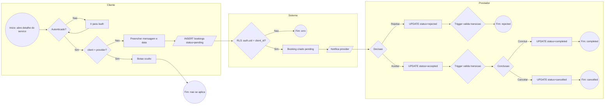

# 01 — BPMN: Fluxo de Booking

Aproxima a notacao BPMN 2.0 com `flowchart LR`. Cobre desde o cliente abrir o detalhe de um servico ate o booking terminar em `completed`, `rejected` ou `cancelled`.

Fontes:
- Regras em [../03-business-rules.md](../03-business-rules.md)
- Validacao de transicoes em [../../supabase/migrations/20260303232457_a8395b1c-7eb2-41e8-91a6-2cee18542cc2.sql](../../supabase/migrations/20260303232457_a8395b1c-7eb2-41e8-91a6-2cee18542cc2.sql) (funcao `validate_booking_status_transition`)
- Implementacao da solicitacao em [../../src/components/BookingDialog.tsx](../../src/components/BookingDialog.tsx)

Legenda: `(())` evento, `{}` gateway, `[]` tarefa, `[/.../]` mensagem.

## Notas

- O trigger `validate_booking_status_transition` impede transicoes invalidas; o gateway "Trigger valida transicao" representa esse ponto de controle.
- As policies de RLS de bookings garantem que o `INSERT` so passa quando `auth.uid() = client_id` e que apenas o provider correspondente atualiza o status.
