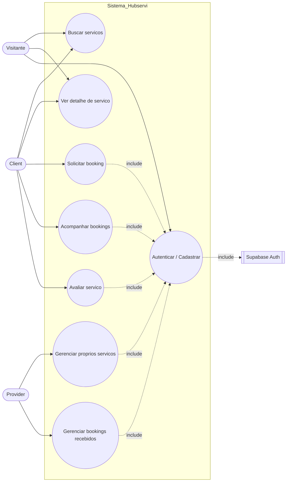

# 02 — Diagrama de Caso de Uso

Mermaid nao tem `usecaseDiagram`, entao usamos `flowchart LR` com dois subgraphs: atores a esquerda e casos de uso dentro do sistema. Casos sao representados por nos elipticos `(( ))`.

Fonte: "Funcionalidades principais" em [../01-overview.md](../01-overview.md) e regras em [../03-business-rules.md](../03-business-rules.md).

## Notas

- Visitante so acessa fluxos publicos (`/`, `/services`, `/services/:id`, `/auth`).
- Toda interacao com dados protegidos depende do caso "Autenticar" — modelado com relacoes `<<include>>` (tracejadas).
- Provider nao aparece em "Solicitar booking" porque a regra de negocio impede solicitar o proprio servico (ver [BookingDialog.tsx:42-48](../../src/components/BookingDialog.tsx#L42-L48)).
