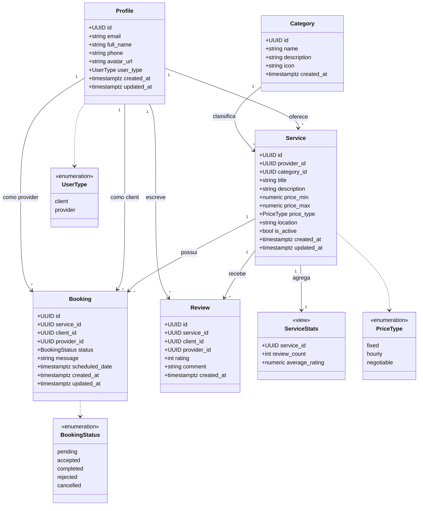

# 03 — Diagrama de Classes UML

Modelo de dominio derivado das tabelas do schema e dos enums.

Fonte: [../../supabase/migrations/20260303232457_a8395b1c-7eb2-41e8-91a6-2cee18542cc2.sql](../../supabase/migrations/20260303232457_a8395b1c-7eb2-41e8-91a6-2cee18542cc2.sql).

## Notas

- `Profile.id` referencia `auth.users.id`; o trigger `handle_new_user` materializa o profile no signup.
- `Review` tem restricao `UNIQUE(service_id, client_id)` — uma avaliacao por cliente por servico.
- `ServiceStats` e uma view derivada de `Review` agrupada por `service_id`.
