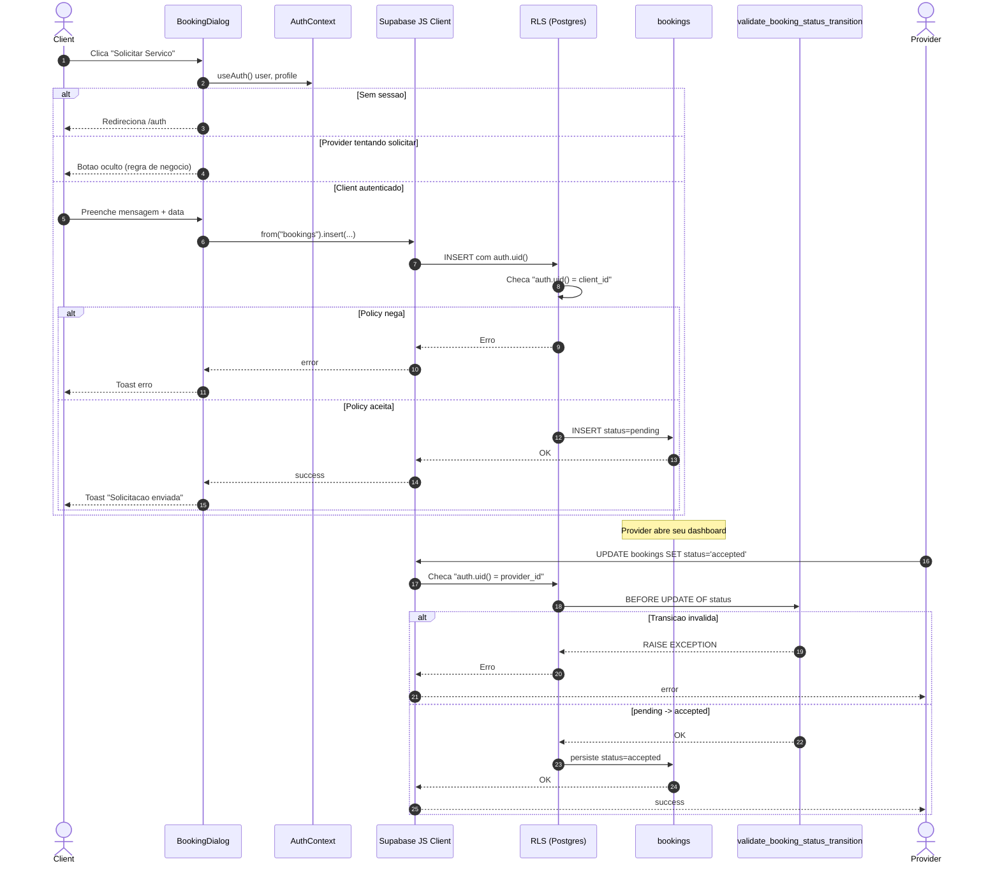

# 04 — Sequencia: Client solicita servico e Provider aceita

Cobre dois fluxos encadeados: o INSERT em `bookings` feito por `BookingDialog` e o UPDATE de status feito pelo provider, validado pelo trigger.

Fontes:
- [../../src/components/BookingDialog.tsx](../../src/components/BookingDialog.tsx)
- [../../src/contexts/AuthContext.tsx](../../src/contexts/AuthContext.tsx)
- RLS e triggers em [../04-data-and-security.md](../04-data-and-security.md)

## Notas

- O `setTimeout` em [AuthContext.tsx:46](../../src/contexts/AuthContext.tsx#L46) existe para evitar deadlocks com a callback do `onAuthStateChange`; nao impacta o fluxo de booking, mas e relevante ao entender a hidratacao do `profile`.
- O trigger so libera `pending -> accepted|rejected` e `accepted -> completed|cancelled`; qualquer outra transicao lanca excecao.
