# 05 — EAP (Estrutura Analitica do Projeto)

Decomposicao do produto em entregas e pacotes de trabalho, derivada das funcionalidades em [../01-overview.md](../01-overview.md) e do "Fluxo recomendado" em [../05-development-and-quality.md](../05-development-and-quality.md).

```mermaid
flowchart TD
    HUB[Hubservi]

    HUB --> E1[1. Plataforma base]
    HUB --> E2[2. Catalogo de servicos]
    HUB --> E3[3. Booking]
    HUB --> E4[4. Reviews]
    HUB --> E5[5. Qualidade e operacao]

    E1 --> E1a[1.1 Auth Supabase]
    E1 --> E1b[1.2 AuthContext + profile]
    E1 --> E1c[1.3 ProtectedRoute]
    E1 --> E1d[1.4 Layout Header/Footer]

    E2 --> E2a[2.1 Listagem publica]
    E2 --> E2b[2.2 Detalhe de servico]
    E2 --> E2c[2.3 ServiceForm provider]
    E2 --> E2d[2.4 Categorias seed]

    E3 --> E3a[3.1 BookingDialog]
    E3 --> E3b[3.2 Maquina de estados + trigger]
    E3 --> E3c[3.3 ProviderDashboard]
    E3 --> E3d[3.4 ClientDashboard]

    E4 --> E4a[4.1 Modelo reviews]
    E4 --> E4b[4.2 ServiceStats view]
    E4 --> E4c[4.3 UI de avaliacao]

    E5 --> E5a[5.1 Lint]
    E5 --> E5b[5.2 Testes]
    E5 --> E5c[5.3 Hardening de RLS]
    E5 --> E5d[5.4 Documentacao]
```

## Notas

- Itens marcados ja existem no codigo: 1.1-1.4, 2.1-2.4, 3.1-3.4, 4.1-4.2, 5.1-5.2, 5.4.
- Lacunas reconhecidas em [../05-development-and-quality.md:38-41](../05-development-and-quality.md#L38-L41): ampliar 5.2 (testes) e 5.3 (hardening RLS, em especial validacao de `provider_id` em bookings).
- 4.3 (UI de avaliacao) ainda nao tem componente dedicado no repositorio.
