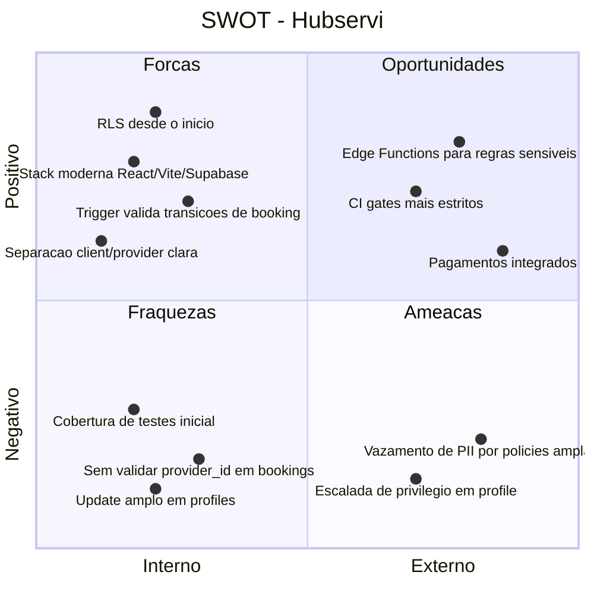

# 06 — SWOT

Analise estrategica do estado atual da plataforma, derivada dos docs 04 e 05.

## Detalhamento

### Forcas (interno, positivo)
- RLS habilitado em todas as tabelas de dominio desde a primeira migration.
- Trigger `validate_booking_status_transition` garante consistencia da maquina de estados no banco.
- Stack consolidada: React 18, TanStack Query, Zod, shadcn/ui.

### Fraquezas (interno, negativo)
- Cobertura de testes ainda inicial ([../05-development-and-quality.md:38-41](../05-development-and-quality.md#L38-L41)).
- Falta validacao no banco para garantir que `bookings.provider_id` coincide com o `services.provider_id` ([../04-data-and-security.md:90-94](../04-data-and-security.md#L90-L94)).
- Policy `Users can update own profile` permite atualizar campos sensiveis sem restricao por coluna.

### Oportunidades (externo, positivo)
- Edge Functions para isolar regras de matching, notificacao e pagamento.
- CI mais estrito (gates de lint, teste, regressao de policies).
- Monetizacao via fee por transacao ou assinatura premium.

### Ameacas (externo, negativo)
- Vazamento de PII se policies de leitura publica permanecerem amplas em `profiles`.
- Risco de escalada de privilegio caso o `user_type` possa ser auto-promovido via UPDATE.
