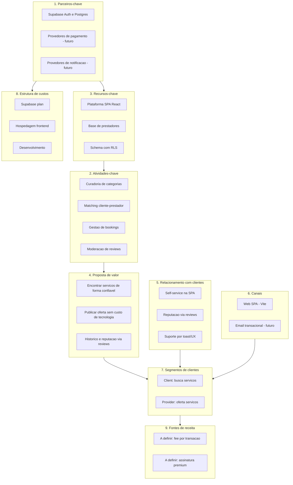

# 07 — Business Model Canvas

Mermaid nao tem canvas nativo; usamos `flowchart TB` com 9 subgraphs simulando os blocos. Setas indicam relacoes principais entre blocos.

Fontes: [../01-overview.md](../01-overview.md), [../03-business-rules.md](../03-business-rules.md).

## Notas

- Os blocos `P9` e parte de `P1`/`P6` estao "a definir" no escopo atual: o produto ainda nao tem fluxo de pagamento nem notificacao por email.
- A proposta de valor `p4b` (publicar oferta sem custo de tecnologia) pressupoe modelo freemium para providers.
