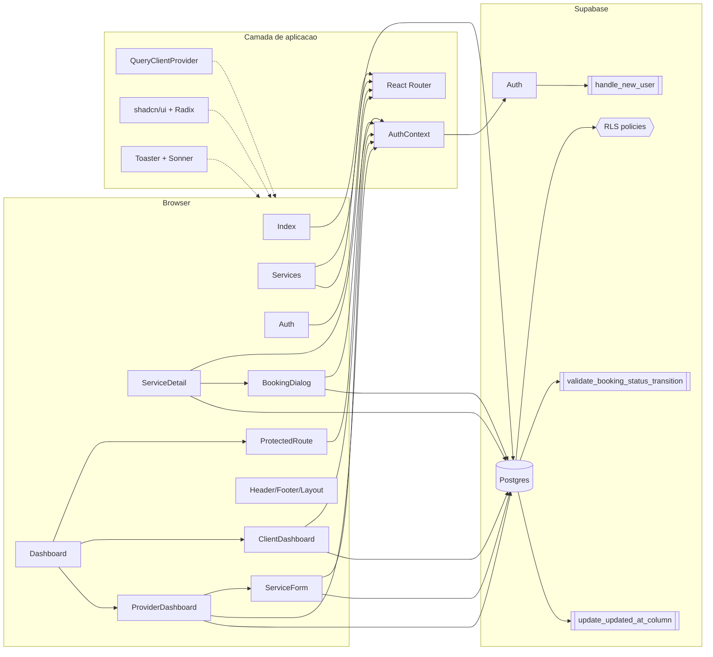

# 08 — Diagrama de Componentes

Visao de componentes da SPA e da camada Supabase, derivada de [../02-architecture.md](../02-architecture.md) e da arvore em [../../src/](../../src/).

## Notas

- O acesso de cada componente a `PG` na verdade passa pelo cliente em [../../src/integrations/supabase/client.ts](../../src/integrations/supabase/client.ts); o diagrama omite esse no para reduzir ruido.
- `ProtectedRoute` so libera filhos quando `AuthContext.session` esta presente; a selecao client vs provider acontece dentro do `Dashboard`.
- `handle_new_user` esta vinculado a `auth.users`, nao a uma tabela de `public`; representado como trigger de `SBA`.
