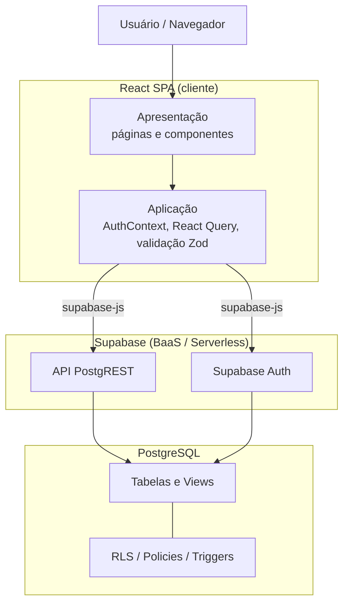

# 4 Arquitetura do Hubservi

Esta seção documenta a arquitetura real da plataforma Hubservi, recuperada a partir do código-fonte (`src/`) e das *migrations* do banco de dados (`supabase/migrations/`). A descrição responde aos objetivos específicos 2 e 3 (modelar e documentar componentes, fluxos, persistência e regras de negócio).

## 4.1 Visão geral e estilo arquitetural

O Hubservi adota o estilo **SPA + BaaS + Serverless**. Um *Single Page Application* (SPA) executado no navegador concentra a interface e a orquestração da lógica de aplicação e comunica-se diretamente com o BaaS Supabase, que provê autenticação, banco de dados PostgreSQL e autorização declarativa via *Row Level Security* (RLS). Não há, portanto, servidor de aplicação intermediário desenvolvido sob medida, tampouco decomposição em microsserviços: as responsabilidades de *backend* são delegadas a serviços gerenciados, e parte expressiva das regras de negócio reside no próprio banco, sob a forma de *triggers*, *views* e políticas de RLS.

A arquitetura organiza-se em camadas lógicas:

| Camada | Responsabilidade | Elementos no repositório |
|--------|------------------|--------------------------|
| Apresentação | Renderização, navegação e interação | `src/pages/*`, `src/components/*`, `src/components/ui/*` |
| Aplicação | Sessão, estado de servidor, regras de fluxo e validação | `src/contexts/AuthContext.tsx`, React Query, esquemas Zod |
| Integração | Acesso ao BaaS | `src/integrations/supabase/{client,views,types}.ts` |
| Dados | Persistência e regras declarativas | `supabase/migrations/*` (PostgreSQL) |

> Diagramas detalhados: [componentes](diagramas/componentes.md) e [implantação](diagramas/implantacao.md).

## 4.2 Tecnologias

| Camada | Tecnologia | Versão |
|--------|-----------|--------|
| Biblioteca de UI | React | 18.3.1 |
| Linguagem | TypeScript | 5.8.3 |
| Empacotador/_build_ | Vite | 5.4.19 |
| Roteamento | React Router DOM | 6.30.1 |
| Estado de servidor | TanStack React Query | 5.83.0 |
| Formulários e validação | react-hook-form 7.61 + Zod 3.25 | — |
| Componentes de UI | shadcn/ui (Radix UI) + Tailwind CSS | 3.4.17 |
| Cliente BaaS | @supabase/supabase-js | 2.98.0 |
| Banco de dados | PostgreSQL (gerenciado pelo Supabase) | — |

## 4.3 Componentes e rotas

A aplicação define as seguintes rotas (`src/App.tsx`):

| Rota | Página | Acesso |
|------|--------|--------|
| `/` | `Index.tsx` — *landing page* | Público |
| `/auth` | `Auth.tsx` — login e cadastro | Público |
| `/services` | `Services.tsx` — busca e listagem | Público |
| `/services/:id` | `ServiceDetail.tsx` — detalhe, avaliações e solicitação | Público |
| `/dashboard` | `Dashboard.tsx` — painel por perfil | Protegido |
| `*` | `NotFound.tsx` — 404 | Público |

O acesso à rota protegida é controlado pelo componente `ProtectedRoute.tsx`, que redireciona usuários sem sessão para `/auth`. O `Dashboard.tsx` seleciona a interface conforme o tipo de usuário: `ClientDashboard` (cliente) ou `ProviderDashboard` (prestador). Provedores globais configurados na raiz incluem `QueryClientProvider` (cache e sincronização de dados), `AuthProvider` (sessão e perfil), `BrowserRouter` e provedores de *feedback* de interface.

> Diagramas detalhados: [casos de uso](diagramas/caso-de-uso.md) e [classes](diagramas/classes.md).

## 4.4 Modelo de dados

O esquema do banco compreende cinco tabelas, três tipos enumerados e duas *views*.

**Tabelas:** `profiles`, `categories`, `services`, `bookings`, `reviews`.

**Enumerações:**
- `user_type` ∈ {`client`, `provider`};
- `price_type` ∈ {`fixed`, `hourly`, `negotiable`};
- `booking_status` ∈ {`pending`, `accepted`, `completed`, `rejected`, `cancelled`}.

**Views:**
- `service_stats` — agrega, por serviço, a contagem de avaliações (`review_count`) e a média de notas (`average_rating`); definida com `security_invoker = true`.
- `public_profiles` — projeção de `profiles` sem dados pessoais sensíveis (expõe `id`, `full_name`, `avatar_url`, `user_type`, `created_at`; **omite** `email` e `phone`), utilizada para apresentar dados de perfil a usuários não autenticados.

As chaves estrangeiras estabelecem as relações: `services` referencia `profiles` (prestador) e `categories`; `bookings` referencia `services` e duas vezes `profiles` (cliente e prestador); `reviews` referencia `services` e `profiles` (cliente e prestador). A tabela `reviews` possui a restrição de unicidade `(service_id, client_id)`, garantindo no máximo uma avaliação por cliente por serviço.

> Modelos detalhados: [DER](diagramas/der.md) e [dicionário de dados](diagramas/dicionario-de-dados.md).

## 4.5 Fluxos principais

### 4.5.1 Autenticação
O cadastro (`Auth.tsx`) chama `supabase.auth.signUp`, fornecendo `full_name` e `user_type` em metadados. O *trigger* `on_auth_user_created` materializa, de forma idempotente, a linha correspondente em `profiles`. O `AuthContext` assina `onAuthStateChange` e carrega o perfil do usuário autenticado. Detalhe em [sequência — autenticação](diagramas/sequencia-autenticacao.md).

### 4.5.2 Cadastro e busca de serviços
Prestadores criam, editam e removem serviços pelo `ServiceForm` no `ProviderDashboard`, com validação Zod. A busca (`Services.tsx`) consulta serviços ativos (`is_active = true`), com filtro por categoria e por título, paginação e ordenação por **recência**, **avaliação** ou **popularidade** — estas duas últimas apoiadas na *view* `service_stats`. Cabe destacar que a *recomendação* de serviços, no Hubservi, resume-se a essa ordenação por popularidade/avaliação, constituindo módulo secundário e não o foco deste trabalho.

### 4.5.3 Contratação (booking)
A solicitação (`BookingDialog`) insere um registro em `bookings` com `status = 'pending'`. O cliente acompanha e pode cancelar solicitações pendentes; o prestador aceita, rejeita, conclui ou cancela. Detalhe em [sequência — contratação](diagramas/sequencia-contratacao.md) e [BPMN — contratação](diagramas/bpmn-contratacao.md).

### 4.5.4 Avaliação (review)
Concluído um booking, o cliente pode registrar uma avaliação (nota de 1 a 5 e comentário) pelo `ReviewForm`. Detalhe em [sequência — avaliação](diagramas/sequencia-avaliacao.md).

## 4.6 Regras de negócio residentes no banco

Boa parte das invariantes do domínio é imposta no servidor por *triggers* e restrições, e não apenas no cliente — característica marcante do paradigma BaaS:

| Regra | Mecanismo | Fonte |
|-------|-----------|-------|
| Provisão automática de perfil no cadastro | *trigger* `on_auth_user_created` → `handle_new_user()` (idempotente, `SECURITY DEFINER`) | migration inicial; `20260316201000` |
| `updated_at` atualizado a cada alteração | *trigger* `update_updated_at_column()` | migration inicial |
| Máquina de estados do booking | *trigger* `validate_booking_status_transition()` | migration inicial; `20260528000000` |
| Imutabilidade do `user_type` (anti-escalonamento de privilégio) | *trigger* `prevent_user_type_change()` | `20260514100000` |
| `booking.provider_id` deve coincidir com o dono do serviço | *trigger* `validate_booking_provider()` | `20260514100100` |
| `price_max ≥ price_min` | *constraint* `services_price_range_check` | `20260514100300` |
| Avaliação só após booking `completed` | política RLS de `INSERT` em `reviews` | `20260514100400` |
| Cliente pode cancelar booking pendente | política RLS + transição `pending → cancelled` | `20260528000000` |

A máquina de estados do booking admite as transições: `pending → {accepted, rejected, cancelled}` e `accepted → {completed, cancelled}`; transições inválidas resultam em exceção. Detalhe em [BPMN — gerenciamento de booking](diagramas/bpmn-gerenciamento-booking.md).

## 4.7 Segurança: autorização declarativa via RLS

Todas as tabelas têm RLS habilitado. A autorização é expressa por políticas declarativas avaliadas pelo PostgreSQL a cada operação. Resumo das políticas reais:

| Tabela | Operação | Política (resumo) |
|--------|----------|-------------------|
| `profiles` | SELECT/UPDATE/INSERT | usuário só acessa/edita o próprio perfil (`auth.uid() = id`); leitura de perfis de terceiros restrita a autenticados |
| `categories` | SELECT | leitura pública |
| `services` | SELECT | qualquer um vê serviços ativos; prestador vê os próprios (ativos ou não) |
| `services` | INSERT/UPDATE/DELETE | apenas o prestador dono (`auth.uid() = provider_id`) |
| `bookings` | SELECT | cliente vê os próprios; prestador vê os próprios |
| `bookings` | INSERT | apenas o cliente (`auth.uid() = client_id`) |
| `bookings` | UPDATE | prestador altera status; cliente pode cancelar apenas os próprios pendentes |
| `reviews` | SELECT | leitura pública |
| `reviews` | INSERT | cliente com booking `completed` no serviço |
| `reviews` | UPDATE/DELETE | apenas o autor (`auth.uid() = client_id`) |

A proteção de dados pessoais (e-mail e telefone) é reforçada pela restrição da leitura direta de `profiles` a usuários autenticados, combinada à *view* `public_profiles` para consumo anônimo. Esse arranjo — autorização concentrada em políticas declarativas — é precisamente o ponto que a avaliação de segurança (Seções 5 e 6) deverá exercitar de forma sistemática.

## 4.8 Síntese arquitetural

O Hubservi exemplifica os *tradeoffs* característicos do paradigma BaaS/Serverless: ganha-se simplicidade operacional e velocidade de desenvolvimento ao delegar autenticação, persistência e autorização a serviços gerenciados, ao custo de concentrar a correção da segurança em configurações declarativas e de transferir parte do desempenho percebido para o cliente e para a latência das chamadas ao serviço. Esses pontos orientam o planejamento experimental apresentado a seguir.
