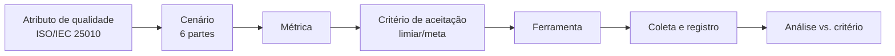

# 5 Planejamento experimental e plano de métricas

Esta seção operacionaliza a avaliação técnica, atendendo aos objetivos específicos 4 a 8. Para cada atributo de qualidade da ISO/IEC 25010 (2011) considerado relevante, define-se um conjunto de cenários, métricas, critérios de aceitação e ferramentas. Os critérios são expressos como **metas/limiares planejados**; nenhum valor apresentado nesta seção corresponde a medição já realizada (ver Seção 7 e nota final).

## 5.1 Visão geral do procedimento de medição

Cada execução de medição registra: ferramenta e versão, ambiente, configuração, data, valor obtido e veredito (atende / não atende ao critério). A reprodutibilidade é assegurada pela fixação de ambiente e parâmetros, conforme a etapa 5 da metodologia (Seção 3.3).

## 5.2 Mapeamento atributo → cenário → métrica → critério → ferramenta

> Os valores na coluna **Critério (meta)** são alvos de planejamento, a serem confirmados/calibrados na execução. Não representam resultados medidos.

### 5.2.1 Segurança

| Cenário | Métrica | Critério (meta) | Ferramenta |
|---------|---------|-----------------|------------|
| Usuário tenta ler/alterar dados de outro usuário (booking, perfil, serviço) | Nº de acessos indevidos bem-sucedidos | 0 acessos indevidos | Testes de política RLS + OWASP ZAP |
| Cliente tenta avaliar serviço sem booking concluído | Nº de inserções de review indevidas | 0 inserções | Teste de integração contra a API |
| Usuário tenta alterar o próprio `user_type` (escalonamento) | Tentativa bloqueada (sim/não) | 100% bloqueadas | Teste de integração + verificação do *trigger* |
| Varredura de vulnerabilidades da aplicação web | Nº de vulnerabilidades por severidade | 0 de severidade alta/crítica | OWASP ZAP |
| Vulnerabilidades em dependências | Nº de CVEs por severidade | 0 de severidade alta/crítica não tratadas | Snyk |
| Exposição de PII a usuário anônimo **e a usuário autenticado não relacionado** | Campos sensíveis expostos (`email`, `phone`) | 0 campos expostos a ambos os perfis de acesso | Teste de política RLS + inspeção da *view* `public_profiles` + ZAP |

> **Nota de refinamento do cenário de exposição de PII.** Em sua formulação inicial, este cenário considerava apenas o acesso **anônimo**. A inspeção das políticas vigentes evidenciou que a política de leitura de `profiles` admite qualquer usuário autenticado (`USING (auth.uid() IS NOT NULL)`), de modo que o cenário restrito ao anônimo seria satisfeito sem exercitar o perfil de acesso mais permissivo efetivamente existente. O cenário foi, por isso, ampliado para contemplar também o **usuário autenticado não relacionado ao perfil consultado**. Registra-se o ajuste por transparência metodológica: a formulação de cenários é atividade sujeita a refinamento à luz da arquitetura concreta sob avaliação, e um cenário incapaz de reprovar o sistema não constitui instrumento de medição.

### 5.2.2 Eficiência de desempenho

| Cenário | Métrica | Critério (meta) | Ferramenta |
|---------|---------|-----------------|------------|
| Carregamento inicial da SPA | *Performance score*; LCP; TBT | Score ≥ 90; LCP ≤ 2,5 s | Lighthouse |
| Listagem/busca de serviços sob carga | Tempo de resposta (p95); vazão (req/s); taxa de erro | p95 ≤ limiar definido; erro < 1% | k6 |
| Operações de booking sob carga concorrente | Latência (p95); taxa de erro | p95 ≤ limiar definido; erro < 1% | k6 / JMeter |
| Comportamento sob carga sustentada | Estabilidade de latência e erros ao longo do tempo | Sem degradação progressiva | JMeter |

### 5.2.3 Testabilidade (subcaracterística de manutenibilidade)

| Cenário | Métrica | Critério (meta) | Ferramenta |
|---------|---------|-----------------|------------|
| Cobertura da suíte de testes | Cobertura de linhas/ramos (%) | Meta de cobertura a definir (ex.: ≥ 70% nos módulos críticos) | Vitest (coverage) |
| Isolamento de componentes em teste | Nº de componentes testáveis sem dependências externas reais (uso de *mocks*) | Fluxos críticos cobertos por teste isolado | Vitest + React Testing Library |
| Esforço de criação de teste por fluxo crítico | Existência de teste para cada fluxo crítico (auth, booking, review) | 100% dos fluxos críticos com ao menos um teste | Vitest + RTL |

### 5.2.4 Manutenibilidade

| Cenário | Métrica | Critério (meta) | Ferramenta |
|---------|---------|-----------------|------------|
| Conformidade de estilo e antipadrões | Nº de violações de *lint* | Tendência a 0; sem erros | ESLint |
| Complexidade e *code smells* | Complexidade ciclomática; densidade de *code smells*; dívida técnica | Dentro de limiares de *quality gate* | SonarQube |
| Duplicação de código | % de linhas duplicadas | Abaixo de limiar (ex.: ≤ 3%) | SonarQube |
| Modularização e acoplamento | Nº de dependências circulares; grafo de dependências | 0 ciclos | Madge / dependency-cruiser |

### 5.2.5 Confiabilidade

| Cenário | Métrica | Critério (meta) | Ferramenta |
|---------|---------|-----------------|------------|
| Consistência da máquina de estados do booking | Nº de transições inválidas aceitas | 0 transições inválidas | Teste de integração do *trigger* |
| Integridade referencial em exclusões em cascata | Nº de registros órfãos após exclusão | 0 órfãos | Teste de integração |
| Fluxos críticos ponta a ponta (auth → booking → review) | Taxa de sucesso dos fluxos | 100% nos casos válidos | Testes de integração |

## 5.3 Ferramentas: papel e instalação

| Categoria | Ferramenta | Já presente no repo? | Observação |
|-----------|-----------|----------------------|------------|
| Teste automatizado | Vitest, React Testing Library | **Sim** | Configurados; *baseline* descrito na Seção 7 |
| Análise estática | ESLint | **Sim** (*flat config*, ESLint 9) | A complementar com regras de qualidade |
| Análise estática | SonarQube | Não | A configurar (*quality gate*) |
| Dependências/modularização | Madge, dependency-cruiser | Não | A configurar |
| Desempenho | Lighthouse | Não | Execução sobre o *build* de produção |
| Desempenho/carga | k6, JMeter | Não | Cenários de carga contra a API |
| Segurança | OWASP ZAP | Não | Varredura *dynamic* (DAST) |
| Segurança | Snyk | Não | Análise de dependências (SCA) |

## 5.4 Ambiente experimental

Uma medição só é reprodutível se o ambiente em que ocorreu for conhecido. O quadro abaixo caracteriza o ambiente único em que toda a coleta foi realizada, nas datas de 15 e 16 de julho de 2026, sobre o estado do repositório fixado pelo *commit* `ad89e6c`. Os testes de desempenho de carregamento utilizaram o *build* de produção (`vite build`); as medições de segurança, de autorização (RLS) e de confiabilidade ocorreram contra uma instância Supabase local em contêiner, reconstruída do zero a cada execução por `supabase db reset`, o que elimina qualquer contato com dados reais de produção.

| Dimensão | Configuração registrada |
|---|---|
| *Host* | Microsoft Windows 11 Pro for Workstations, *build* 26200; processador AMD Ryzen 5 PRO 230; 15,2 GB de memória RAM |
| Tempo de execução | Node.js 24.14.0; npm 11.9.0 (versão fixada em `packageManager`); dependências instaladas por `npm ci`, a partir do `package-lock.json` |
| Aplicação avaliada | *Build* de produção gerado por Vite 5.4.19; servido localmente para as execuções do Lighthouse |
| Banco de dados e API | Supabase CLI 2.109.1, invocada por `npx` com versão fixada; imagem de contêiner `supabase/postgres:15.8.1.085` (PostgreSQL 15.8), executada em Docker Desktop sobre WSL 2; API PostgREST exposta em `127.0.0.1:54321` |
| Versões das ferramentas | Vitest 3.2.7 com `@vitest/coverage-v8`; ESLint 9.32 com `typescript-eslint` 8.38 e `eslint-plugin-sonarjs` 3; jscpd 4; Madge 8; dependency-cruiser 16.10.4; Lighthouse 12.8.2 (perfil móvel, com limitação de CPU e de rede); autocannon 8; `npm audit`; `supabase db lint` 2.109.1 |
| Volume de dados | Base reconstruída do zero (10 *migrations* e *seed*), com 11 categorias e nenhum usuário pré-existente; as suítes de integração criam e descartam os próprios usuários e registros a cada execução; o teste de carga foi semeado com 50 serviços ativos de um prestador, consultados com `limit=20` por requisição |

> Fonte: registros de ambiente das coletas de 15 e 16 de julho de 2026, em [`medicoes/evidencias/`](medicoes/evidencias/).

Uma dimensão do ambiente **não foi registrada** na coleta: a versão do Docker Desktop. Registra-se a omissão em vez de preenchê-la com a versão instalada hoje, que não seria a da medição. O impacto é considerado baixo, porque o que determina o comportamento do banco é a imagem de contêiner, essa sim fixada por *tag* (`15.8.1.085`), e não o programa que a executa.

## 5.5 Ameaças à validade

- **Ambiente local em vez de produção (validade externa).** As medições de API e de banco correm contra a instância local, sem latência de rede real nem os limites do plano de serviço gerenciado. Os números de desempenho de *backend* devem ser lidos como um **piso** — uma execução contra a instância gerenciada tende a apresentar latência maior.
- **Volume de dados reduzido (validade de construção).** O teste de carga exercita uma tabela com 50 serviços, muito abaixo de qualquer operação real. O resultado atesta que a camada de dados responde sob concorrência, não que se mantenha sob volume; latência de leitura é sensível ao tamanho da relação e à seletividade dos índices, e essa dimensão permanece fora do escopo desta avaliação.
- **Máquina única e não dedicada (validade de conclusão).** Toda a coleta ocorreu em um só *host*, compartilhado com o sistema operacional do usuário. Mitigou-se pela repetição das execuções sensíveis a ruído — o Lighthouse é reportado pela mediana de três execuções — e pela fixação dos parâmetros de cada ferramenta.
- **Representatividade dos cenários (validade de construção).** Os cenários derivam da árvore de utilidade do ATAM (Seção 6) e não de dados de uso real, inexistentes para uma plataforma ainda não operada em produção.
- **Avaliação conduzida pela equipe desenvolvedora (viés do avaliador).** Mitigou-se pela fixação dos critérios de aceitação **antes** da coleta (Seção 5.2) e pela regra de registro anti-fabricação (Seção 3.5), que obriga a reportar o resultado desfavorável com o mesmo rigor do favorável.

Nem toda medição planejada é igualmente reproduzível por terceiros, e o [Apêndice B](apendice-b-reproducao.md) classifica cada uma quanto a isso, explicitando as que **não** reproduzem e por quê — a cobertura do *baseline*, por depender de um estado de árvore anterior às correções, e as medições de tempo, que reproduzem a faixa e o veredito, não o valor exato.
