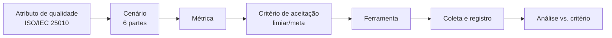

# 5 Planejamento experimental e plano de métricas

Esta seção operacionaliza a avaliação técnica, atendendo aos objetivos específicos 4 a 8. Para cada atributo de qualidade da ISO/IEC 25010 (2011) considerado relevante, define-se um conjunto de cenários, métricas, critérios de aceitação e ferramentas. Os critérios são expressos como **metas/limiares planejados**; nenhum valor apresentado nesta seção corresponde a medição já realizada (ver Seção 7 e nota final).

## 5.1 Visão geral do procedimento de medição

Cada execução de medição registra: ferramenta e versão, ambiente, configuração, data, valor obtido e veredito (atende / não atende ao critério). A reprodutibilidade é assegurada pela fixação de ambiente e parâmetros, conforme a etapa 5 da metodologia (Seção 3.3).

## 5.2 Mapeamento atributo → cenário → métrica → critério → ferramenta

> Os valores na coluna **Critério (meta)** são alvos de planejamento, a serem confirmados/calibrados na execução. Não representam resultados medidos.

### 5.2.1 Segurança

| Cenário | Métrica | Critério (meta) | Ferramenta |
|---------|---------|-----------------|------------|
| Usuário tenta ler/alterar dados de outro usuário (booking, perfil, serviço) | Nº de acessos indevidos bem-sucedidos | 0 acessos indevidos | Testes de política RLS + OWASP ZAP |
| Cliente tenta avaliar serviço sem booking concluído | Nº de inserções de review indevidas | 0 inserções | Teste de integração contra a API |
| Usuário tenta alterar o próprio `user_type` (escalonamento) | Tentativa bloqueada (sim/não) | 100% bloqueadas | Teste de integração + verificação do *trigger* |
| Varredura de vulnerabilidades da aplicação web | Nº de vulnerabilidades por severidade | 0 de severidade alta/crítica | OWASP ZAP |
| Vulnerabilidades em dependências | Nº de CVEs por severidade | 0 de severidade alta/crítica não tratadas | Snyk |
| Exposição de PII a usuário anônimo **e a usuário autenticado não relacionado** | Campos sensíveis expostos (`email`, `phone`) | 0 campos expostos a ambos os perfis de acesso | Teste de política RLS + inspeção da *view* `public_profiles` + ZAP |

> **Nota de refinamento do cenário de exposição de PII.** Em sua formulação inicial, este cenário considerava apenas o acesso **anônimo**. A inspeção das políticas vigentes evidenciou que a política de leitura de `profiles` admite qualquer usuário autenticado (`USING (auth.uid() IS NOT NULL)`), de modo que o cenário restrito ao anônimo seria satisfeito sem exercitar o perfil de acesso mais permissivo efetivamente existente. O cenário foi, por isso, ampliado para contemplar também o **usuário autenticado não relacionado ao perfil consultado**. Registra-se o ajuste por transparência metodológica: a formulação de cenários é atividade sujeita a refinamento à luz da arquitetura concreta sob avaliação, e um cenário incapaz de reprovar o sistema não constitui instrumento de medição.

### 5.2.2 Eficiência de desempenho

| Cenário | Métrica | Critério (meta) | Ferramenta |
|---------|---------|-----------------|------------|
| Carregamento inicial da SPA | *Performance score*; LCP; TBT | Score ≥ 90; LCP ≤ 2,5 s | Lighthouse |
| Listagem/busca de serviços sob carga | Tempo de resposta (p95); vazão (req/s); taxa de erro | p95 ≤ limiar definido; erro < 1% | k6 |
| Operações de booking sob carga concorrente | Latência (p95); taxa de erro | p95 ≤ limiar definido; erro < 1% | k6 / JMeter |
| Comportamento sob carga sustentada | Estabilidade de latência e erros ao longo do tempo | Sem degradação progressiva | JMeter |

### 5.2.3 Testabilidade (subcaracterística de manutenibilidade)

| Cenário | Métrica | Critério (meta) | Ferramenta |
|---------|---------|-----------------|------------|
| Cobertura da suíte de testes | Cobertura de linhas/ramos (%) | Meta de cobertura a definir (ex.: ≥ 70% nos módulos críticos) | Vitest (coverage) |
| Isolamento de componentes em teste | Nº de componentes testáveis sem dependências externas reais (uso de *mocks*) | Fluxos críticos cobertos por teste isolado | Vitest + React Testing Library |
| Esforço de criação de teste por fluxo crítico | Existência de teste para cada fluxo crítico (auth, booking, review) | 100% dos fluxos críticos com ao menos um teste | Vitest + RTL |

### 5.2.4 Manutenibilidade

| Cenário | Métrica | Critério (meta) | Ferramenta |
|---------|---------|-----------------|------------|
| Conformidade de estilo e antipadrões | Nº de violações de *lint* | Tendência a 0; sem erros | ESLint |
| Complexidade e *code smells* | Complexidade ciclomática; densidade de *code smells*; dívida técnica | Dentro de limiares de *quality gate* | SonarQube |
| Duplicação de código | % de linhas duplicadas | Abaixo de limiar (ex.: ≤ 3%) | SonarQube |
| Modularização e acoplamento | Nº de dependências circulares; grafo de dependências | 0 ciclos | Madge / dependency-cruiser |

### 5.2.5 Confiabilidade

| Cenário | Métrica | Critério (meta) | Ferramenta |
|---------|---------|-----------------|------------|
| Consistência da máquina de estados do booking | Nº de transições inválidas aceitas | 0 transições inválidas | Teste de integração do *trigger* |
| Integridade referencial em exclusões em cascata | Nº de registros órfãos após exclusão | 0 órfãos | Teste de integração |
| Fluxos críticos ponta a ponta (auth → booking → review) | Taxa de sucesso dos fluxos | 100% nos casos válidos | Testes de integração |

## 5.3 Ferramentas: papel e instalação

| Categoria | Ferramenta | Já presente no repo? | Observação |
|-----------|-----------|----------------------|------------|
| Teste automatizado | Vitest, React Testing Library | **Sim** | Configurados; *baseline* descrito na Seção 7 |
| Análise estática | ESLint | **Sim** (*flat config*, ESLint 9) | A complementar com regras de qualidade |
| Análise estática | SonarQube | Não | A configurar (*quality gate*) |
| Dependências/modularização | Madge, dependency-cruiser | Não | A configurar |
| Desempenho | Lighthouse | Não | Execução sobre o *build* de produção |
| Desempenho/carga | k6, JMeter | Não | Cenários de carga contra a API |
| Segurança | OWASP ZAP | Não | Varredura *dynamic* (DAST) |
| Segurança | Snyk | Não | Análise de dependências (SCA) |

## 5.4 Ambiente experimental e ameaças à validade

- **Ambiente:** os testes de desempenho devem usar o *build* de produção (`vite build`), e as medições de segurança/RLS devem ocorrer contra uma instância Supabase de teste, evitando dados reais de produção.
- **Ameaças à validade:** variabilidade de rede e do plano de serviço gerenciado (validade externa); dependência da configuração do ambiente de carga (validade de conclusão); representatividade dos cenários frente ao uso real (validade de construção). Tais ameaças serão mitigadas pela repetição das medições, pela fixação de parâmetros e pelo registro das condições de cada execução.

> **Importante (regra anti-fabricação).** Esta seção define **o que** e **como** medir. Os resultados quantitativos serão obtidos na fase de execução (agosto de 2026 — Seção 8) e somente então preencherão a seção de resultados finais. Nenhum número aqui constitui medição realizada.
