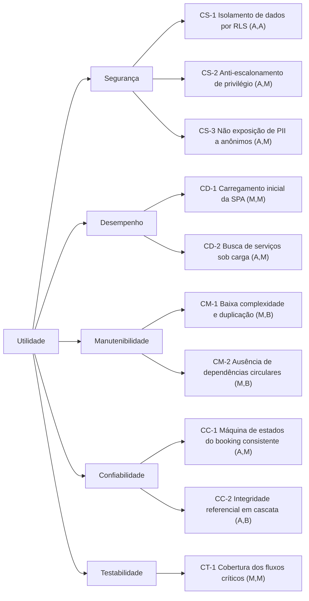

# 6 Plano de avaliação arquitetural (ATAM)

Esta seção apresenta o plano de aplicação do *Architecture Tradeoff Analysis Method* (ATAM) à arquitetura do Hubservi, conforme Clements, Kazman e Klein (2002). O ATAM complementa o plano de métricas (Seção 5): enquanto este coleta evidências quantitativas, o ATAM organiza a análise qualitativa das decisões arquiteturais, evidenciando riscos, pontos de sensibilidade e pontos de compromisso.

## 6.1 Etapas do ATAM aplicadas ao estudo de caso

O método é conduzido nas etapas a seguir, adaptadas ao contexto de um estudo de caso conduzido pela própria equipe técnica:

1. **Apresentação do ATAM** — alinhamento do método com os envolvidos.
2. **Apresentação dos direcionadores de negócio** — intermediação de serviços, confiança entre partes e proteção de dados pessoais.
3. **Apresentação da arquitetura** — conforme a Seção 4 (SPA + BaaS + Serverless).
4. **Identificação das abordagens arquiteturais** — delegação de *backend* ao BaaS; autorização declarativa por RLS; regras de negócio em *triggers*/*views*; estado de servidor gerenciado por React Query no cliente.
5. **Construção da árvore de utilidade** — Seção 6.2.
6. **Análise das abordagens arquiteturais** — Seção 6.4.
7. **Brainstorming e priorização de cenários** — refinamento dos cenários da árvore de utilidade.
8. **Reanálise das abordagens** — à luz dos cenários priorizados.
9. **Apresentação dos resultados** — riscos, *temas de risco* e *tradeoffs* consolidados (etapa a executar junto com a coleta de métricas).

## 6.2 Árvore de utilidade

A árvore decompõe a utilidade geral em atributos de qualidade, refinamentos e cenários, cada qual rotulado por um par **(Importância para o negócio, Risco arquitetural)** em escala Alto/Médio/Baixo — A/M/B.

## 6.3 Cenários de atributo de qualidade (formato de seis partes)

Os cenários prioritários são especificados segundo a estrutura de Bass, Clements e Kazman (2012): fonte, estímulo, artefato, ambiente, resposta e medida.

**CS-1 — Isolamento de dados por RLS**
- *Fonte:* usuário autenticado mal-intencionado. *Estímulo:* requisição para ler/alterar registros de outro usuário. *Artefato:* políticas RLS das tabelas `bookings`, `services`, `profiles`. *Ambiente:* operação normal. *Resposta:* a requisição é negada pelo banco. *Medida:* 0 acessos indevidos bem-sucedidos.

**CS-2 — Anti-escalonamento de privilégio**
- *Fonte:* usuário autenticado. *Estímulo:* tentativa de alterar o próprio `user_type`. *Artefato:* *trigger* `prevent_user_type_change()`. *Ambiente:* operação normal. *Resposta:* alteração rejeitada com exceção. *Medida:* 100% das tentativas bloqueadas.

**CS-3 — Não exposição de PII a anônimos**
- *Fonte:* visitante não autenticado. *Estímulo:* leitura de dados de perfil. *Artefato:* *view* `public_profiles` e RLS de `profiles`. *Ambiente:* operação normal. *Resposta:* apenas campos não sensíveis são retornados. *Medida:* 0 ocorrências de `email`/`phone` expostos.

**CD-2 — Busca de serviços sob carga**
- *Fonte:* conjunto de usuários concorrentes. *Estímulo:* requisições simultâneas de busca/listagem. *Artefato:* API PostgREST + *view* `service_stats`. *Ambiente:* carga de pico planejada. *Resposta:* respostas corretas dentro do tempo-alvo. *Medida:* p95 ≤ limiar definido; taxa de erro < 1%.

**CC-1 — Máquina de estados do booking consistente**
- *Fonte:* cliente ou prestador. *Estímulo:* tentativa de transição de status (válida ou inválida). *Artefato:* *trigger* `validate_booking_status_transition()`. *Ambiente:* operação normal. *Resposta:* transições válidas aplicadas; inválidas rejeitadas. *Medida:* 0 transições inválidas aceitas.

> Os demais cenários (CD-1, CM-1, CM-2, CC-2, CT-1) seguem a mesma estrutura e estão associados às métricas da Seção 5.

## 6.4 Pontos de sensibilidade, de compromisso e riscos (análise preliminar)

A análise a seguir é **preliminar e qualitativa**, derivada da inspeção arquitetural (Seção 4); será confirmada na execução do ATAM com apoio das métricas.

| Tipo | Descrição |
|------|-----------|
| **Ponto de sensibilidade** | A correção da segurança é altamente sensível à completude e exatidão das políticas de RLS e dos *triggers*: uma política ausente ou mal especificada compromete CS-1/CS-3 sem gerar erro funcional aparente. |
| **Ponto de sensibilidade** | O desempenho de CD-2 é sensível à eficiência da *view* `service_stats` e à indexação das tabelas consultadas. |
| **Ponto de compromisso** | A delegação total de autorização ao banco (RLS) favorece simplicidade e consistência (positivo para manutenibilidade e segurança), mas concentra o risco em um único mecanismo declarativo e desloca o esforço de teste para a fronteira cliente–banco (impacto em testabilidade). |
| **Ponto de compromisso** | A arquitetura SPA reduz acoplamento de *backend* e acelera o desenvolvimento, porém transfere carga de processamento e desempenho percebido para o cliente (tensão entre manutenibilidade/agilidade e desempenho — CD-1). |
| **Risco** | Ausência atual de ferramentas de análise estática avançada, desempenho e segurança configuradas (Seção 7), o que impede, no estágio atual, a verificação quantitativa dos atributos — mitigado pelo cronograma de execução (Seção 8). |
| **Não risco** | A imutabilidade do `user_type` e a validação de `provider_id` por *trigger* fornecem defesa em profundidade contra escalonamento e *spoofing* de prestador, reduzindo o risco de CS-2. |

## 6.5 Articulação com o plano de métricas

Cada cenário da árvore de utilidade vincula-se a uma ou mais métricas da Seção 5, de modo que a coleta quantitativa fornecerá a evidência para confirmar ou refutar a análise qualitativa do ATAM. Essa articulação entre ATAM (qualitativo) e ISO/IEC 25010 (quantitativo) constitui o procedimento de avaliação proposto como contribuição do trabalho.
