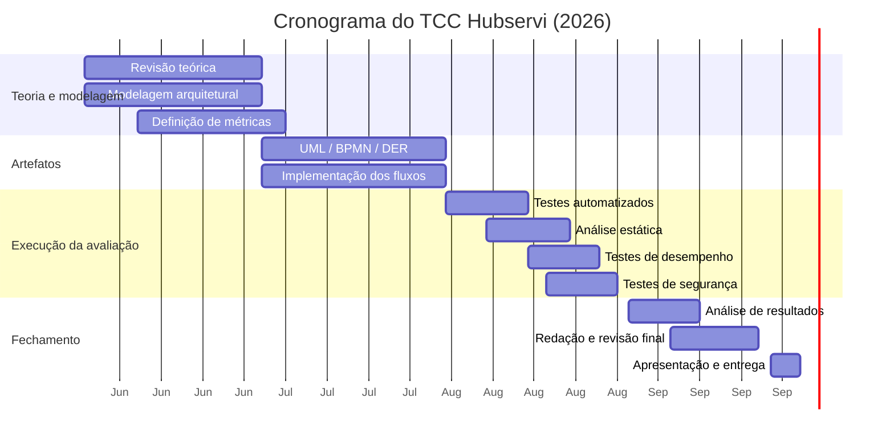

# 8 Cronograma

O trabalho está organizado em quatro etapas mensais, com entrega final prevista para **setembro de 2026**.

| Mês (2026) | Atividades | Objetivos específicos | Situação |
|------------|-----------|------------------------|----------|
| **Junho** | Revisão teórica; modelagem arquitetural; definição de métricas | OE1, OE2, OE3, OE4 | Em consolidação |
| **Julho** | Consolidação dos modelos UML; BPMN; DER; implementação/ajuste dos fluxos | OE2, OE3 | Planejado |
| **Agosto** | Execução de testes automatizados; análise estática; testes de desempenho; testes de segurança | OE5, OE6, OE7, OE8 | Planejado |
| **Setembro** | Análise dos resultados; redação final; revisão; apresentação; entrega | OE9 | Planejado |

> **Marco crítico:** a coleta de resultados quantitativos ocorre em **agosto de 2026**; até lá, o trabalho reporta planejamento e *baseline* (Seções 5 e 7), sem números de avaliação medidos.
