<!-- Documento consolidado gerado a partir dos arquivos de docs/tcc/. Para editar, prefira os arquivos-fonte individuais e regenerar este consolidado. -->

# Elementos pré-textuais

## Título

**Avaliação Técnica de uma Arquitetura Web baseada em BaaS/Serverless para Intermediação de Serviços**

**Subtítulo:** um estudo de caso da plataforma Hubservi

---

## Resumo

Arquiteturas web fundamentadas em *Backend as a Service* (BaaS) e em computação *serverless* têm sido amplamente adotadas no desenvolvimento de aplicações, por reduzirem o esforço de implementação e operação da infraestrutura de *backend*. Entretanto, equipes de desenvolvimento enfrentam dificuldade em validar tecnicamente se essas arquiteturas atendem aos atributos de qualidade esperados, como segurança, desempenho, testabilidade e manutenibilidade. Este trabalho tem como objetivo avaliar tecnicamente a arquitetura de software da plataforma Hubservi — uma aplicação web de intermediação de serviços construída como *Single Page Application* (SPA) em React e TypeScript, apoiada pelo BaaS Supabase sobre PostgreSQL —, utilizando métricas e testes de Engenharia de Software relacionados a segurança, desempenho, testabilidade, manutenibilidade e confiabilidade, à luz da norma ISO/IEC 25010. A pesquisa caracteriza-se como aplicada, de abordagem mista, com objetivos exploratórios e descritivos, conduzida por meio de estudo de caso combinado a experimento técnico. Como contribuição, propõe-se um procedimento de avaliação arquitetural que articula a norma ISO/IEC 25010, o método ATAM (*Architecture Tradeoff Analysis Method*) e um conjunto de ferramentas de teste automatizado, análise estática, desempenho e segurança. Este artigo apresenta os resultados parciais consolidados — a definição do problema, a modelagem da arquitetura real e o planejamento experimental —, enquanto a execução das medições e a análise dos resultados constituem etapas subsequentes do cronograma.

**Palavras-chave:** Arquitetura de software. Avaliação arquitetural. ISO/IEC 25010. Backend as a Service. Serverless.

---

## Abstract

Web architectures based on *Backend as a Service* (BaaS) and *serverless* computing have been widely adopted in application development, as they reduce the effort of implementing and operating backend infrastructure. However, development teams struggle to technically validate whether such architectures meet the expected quality attributes, such as security, performance, testability, and maintainability. This work aims to technically evaluate the software architecture of the Hubservi platform — a web application for service intermediation built as a *Single Page Application* (SPA) using React and TypeScript, supported by the Supabase BaaS over PostgreSQL —, using Software Engineering metrics and tests related to security, performance, testability, maintainability, and reliability, in light of the ISO/IEC 25010 standard. The research is characterized as applied, with a mixed approach and exploratory and descriptive objectives, conducted through a case study combined with a technical experiment. As a contribution, it proposes an architectural evaluation procedure that articulates the ISO/IEC 25010 standard, the ATAM (*Architecture Tradeoff Analysis Method*), and a set of tools for automated testing, static analysis, performance, and security. This article presents the consolidated partial results — the problem definition, the modeling of the actual architecture, and the experimental planning —, while the execution of measurements and the analysis of results constitute subsequent stages of the schedule.

**Keywords:** Software architecture. Architectural evaluation. ISO/IEC 25010. Backend as a Service. Serverless.

---

# 1 Introdução

## 1.1 Contexto

A intermediação de serviços — atividade que conecta pessoas que demandam um serviço a profissionais capazes de executá-lo — tem migrado progressivamente para plataformas digitais. Aplicações web nesse domínio precisam suportar cadastro e descoberta de serviços, solicitação e gerenciamento de atendimentos e avaliação reputacional, com requisitos não triviais de segurança, desempenho e confiabilidade, uma vez que manipulam dados pessoais e transações entre partes que, em geral, não se conhecem previamente.

Em paralelo, o modelo de desenvolvimento de aplicações web tem sido reconfigurado pela popularização de arquiteturas baseadas em *Backend as a Service* (BaaS) e em computação *serverless*. Nesses modelos, responsabilidades tradicionalmente implementadas em servidores próprios — autenticação, persistência, autorização e regras de acesso — são delegadas a serviços gerenciados por terceiros, acessados diretamente pelo cliente por meio de APIs e bibliotecas. Plataformas como o Supabase materializam esse paradigma ao expor, sobre um banco PostgreSQL, autenticação integrada e autorização declarativa via *Row Level Security* (RLS), eliminando boa parte da camada de servidor de aplicação convencional.

A plataforma Hubservi, objeto deste estudo, é uma aplicação web de intermediação de serviços construída como *Single Page Application* (SPA) em React e TypeScript, apoiada pelo Supabase. Trata-se, portanto, de um caso representativo da arquitetura **SPA + BaaS + Serverless**, na qual a lógica de negócio se distribui entre o cliente (validações, fluxos de interface e orquestração de chamadas) e o banco de dados (regras declarativas de autorização, *triggers* e *views*).

## 1.2 Problema de pesquisa

A adoção de arquiteturas BaaS/Serverless reduz o esforço de implementação e operação de infraestrutura, mas desloca atributos de qualidade críticos — em especial a segurança e a confiabilidade — para configurações declarativas (políticas de RLS, *triggers*, restrições de integridade) e para a fronteira cliente–serviço gerenciado. Esse deslocamento dificulta a verificação de que a arquitetura efetivamente atende aos atributos de qualidade esperados: a ausência de uma camada de servidor de aplicação própria altera o que deve ser testado, onde residem os pontos de falha e como o desempenho e a manutenibilidade devem ser medidos.

Formaliza-se, assim, o problema de pesquisa:

> Equipes de desenvolvimento de aplicações web têm dificuldade em validar tecnicamente se uma arquitetura baseada em *Backend as a Service* (BaaS) e *Serverless* atende aos atributos de qualidade esperados, como segurança, desempenho, testabilidade e manutenibilidade.

## 1.3 Questão de pesquisa

Decorre do problema a seguinte questão de pesquisa:

> Como avaliar tecnicamente uma arquitetura web baseada em BaaS/Serverless por meio de métricas e testes de Engenharia de Software, considerando atributos de qualidade em uma plataforma de intermediação de serviços?

## 1.4 Objetivos

### 1.4.1 Objetivo geral

Avaliar tecnicamente a arquitetura de software da plataforma Hubservi, baseada em React, TypeScript, Supabase e PostgreSQL, utilizando métricas e testes relacionados à segurança, ao desempenho, à testabilidade e à manutenibilidade.

### 1.4.2 Objetivos específicos

1. Identificar os requisitos arquiteturais e os atributos de qualidade relevantes para a plataforma.
2. Modelar a arquitetura da plataforma.
3. Documentar os componentes, fluxos, persistência e regras de negócio.
4. Definir cenários de avaliação arquitetural.
5. Executar testes automatizados.
6. Executar análise estática de código.
7. Executar testes de segurança.
8. Executar testes de desempenho.
9. Analisar os resultados obtidos.

> **Nota de escopo deste artigo.** Os objetivos específicos 1 a 4 (delimitação, modelagem, documentação e definição de cenários) e os objetivos 5 a 9 (execução de testes automatizados, análise estática, testes de segurança e de desempenho, e análise) foram executados; os resultados são reportados na Seção 7 e derivam do registro reprodutível em `docs/tcc/medicoes/`.

## 1.5 Delimitação do escopo

**Objeto de pesquisa e instrumento.** O objeto deste trabalho é a **avaliação técnica** de uma arquitetura web baseada em BaaS/Serverless; a plataforma Hubservi é o **instrumento** por meio do qual essa avaliação se torna possível. A distinção é necessária porque o trabalho envolve dois produtos de naturezas distintas: um sistema de software, desenvolvido integralmente pela equipe, e um procedimento de avaliação, aplicado sobre esse sistema. Apenas o segundo constitui a contribuição científica pretendida. Conforme exposto na Seção 1.6, a lacuna identificada é de ordem metodológica — não é evidente *como* aplicar métricas e testes de Engenharia de Software para validar atributos de qualidade em um arranjo no qual autorização e integridade migram para o banco de dados. O que se oferece como contribuição, portanto, é um roteiro de avaliação reprodutível e transferível a outras aplicações que adotem o mesmo paradigma, e não a plataforma em si.

**Justificativa do desenvolvimento do sistema.** A construção do Hubservi não constitui objetivo do trabalho, mas **pré-requisito metodológico** dele. Avaliar políticas de RLS, *triggers*, restrições de integridade e a fronteira entre cliente e serviço gerenciado exige acesso irrestrito ao código-fonte, ao esquema do banco de dados, às configurações de autorização e ao ambiente de execução — condições inviáveis de obter sobre uma plataforma de terceiros, cujo código e cuja base de dados não são acessíveis ao pesquisador. O desenvolvimento próprio é o que assegura a validade interna do experimento: permite controlar as variáveis do ambiente, reproduzir as medições sobre um estado conhecido e conduzir o ciclo de detecção e correção de defeitos sem restrições de acesso. Os quatro fluxos críticos implementados — autenticação, cadastro e busca de serviços, contratação (*booking*) e avaliação (*review*), descritos na Seção 4 — constituem a superfície sobre a qual os cenários de avaliação da Seção 5 são exercitados.

**Delimitação negativa.** Não integram o escopo deste trabalho: (i) a avaliação de **usabilidade e acessibilidade**, por estarem fora das quatro características da ISO/IEC 25010 (2011) selecionadas como relevantes para o problema de pesquisa — segurança, eficiência de desempenho, manutenibilidade e confiabilidade —, ainda que constem como requisitos não funcionais do produto; (ii) o **módulo de recomendação**, que permanece secundário e limitado à ordenação de resultados por popularidade e avaliação média, não sendo objeto de avaliação; (iii) arquiteturas de **microsserviços**, uma vez que o sistema avaliado adota o modelo SPA + BaaS + Serverless, sem camada de servidor de aplicação própria; e (iv) testes **fim a fim conduzidos por ferramenta dedicada de automação de navegador**, dado que, em uma arquitetura BaaS, a superfície de integração relevante é a própria API do serviço gerenciado — os fluxos ponta a ponta são, por essa razão, verificados por testes de integração executados contra a API, conforme a Seção 5.

## 1.6 Justificativa

A literatura de arquitetura de software dispõe de métodos consolidados de avaliação — notadamente o ATAM (*Architecture Tradeoff Analysis Method*), de Clements, Kazman e Klein (2002) — e de modelos de qualidade reconhecidos, como o estabelecido pela norma ISO/IEC 25010 (2011). Tais referenciais, contudo, foram concebidos predominantemente sob o pressuposto de arquiteturas com camada de servidor de aplicação explícita. A crescente adoção de arquiteturas BaaS/Serverless, nas quais responsabilidades de autorização e integridade migram para o banco de dados e para serviços gerenciados, cria uma lacuna prática: não é evidente *como* aplicar métricas e testes de Engenharia de Software para validar tecnicamente esses atributos de qualidade nesse novo arranjo.

Justifica-se, portanto, conduzir um estudo de caso que (i) modele e documente rigorosamente uma arquitetura BaaS/Serverless real, (ii) defina cenários e métricas de avaliação alinhados aos atributos de qualidade da ISO/IEC 25010, e (iii) organize um procedimento reprodutível de avaliação. A contribuição é tanto prática — para a equipe da plataforma Hubservi — quanto metodológica, ao oferecer um roteiro de avaliação técnica transferível a outras aplicações que adotem o mesmo paradigma.

## 1.7 Organização do artigo

O restante do artigo está organizado da seguinte forma. A Seção 2 apresenta o referencial teórico sobre arquitetura de software, avaliação arquitetural, qualidade de software e arquiteturas BaaS/Serverless. A Seção 3 descreve a metodologia adotada. A Seção 4 documenta a arquitetura da plataforma Hubservi. A Seção 5 detalha o planejamento experimental e o plano de métricas. A Seção 6 apresenta o plano de avaliação arquitetural com base no ATAM. A Seção 7 consolida os resultados parciais. A Seção 8 expõe o cronograma. Por fim, são listadas as referências.

---

# 2 Referencial teórico

Esta seção fundamenta teoricamente o trabalho em quatro eixos: (i) arquitetura de software e atributos de qualidade; (ii) avaliação arquitetural e o método ATAM; (iii) qualidade de software segundo a ISO/IEC 25010; e (iv) o paradigma de arquiteturas BaaS/Serverless. Encerra com a contribuição da Engenharia de Software no que tange a testes e análise estática.

## 2.1 Arquitetura de software e atributos de qualidade

A arquitetura de software de um sistema é definida por Bass, Clements e Kazman (2012) como o conjunto de estruturas necessárias para raciocinar sobre o sistema, compreendendo elementos de software, as relações entre eles e as propriedades de ambos. Para os autores, a arquitetura é o artefato que viabiliza ou inibe os atributos de qualidade do sistema: decisões arquiteturais — e não primariamente decisões de implementação — determinam o grau em que requisitos como desempenho, segurança e modificabilidade serão satisfeitos.

Bass, Clements e Kazman (2012) distinguem requisitos funcionais, que expressam *o que* o sistema deve fazer, dos *requisitos de atributos de qualidade*, que expressam *quão bem* o sistema deve fazê-lo. Esses requisitos são expressos por meio de **cenários de atributos de qualidade**, estruturados em seis partes: fonte do estímulo, estímulo, artefato, ambiente, resposta e medida da resposta. Tal estrutura é central para este trabalho, pois fornece o formato pelo qual os atributos avaliados na plataforma Hubservi serão operacionalizados como cenários verificáveis (Seções 5 e 6).

Os autores também introduzem o conceito de **táticas** — decisões de projeto que influenciam o controle de um atributo de qualidade — e de **ASR** (*Architecturally Significant Requirements*), os requisitos cuja satisfação depende de decisões arquiteturais. No contexto de uma arquitetura BaaS/Serverless, táticas de segurança como *autenticar atores* e *autorizar atores* materializam-se em mecanismos declarativos (autenticação gerenciada e políticas de RLS), o que justifica avaliá-las de forma específica.

## 2.2 Avaliação arquitetural e o método ATAM

Clements, Kazman e Klein (2002), em *Evaluating Software Architectures*, argumentam que a arquitetura, por ser o primeiro artefato em que os atributos de qualidade do sistema se tornam analisáveis, pode e deve ser avaliada antes de a construção avançar, reduzindo o risco de retrabalho. Os autores propõem o **ATAM** (*Architecture Tradeoff Analysis Method*), método de avaliação baseado em cenários cujo objetivo não é fornecer notas precisas, mas identificar **riscos**, **pontos de sensibilidade** (*sensitivity points*) e **pontos de compromisso** (*tradeoff points*) decorrentes das decisões arquiteturais.

O ATAM organiza-se em torno de uma **árvore de utilidade** (*utility tree*), que decompõe a "utilidade" geral do sistema em atributos de qualidade, estes em refinamentos, e estes, por fim, em cenários priorizados segundo a importância para o negócio e o grau de risco arquitetural. Os principais conceitos do método, mobilizados na Seção 6, são:

- **Ponto de sensibilidade:** propriedade de um ou mais componentes da arquitetura que é crítica para se alcançar uma resposta de atributo de qualidade.
- **Ponto de compromisso:** propriedade que é ponto de sensibilidade para mais de um atributo, de modo que melhorá-la para um atributo pode degradar outro.
- **Risco e não risco:** decisões arquiteturais com consequências potencialmente negativas (ou explicitamente seguras) para os atributos de qualidade.

O método é especialmente adequado a este trabalho por ser orientado a cenários e por focalizar *tradeoffs*, dimensão central em arquiteturas BaaS/Serverless, nas quais a delegação de responsabilidades a serviços gerenciados implica compromissos explícitos entre simplicidade, controle, desempenho e segurança.

## 2.3 Qualidade de software e a norma ISO/IEC 25010

A norma ISO/IEC 25010 (2011), parte da família SQuaRE (*Systems and software Quality Requirements and Evaluation*), define um **modelo de qualidade do produto de software** composto por oito características, cada qual subdividida em subcaracterísticas. As características são: adequação funcional, eficiência de desempenho, compatibilidade, usabilidade, confiabilidade, segurança, manutenibilidade e portabilidade.

Para o escopo deste trabalho, são mobilizadas as seguintes características e subcaracterísticas:

- **Segurança** (*security*): confidencialidade, integridade, não repúdio, responsabilização (*accountability*) e autenticidade. Avaliada por meio de autenticação, autorização e controle de acesso indevido.
- **Eficiência de desempenho** (*performance efficiency*): comportamento temporal, utilização de recursos e capacidade. Avaliada por tempo de resposta, tempo de carregamento e comportamento sob carga.
- **Manutenibilidade** (*maintainability*): modularidade, reusabilidade, analisabilidade, modificabilidade e **testabilidade**. Cabe registrar que, na ISO/IEC 25010 (2011), a *testabilidade* é uma subcaracterística da manutenibilidade; neste trabalho ela é tratada como dimensão avaliativa destacada, em razão de sua centralidade para a verificação dos demais atributos.
- **Confiabilidade** (*reliability*): maturidade, disponibilidade, tolerância a falhas e recuperabilidade. Avaliada pela consistência de operações e pelo comportamento em fluxos críticos.

A norma fornece, assim, o vocabulário e a taxonomia que estruturam o plano de métricas (Seção 5), garantindo rastreabilidade entre cada métrica coletada e a característica de qualidade que ela pretende evidenciar.

## 2.4 Arquiteturas BaaS e Serverless

O termo *serverless* designa um modelo de execução no qual a provisão, o escalonamento e a manutenção de servidores são abstraídos e delegados a um provedor, de modo que a equipe de desenvolvimento concentra-se na lógica da aplicação. Uma de suas manifestações é o *Backend as a Service* (BaaS), no qual funcionalidades de *backend* comumente necessárias — autenticação, banco de dados, armazenamento de arquivos e autorização — são oferecidas como serviços gerenciados, consumidos diretamente pelo cliente por meio de SDKs e APIs.

Nesse arranjo, parte significativa das regras de negócio e, sobretudo, das regras de autorização desloca-se para a camada de dados. No caso do Supabase, isso se concretiza por meio do *Row Level Security* (RLS) do PostgreSQL, mecanismo que permite definir, de forma **declarativa**, políticas que restringem quais linhas cada usuário pode ler ou modificar, avaliadas pelo próprio banco a cada operação. Complementam o modelo as *views* (que expõem projeções controladas dos dados) e os *triggers* (que aplicam regras de integridade e máquinas de estado no servidor).

Do ponto de vista arquitetural, esse paradigma apresenta implicações relevantes para a avaliação de qualidade:

- A **superfície de autorização** concentra-se em políticas declarativas, cuja correção precisa ser testada explicitamente, pois falhas de RLS podem expor dados sem que haja erro funcional aparente no cliente.
- A **ausência de servidor de aplicação próprio** transfere parte do desempenho percebido para o cliente (carregamento da SPA) e para a latência das chamadas ao serviço gerenciado.
- A **testabilidade** passa a depender da capacidade de testar tanto o cliente quanto as regras residentes no banco.

Essas implicações motivam a necessidade, identificada no problema de pesquisa, de um procedimento de avaliação técnica específico para arquiteturas BaaS/Serverless.

## 2.5 Engenharia de software: testes e análise estática

Pressman e Maxim (2016) sistematizam o teste de software como atividade planejada e mensurável, distinguindo níveis (unidade, integração, sistema) e abordagens (caixa-branca e caixa-preta), e enfatizam o papel das métricas de software na avaliação objetiva da qualidade de produto e de processo. Sommerville (2011), por sua vez, situa a verificação e a validação, a análise estática e a inspeção de código como práticas complementares ao teste dinâmico, destacando que a análise estática permite detectar classes de defeitos — e indicadores de manutenibilidade, como complexidade e duplicação — sem a execução do programa.

Esses referenciais embasam a escolha das ferramentas e métricas do plano experimental (Seção 5): testes automatizados (de unidade e de integração) para adequação funcional, confiabilidade e testabilidade; análise estática para manutenibilidade; e técnicas específicas para os atributos de segurança e desempenho.

---

# 3 Metodologia

## 3.1 Classificação da pesquisa

A pesquisa é classificada segundo quatro dimensões usuais na metodologia científica: natureza, abordagem, objetivos e procedimentos técnicos.

| Dimensão | Classificação | Justificativa |
|----------|---------------|---------------|
| **Natureza** | Aplicada | Visa gerar conhecimento de aplicação prática — um procedimento de avaliação técnica — dirigido à solução de um problema concreto de validação arquitetural. |
| **Abordagem** | Mista (quantitativa e qualitativa) | Combina a coleta de métricas objetivas (cobertura, tempos de resposta, complexidade, vulnerabilidades) com a análise qualitativa de decisões arquiteturais via ATAM. |
| **Objetivos** | Exploratória e descritiva | Explora a aplicação de métodos de avaliação a um paradigma arquitetural pouco coberto pela literatura clássica (BaaS/Serverless) e descreve detalhadamente a arquitetura e os resultados da avaliação. |
| **Procedimentos** | Estudo de caso com experimento técnico | Investiga em profundidade um caso real (Hubservi) e conduz um experimento técnico controlado de coleta de métricas e execução de testes. |

## 3.2 Objeto de estudo

O objeto de estudo é a plataforma **Hubservi**, aplicação web de intermediação de serviços construída como SPA em React e TypeScript e apoiada pelo BaaS Supabase sobre PostgreSQL. A escolha justifica-se por ser um caso representativo do paradigma SPA + BaaS + Serverless, com regras de negócio expressivas residentes no banco (políticas de RLS, *triggers* e *views*), o que a torna adequada à investigação do problema de pesquisa. A arquitetura do objeto é detalhada na Seção 4.

## 3.3 Etapas metodológicas

A condução do trabalho organiza-se em seis etapas, alinhadas aos objetivos específicos (Seção 1.4.2):

1. **Levantamento de requisitos arquiteturais e atributos de qualidade.** Identificação dos *Architecturally Significant Requirements* (ASR) e seleção das características de qualidade da ISO/IEC 25010 (2011) relevantes ao domínio: segurança, eficiência de desempenho, manutenibilidade (com ênfase em testabilidade) e confiabilidade.

2. **Modelagem da arquitetura.** Recuperação e representação da arquitetura real a partir do código-fonte e das *migrations*, produzindo modelos UML (casos de uso, classes, sequência, componentes e implantação), modelo de processos de negócio (BPMN) e o modelo de dados (DER e dicionário de dados). Os artefatos encontram-se em `docs/tcc/diagramas/`.

3. **Documentação técnica.** Descrição dos componentes, fluxos, persistência e regras de negócio (Seção 4), assegurando rastreabilidade entre cada afirmação e sua fonte no repositório.

4. **Definição de cenários de avaliação.** Construção de uma árvore de utilidade ATAM e especificação de cenários de atributo de qualidade no formato de seis partes (Seção 6), além do mapeamento atributo → cenário → métrica → critério → ferramenta (Seção 5).

5. **Execução da avaliação técnica.** *(Etapa planejada — Seção 8.)* Execução de testes automatizados, análise estática de código, testes de segurança e testes de desempenho, conforme o plano de métricas.

6. **Análise dos resultados.** *(Etapa planejada — Seção 8.)* Interpretação das métricas coletadas à luz dos critérios definidos e dos *tradeoffs* identificados no ATAM, com discussão dos achados e recomendações.

## 3.4 Instrumentos e ferramentas

A coleta de dados apoia-se em um conjunto de ferramentas, organizado por atributo de qualidade e detalhado na Seção 5:

- **Testes automatizados:** Vitest e React Testing Library.
- **Análise estática:** ESLint e SonarQube.
- **Análise de dependências e modularização:** Madge e dependency-cruiser.
- **Desempenho:** Lighthouse, k6 e JMeter.
- **Segurança:** OWASP ZAP e Snyk.

## 3.5 Procedimentos de análise

As métricas quantitativas serão confrontadas com os critérios de aceitação previamente definidos (limiares e metas), e os achados qualitativos serão organizados segundo os conceitos do ATAM (riscos, pontos de sensibilidade e pontos de compromisso). A triangulação entre as evidências quantitativas e a análise arquitetural qualitativa sustenta a resposta à questão de pesquisa.

> **Observação sobre o estágio atual.** Em conformidade com o cronograma (Seção 8), este artigo reporta os produtos das etapas 1 a 4. As etapas 5 e 6 — que produzem os resultados quantitativos — estão planejadas e ainda não foram executadas; consequentemente, nenhum valor de métrica medido é apresentado, apenas o *baseline* já existente no repositório e as metas de avaliação (Seções 5 e 7).

---

# 4 Arquitetura do Hubservi

Esta seção documenta a arquitetura real da plataforma Hubservi, recuperada a partir do código-fonte (`src/`) e das *migrations* do banco de dados (`supabase/migrations/`). A descrição responde aos objetivos específicos 2 e 3 (modelar e documentar componentes, fluxos, persistência e regras de negócio).

## 4.1 Visão geral e estilo arquitetural

O Hubservi adota o estilo **SPA + BaaS + Serverless**. Um *Single Page Application* (SPA) executado no navegador concentra a interface e a orquestração da lógica de aplicação e comunica-se diretamente com o BaaS Supabase, que provê autenticação, banco de dados PostgreSQL e autorização declarativa via *Row Level Security* (RLS). Não há, portanto, servidor de aplicação intermediário desenvolvido sob medida, tampouco decomposição em microsserviços: as responsabilidades de *backend* são delegadas a serviços gerenciados, e parte expressiva das regras de negócio reside no próprio banco, sob a forma de *triggers*, *views* e políticas de RLS.

A arquitetura organiza-se em camadas lógicas:

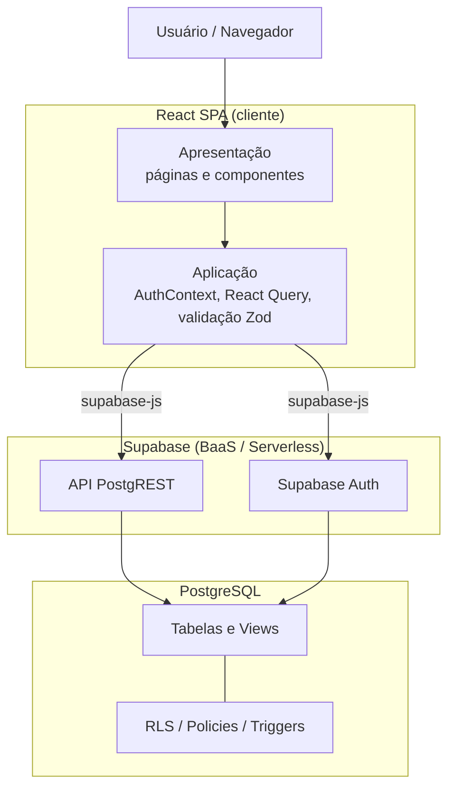

| Camada | Responsabilidade | Elementos no repositório |
|--------|------------------|--------------------------|
| Apresentação | Renderização, navegação e interação | `src/pages/*`, `src/components/*`, `src/components/ui/*` |
| Aplicação | Sessão, estado de servidor, regras de fluxo e validação | `src/contexts/AuthContext.tsx`, React Query, esquemas Zod |
| Integração | Acesso ao BaaS | `src/integrations/supabase/{client,views,types}.ts` |
| Dados | Persistência e regras declarativas | `supabase/migrations/*` (PostgreSQL) |

> Diagramas detalhados: [componentes](diagramas/componentes.md) e [implantação](diagramas/implantacao.md).

## 4.2 Tecnologias

| Camada | Tecnologia | Versão |
|--------|-----------|--------|
| Biblioteca de UI | React | 18.3.1 |
| Linguagem | TypeScript | 5.8.3 |
| Empacotador/_build_ | Vite | 5.4.19 |
| Roteamento | React Router DOM | 6.30.1 |
| Estado de servidor | TanStack React Query | 5.83.0 |
| Formulários e validação | react-hook-form 7.61 + Zod 3.25 | — |
| Componentes de UI | shadcn/ui (Radix UI) + Tailwind CSS | 3.4.17 |
| Cliente BaaS | @supabase/supabase-js | 2.98.0 |
| Banco de dados | PostgreSQL (gerenciado pelo Supabase) | — |

## 4.3 Componentes e rotas

A aplicação define as seguintes rotas (`src/App.tsx`):

| Rota | Página | Acesso |
|------|--------|--------|
| `/` | `Index.tsx` — *landing page* | Público |
| `/auth` | `Auth.tsx` — login e cadastro | Público |
| `/services` | `Services.tsx` — busca e listagem | Público |
| `/services/:id` | `ServiceDetail.tsx` — detalhe, avaliações e solicitação | Público |
| `/dashboard` | `Dashboard.tsx` — painel por perfil | Protegido |
| `*` | `NotFound.tsx` — 404 | Público |

O acesso à rota protegida é controlado pelo componente `ProtectedRoute.tsx`, que redireciona usuários sem sessão para `/auth`. O `Dashboard.tsx` seleciona a interface conforme o tipo de usuário: `ClientDashboard` (cliente) ou `ProviderDashboard` (prestador). Provedores globais configurados na raiz incluem `QueryClientProvider` (cache e sincronização de dados), `AuthProvider` (sessão e perfil), `BrowserRouter` e provedores de *feedback* de interface.

> Diagramas detalhados: [casos de uso](diagramas/caso-de-uso.md) e [classes](diagramas/classes.md).

## 4.4 Modelo de dados

O esquema do banco compreende cinco tabelas, três tipos enumerados e duas *views*.

**Tabelas:** `profiles`, `categories`, `services`, `bookings`, `reviews`.

**Enumerações:**
- `user_type` ∈ {`client`, `provider`};
- `price_type` ∈ {`fixed`, `hourly`, `negotiable`};
- `booking_status` ∈ {`pending`, `accepted`, `completed`, `rejected`, `cancelled`}.

**Views:**
- `service_stats` — agrega, por serviço, a contagem de avaliações (`review_count`) e a média de notas (`average_rating`); definida com `security_invoker = true`.
- `public_profiles` — projeção de `profiles` sem dados pessoais sensíveis (expõe `id`, `full_name`, `avatar_url`, `user_type`, `created_at`; **omite** `email` e `phone`), utilizada para apresentar dados de perfil a usuários não autenticados.

As chaves estrangeiras estabelecem as relações: `services` referencia `profiles` (prestador) e `categories`; `bookings` referencia `services` e duas vezes `profiles` (cliente e prestador); `reviews` referencia `services` e `profiles` (cliente e prestador). A tabela `reviews` possui a restrição de unicidade `(service_id, client_id)`, garantindo no máximo uma avaliação por cliente por serviço.

> Modelos detalhados: [DER](diagramas/der.md) e [dicionário de dados](diagramas/dicionario-de-dados.md).

## 4.5 Fluxos principais

### 4.5.1 Autenticação
O cadastro (`Auth.tsx`) chama `supabase.auth.signUp`, fornecendo `full_name` e `user_type` em metadados. O *trigger* `on_auth_user_created` materializa, de forma idempotente, a linha correspondente em `profiles`. O `AuthContext` assina `onAuthStateChange` e carrega o perfil do usuário autenticado. Detalhe em [sequência — autenticação](diagramas/sequencia-autenticacao.md).

### 4.5.2 Cadastro e busca de serviços
Prestadores criam, editam e removem serviços pelo `ServiceForm` no `ProviderDashboard`, com validação Zod. A busca (`Services.tsx`) consulta serviços ativos (`is_active = true`), com filtro por categoria e por título, paginação e ordenação por **recência**, **avaliação** ou **popularidade** — estas duas últimas apoiadas na *view* `service_stats`. Cabe destacar que a *recomendação* de serviços, no Hubservi, resume-se a essa ordenação por popularidade/avaliação, constituindo módulo secundário e não o foco deste trabalho.

### 4.5.3 Contratação (booking)
A solicitação (`BookingDialog`) insere um registro em `bookings` com `status = 'pending'`. O cliente acompanha e pode cancelar solicitações pendentes; o prestador aceita, rejeita, conclui ou cancela. Detalhe em [sequência — contratação](diagramas/sequencia-contratacao.md) e [BPMN — contratação](diagramas/bpmn-contratacao.md).

### 4.5.4 Avaliação (review)
Concluído um booking, o cliente pode registrar uma avaliação (nota de 1 a 5 e comentário) pelo `ReviewForm`. Detalhe em [sequência — avaliação](diagramas/sequencia-avaliacao.md).

## 4.6 Regras de negócio residentes no banco

Boa parte das invariantes do domínio é imposta no servidor por *triggers* e restrições, e não apenas no cliente — característica marcante do paradigma BaaS:

| Regra | Mecanismo | Fonte |
|-------|-----------|-------|
| Provisão automática de perfil no cadastro | *trigger* `on_auth_user_created` → `handle_new_user()` (idempotente, `SECURITY DEFINER`) | migration inicial; `20260316201000` |
| `updated_at` atualizado a cada alteração | *trigger* `update_updated_at_column()` | migration inicial |
| Máquina de estados do booking | *trigger* `validate_booking_status_transition()` | migration inicial; `20260528000000` |
| Imutabilidade do `user_type` (anti-escalonamento de privilégio) | *trigger* `prevent_user_type_change()` | `20260514100000` |
| `booking.provider_id` deve coincidir com o dono do serviço | *trigger* `validate_booking_provider()` | `20260514100100` |
| `price_max ≥ price_min` | *constraint* `services_price_range_check` | `20260514100300` |
| Avaliação só após booking `completed` | política RLS de `INSERT` em `reviews` | `20260514100400` |
| Cliente pode cancelar booking pendente | política RLS + transição `pending → cancelled` | `20260528000000` |

A máquina de estados do booking admite as transições: `pending → {accepted, rejected, cancelled}` e `accepted → {completed, cancelled}`; transições inválidas resultam em exceção. Detalhe em [BPMN — gerenciamento de booking](diagramas/bpmn-gerenciamento-booking.md).

## 4.7 Segurança: autorização declarativa via RLS

Todas as tabelas têm RLS habilitado. A autorização é expressa por políticas declarativas avaliadas pelo PostgreSQL a cada operação. Resumo das políticas reais:

| Tabela | Operação | Política (resumo) |
|--------|----------|-------------------|
| `profiles` | SELECT/UPDATE/INSERT | usuário só acessa/edita o próprio perfil (`auth.uid() = id`); leitura de perfis de terceiros restrita a autenticados |
| `categories` | SELECT | leitura pública |
| `services` | SELECT | qualquer um vê serviços ativos; prestador vê os próprios (ativos ou não) |
| `services` | INSERT/UPDATE/DELETE | apenas o prestador dono (`auth.uid() = provider_id`) |
| `bookings` | SELECT | cliente vê os próprios; prestador vê os próprios |
| `bookings` | INSERT | apenas o cliente (`auth.uid() = client_id`) |
| `bookings` | UPDATE | prestador altera status; cliente pode cancelar apenas os próprios pendentes |
| `reviews` | SELECT | leitura pública |
| `reviews` | INSERT | cliente com booking `completed` no serviço |
| `reviews` | UPDATE/DELETE | apenas o autor (`auth.uid() = client_id`) |

A proteção de dados pessoais (e-mail e telefone) é reforçada pela restrição da leitura direta de `profiles` a usuários autenticados, combinada à *view* `public_profiles` para consumo anônimo. Esse arranjo — autorização concentrada em políticas declarativas — é precisamente o ponto que a avaliação de segurança (Seções 5 e 6) deverá exercitar de forma sistemática.

## 4.8 Síntese arquitetural

O Hubservi exemplifica os *tradeoffs* característicos do paradigma BaaS/Serverless: ganha-se simplicidade operacional e velocidade de desenvolvimento ao delegar autenticação, persistência e autorização a serviços gerenciados, ao custo de concentrar a correção da segurança em configurações declarativas e de transferir parte do desempenho percebido para o cliente e para a latência das chamadas ao serviço. Esses pontos orientam o planejamento experimental apresentado a seguir.

---

# 5 Planejamento experimental e plano de métricas

Esta seção operacionaliza a avaliação técnica, atendendo aos objetivos específicos 4 a 8. Para cada atributo de qualidade da ISO/IEC 25010 (2011) considerado relevante, define-se um conjunto de cenários, métricas, critérios de aceitação e ferramentas. Os critérios são expressos como **metas/limiares planejados**; nenhum valor apresentado nesta seção corresponde a medição já realizada (ver Seção 7 e nota final).

## 5.1 Visão geral do procedimento de medição

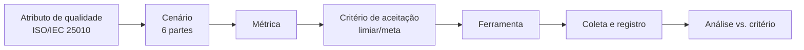

Cada execução de medição registra: ferramenta e versão, ambiente, configuração, data, valor obtido e veredito (atende / não atende ao critério). A reprodutibilidade é assegurada pela fixação de ambiente e parâmetros, conforme a etapa 5 da metodologia (Seção 3.3).

## 5.2 Mapeamento atributo → cenário → métrica → critério → ferramenta

> Os valores na coluna **Critério (meta)** são alvos de planejamento, a serem confirmados/calibrados na execução. Não representam resultados medidos.

### 5.2.1 Segurança

| Cenário | Métrica | Critério (meta) | Ferramenta |
|---------|---------|-----------------|------------|
| Usuário tenta ler/alterar dados de outro usuário (booking, perfil, serviço) | Nº de acessos indevidos bem-sucedidos | 0 acessos indevidos | Testes de política RLS + OWASP ZAP |
| Cliente tenta avaliar serviço sem booking concluído | Nº de inserções de review indevidas | 0 inserções | Teste de integração contra a API |
| Usuário tenta alterar o próprio `user_type` (escalonamento) | Tentativa bloqueada (sim/não) | 100% bloqueadas | Teste de integração + verificação do *trigger* |
| Varredura de vulnerabilidades da aplicação web | Nº de vulnerabilidades por severidade | 0 de severidade alta/crítica | OWASP ZAP |
| Vulnerabilidades em dependências | Nº de CVEs por severidade | 0 de severidade alta/crítica não tratadas | Snyk |
| Exposição de PII a usuário anônimo **e a usuário autenticado não relacionado** | Campos sensíveis expostos (`email`, `phone`) | 0 campos expostos a ambos os perfis de acesso | Teste de política RLS + inspeção da *view* `public_profiles` + ZAP |

> **Nota de refinamento do cenário de exposição de PII.** Em sua formulação inicial, este cenário considerava apenas o acesso **anônimo**. A inspeção das políticas vigentes evidenciou que a política de leitura de `profiles` admite qualquer usuário autenticado (`USING (auth.uid() IS NOT NULL)`), de modo que o cenário restrito ao anônimo seria satisfeito sem exercitar o perfil de acesso mais permissivo efetivamente existente. O cenário foi, por isso, ampliado para contemplar também o **usuário autenticado não relacionado ao perfil consultado**. Registra-se o ajuste por transparência metodológica: a formulação de cenários é atividade sujeita a refinamento à luz da arquitetura concreta sob avaliação, e um cenário incapaz de reprovar o sistema não constitui instrumento de medição.

### 5.2.2 Eficiência de desempenho

| Cenário | Métrica | Critério (meta) | Ferramenta |
|---------|---------|-----------------|------------|
| Carregamento inicial da SPA | *Performance score*; LCP; TBT | Score ≥ 90; LCP ≤ 2,5 s | Lighthouse |
| Listagem/busca de serviços sob carga | Tempo de resposta (p95); vazão (req/s); taxa de erro | p95 ≤ limiar definido; erro < 1% | k6 |
| Operações de booking sob carga concorrente | Latência (p95); taxa de erro | p95 ≤ limiar definido; erro < 1% | k6 / JMeter |
| Comportamento sob carga sustentada | Estabilidade de latência e erros ao longo do tempo | Sem degradação progressiva | JMeter |

### 5.2.3 Testabilidade (subcaracterística de manutenibilidade)

| Cenário | Métrica | Critério (meta) | Ferramenta |
|---------|---------|-----------------|------------|
| Cobertura da suíte de testes | Cobertura de linhas/ramos (%) | Meta de cobertura a definir (ex.: ≥ 70% nos módulos críticos) | Vitest (coverage) |
| Isolamento de componentes em teste | Nº de componentes testáveis sem dependências externas reais (uso de *mocks*) | Fluxos críticos cobertos por teste isolado | Vitest + React Testing Library |
| Esforço de criação de teste por fluxo crítico | Existência de teste para cada fluxo crítico (auth, booking, review) | 100% dos fluxos críticos com ao menos um teste | Vitest + RTL |

### 5.2.4 Manutenibilidade

| Cenário | Métrica | Critério (meta) | Ferramenta |
|---------|---------|-----------------|------------|
| Conformidade de estilo e antipadrões | Nº de violações de *lint* | Tendência a 0; sem erros | ESLint |
| Complexidade e *code smells* | Complexidade ciclomática; densidade de *code smells*; dívida técnica | Dentro de limiares de *quality gate* | SonarQube |
| Duplicação de código | % de linhas duplicadas | Abaixo de limiar (ex.: ≤ 3%) | SonarQube |
| Modularização e acoplamento | Nº de dependências circulares; grafo de dependências | 0 ciclos | Madge / dependency-cruiser |

### 5.2.5 Confiabilidade

| Cenário | Métrica | Critério (meta) | Ferramenta |
|---------|---------|-----------------|------------|
| Consistência da máquina de estados do booking | Nº de transições inválidas aceitas | 0 transições inválidas | Teste de integração do *trigger* |
| Integridade referencial em exclusões em cascata | Nº de registros órfãos após exclusão | 0 órfãos | Teste de integração |
| Fluxos críticos ponta a ponta (auth → booking → review) | Taxa de sucesso dos fluxos | 100% nos casos válidos | Testes de integração |

## 5.3 Ferramentas: papel e instalação

| Categoria | Ferramenta | Já presente no repo? | Observação |
|-----------|-----------|----------------------|------------|
| Teste automatizado | Vitest, React Testing Library | **Sim** | Configurados; *baseline* descrito na Seção 7 |
| Análise estática | ESLint | **Sim** (*flat config*, ESLint 9) | A complementar com regras de qualidade |
| Análise estática | SonarQube | Não | A configurar (*quality gate*) |
| Dependências/modularização | Madge, dependency-cruiser | Não | A configurar |
| Desempenho | Lighthouse | Não | Execução sobre o *build* de produção |
| Desempenho/carga | k6, JMeter | Não | Cenários de carga contra a API |
| Segurança | OWASP ZAP | Não | Varredura *dynamic* (DAST) |
| Segurança | Snyk | Não | Análise de dependências (SCA) |

## 5.4 Ambiente experimental e ameaças à validade

- **Ambiente:** os testes de desempenho devem usar o *build* de produção (`vite build`), e as medições de segurança/RLS devem ocorrer contra uma instância Supabase de teste, evitando dados reais de produção.
- **Ameaças à validade:** variabilidade de rede e do plano de serviço gerenciado (validade externa); dependência da configuração do ambiente de carga (validade de conclusão); representatividade dos cenários frente ao uso real (validade de construção). Tais ameaças serão mitigadas pela repetição das medições, pela fixação de parâmetros e pelo registro das condições de cada execução.

> **Importante (regra anti-fabricação).** Esta seção define **o que** e **como** medir. Os resultados quantitativos serão obtidos na fase de execução (agosto de 2026 — Seção 8) e somente então preencherão a seção de resultados finais. Nenhum número aqui constitui medição realizada.

---

# 6 Plano de avaliação arquitetural (ATAM)

Esta seção apresenta o plano de aplicação do *Architecture Tradeoff Analysis Method* (ATAM) à arquitetura do Hubservi, conforme Clements, Kazman e Klein (2002). O ATAM complementa o plano de métricas (Seção 5): enquanto este coleta evidências quantitativas, o ATAM organiza a análise qualitativa das decisões arquiteturais, evidenciando riscos, pontos de sensibilidade e pontos de compromisso.

## 6.1 Etapas do ATAM aplicadas ao estudo de caso

O método é conduzido nas etapas a seguir, adaptadas ao contexto de um estudo de caso conduzido pela própria equipe técnica:

1. **Apresentação do ATAM** — alinhamento do método com os envolvidos.
2. **Apresentação dos direcionadores de negócio** — intermediação de serviços, confiança entre partes e proteção de dados pessoais.
3. **Apresentação da arquitetura** — conforme a Seção 4 (SPA + BaaS + Serverless).
4. **Identificação das abordagens arquiteturais** — delegação de *backend* ao BaaS; autorização declarativa por RLS; regras de negócio em *triggers*/*views*; estado de servidor gerenciado por React Query no cliente.
5. **Construção da árvore de utilidade** — Seção 6.2.
6. **Análise das abordagens arquiteturais** — Seção 6.4.
7. **Brainstorming e priorização de cenários** — refinamento dos cenários da árvore de utilidade.
8. **Reanálise das abordagens** — à luz dos cenários priorizados.
9. **Apresentação dos resultados** — riscos, *temas de risco* e *tradeoffs* consolidados (etapa a executar junto com a coleta de métricas).

## 6.2 Árvore de utilidade

A árvore decompõe a utilidade geral em atributos de qualidade, refinamentos e cenários, cada qual rotulado por um par **(Importância para o negócio, Risco arquitetural)** em escala Alto/Médio/Baixo — A/M/B.

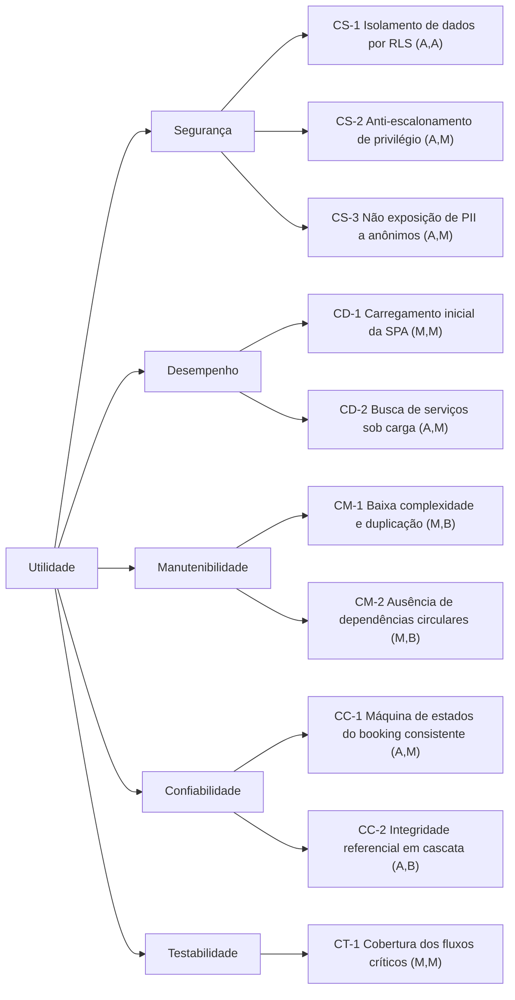

## 6.3 Cenários de atributo de qualidade (formato de seis partes)

Os cenários prioritários são especificados segundo a estrutura de Bass, Clements e Kazman (2012): fonte, estímulo, artefato, ambiente, resposta e medida.

**CS-1 — Isolamento de dados por RLS**
- *Fonte:* usuário autenticado mal-intencionado. *Estímulo:* requisição para ler/alterar registros de outro usuário. *Artefato:* políticas RLS das tabelas `bookings`, `services`, `profiles`. *Ambiente:* operação normal. *Resposta:* a requisição é negada pelo banco. *Medida:* 0 acessos indevidos bem-sucedidos.

**CS-2 — Anti-escalonamento de privilégio**
- *Fonte:* usuário autenticado. *Estímulo:* tentativa de alterar o próprio `user_type`. *Artefato:* *trigger* `prevent_user_type_change()`. *Ambiente:* operação normal. *Resposta:* alteração rejeitada com exceção. *Medida:* 100% das tentativas bloqueadas.

**CS-3 — Não exposição de PII a anônimos**
- *Fonte:* visitante não autenticado. *Estímulo:* leitura de dados de perfil. *Artefato:* *view* `public_profiles` e RLS de `profiles`. *Ambiente:* operação normal. *Resposta:* apenas campos não sensíveis são retornados. *Medida:* 0 ocorrências de `email`/`phone` expostos.

**CD-2 — Busca de serviços sob carga**
- *Fonte:* conjunto de usuários concorrentes. *Estímulo:* requisições simultâneas de busca/listagem. *Artefato:* API PostgREST + *view* `service_stats`. *Ambiente:* carga de pico planejada. *Resposta:* respostas corretas dentro do tempo-alvo. *Medida:* p95 ≤ limiar definido; taxa de erro < 1%.

**CC-1 — Máquina de estados do booking consistente**
- *Fonte:* cliente ou prestador. *Estímulo:* tentativa de transição de status (válida ou inválida). *Artefato:* *trigger* `validate_booking_status_transition()`. *Ambiente:* operação normal. *Resposta:* transições válidas aplicadas; inválidas rejeitadas. *Medida:* 0 transições inválidas aceitas.

> Os demais cenários (CD-1, CM-1, CM-2, CC-2, CT-1) seguem a mesma estrutura e estão associados às métricas da Seção 5.

## 6.4 Pontos de sensibilidade, de compromisso e riscos (análise preliminar)

A análise a seguir é **preliminar e qualitativa**, derivada da inspeção arquitetural (Seção 4); será confirmada na execução do ATAM com apoio das métricas.

| Tipo | Descrição |
|------|-----------|
| **Ponto de sensibilidade** | A correção da segurança é altamente sensível à completude e exatidão das políticas de RLS e dos *triggers*: uma política ausente ou mal especificada compromete CS-1/CS-3 sem gerar erro funcional aparente. |
| **Ponto de sensibilidade** | O desempenho de CD-2 é sensível à eficiência da *view* `service_stats` e à indexação das tabelas consultadas. |
| **Ponto de compromisso** | A delegação total de autorização ao banco (RLS) favorece simplicidade e consistência (positivo para manutenibilidade e segurança), mas concentra o risco em um único mecanismo declarativo e desloca o esforço de teste para a fronteira cliente–banco (impacto em testabilidade). |
| **Ponto de compromisso** | A arquitetura SPA reduz acoplamento de *backend* e acelera o desenvolvimento, porém transfere carga de processamento e desempenho percebido para o cliente (tensão entre manutenibilidade/agilidade e desempenho — CD-1). |
| **Risco** | O desempenho de carregamento inicial do *frontend* não atinge a meta (LCP acima de 2,5 s mesmo após *code-splitting*), confirmando quantitativamente o ponto de compromisso CD-1 (Seção 7.3.5). |
| **Não risco** | A imutabilidade do `user_type` e a validação de `provider_id` por *trigger* fornecem defesa em profundidade contra escalonamento e *spoofing* de prestador, reduzindo o risco de CS-2. |

## 6.5 Articulação com o plano de métricas

Cada cenário da árvore de utilidade vincula-se a uma ou mais métricas da Seção 5, de modo que a coleta quantitativa fornecerá a evidência para confirmar ou refutar a análise qualitativa do ATAM. Essa articulação entre ATAM (qualitativo) e ISO/IEC 25010 (quantitativo) constitui o procedimento de avaliação proposto como contribuição do trabalho.

---

# 7 Resultados

Esta seção consolida os resultados do trabalho. Os objetivos específicos 1 a 4 (delimitação, modelagem, documentação e definição de cenários) foram concluídos e são reportados em 7.1–7.2. Os objetivos 5 a 9 (execução de testes automatizados, análise estática, testes de segurança e de desempenho, e análise) foram **executados**, antecipando o cronograma original (Seção 8): as medições são apresentadas em 7.3, e a síntese por atributo de qualidade em 7.4.

Todos os valores quantitativos aqui reportados derivam de execuções registradas de forma reprodutível em `docs/tcc/medicoes/`, onde cada medição remete a uma ferramenta e versão, ao ambiente, à data e a um arquivo de evidência (conforme a Seção 5.1). Nenhum número é apresentado sem evidência correspondente.

## 7.1 Definição e delimitação do estudo

- **Foco redefinido:** o trabalho foi reorientado da temática de recomendação para a **avaliação técnica da arquitetura de software**, mantendo o Hubservi como objeto de estudo. A recomendação permanece como módulo secundário (ordenação por popularidade/avaliação).
- **Objeto vs. instrumento (Seção 1.5):** o objeto de pesquisa é a avaliação; o Hubservi é o instrumento, desenvolvido pela equipe como pré-requisito metodológico — condição para o acesso irrestrito ao código, ao esquema e ao ambiente que a avaliação exige.
- **Modelo arquitetural consolidado:** **SPA + BaaS + Serverless**, corrigindo incoerência documental anterior que mencionava microsserviços (inexistentes no sistema real).
- **Atributos de qualidade selecionados** (ISO/IEC 25010): segurança, eficiência de desempenho, manutenibilidade (com ênfase em testabilidade) e confiabilidade.
- **Metodologia definida:** pesquisa aplicada, abordagem mista, objetivos exploratório-descritivos, estudo de caso com experimento técnico.

## 7.2 Modelagem e documentação da arquitetura (produtos)

Foram produzidos e estão disponíveis em `docs/tcc/`:

- Descrição técnica completa da arquitetura, componentes, fluxos, persistência e regras de negócio (Seção 4);
- Modelos UML — casos de uso, classes, sequência (autenticação, contratação e avaliação), componentes e implantação;
- Modelo de processos de negócio (BPMN) para contratação e gerenciamento de booking;
- Modelo de dados — DER e dicionário de dados, fiéis ao esquema real das *migrations*.

Esses artefatos atendem aos objetivos específicos 2 e 3 e fundamentam a árvore de utilidade e os cenários do ATAM (Seção 6).

## 7.3 Resultados das medições

A fase de execução configurou o ambiente reprodutível e coletou as métricas planejadas na Seção 5. O ambiente de teste de banco/API foi levantado com uma instância **Supabase local** (Docker), contra a qual os cenários de autorização e confiabilidade foram exercitados através da API real (PostgREST) — atendendo à exigência de "teste de integração contra a API" (Seção 5.2.1). Onde uma ferramenta nomeada no plano não estava disponível no ambiente, adotou-se um substituto da mesma classe, com a troca registrada: **k6 → autocannon** (teste de carga) e **Snyk → npm audit** (análise de composição de dependências).

### 7.3.1 Achado transversal de reprodutibilidade

Ao reconstruir o banco a partir apenas das *migrations* versionadas, constatou-se que **o histórico não reproduzia um sistema funcional do zero**: faltavam os *grants* de privilégios de API aos papéis `anon`/`authenticated`/`service_role` no *schema* `public`, provocando `permission denied` antes mesmo da avaliação de RLS. O sistema funciona em produção porque esses privilégios foram aplicados fora do versionamento. Corrigiu-se com uma *migration* que torna o histórico auto-suficiente, sem alterar políticas de segurança. É um resultado característico do paradigma BaaS — parte da configuração vive no serviço gerenciado e escapa ao controle de versão — e só se revela sob uma avaliação conduzida em ambiente limpo e reprodutível.

### 7.3.2 Segurança

Os cenários de autorização foram automatizados como testes de integração por papel. **Dois defeitos reais de autorização foram detectados, corrigidos e re-medidos** (padrão medir → detectar → corrigir → re-medir):

- **Exposição de PII a usuário autenticado:** a política de leitura de `profiles` (`USING (auth.uid() IS NOT NULL)`) permitia que qualquer usuário autenticado lesse `email`/`phone` de todos os perfis. Corrigido restringindo a leitura direta ao próprio registro; dados de contraparte seguem pela *view* `public_profiles` (sem PII).
- **Avaliação atribuída a prestador incorreto:** a política de inserção de *reviews* não validava que `provider_id` corresponde ao dono do serviço — assimetria em relação aos *bookings*, que já possuíam esse *trigger*. Corrigido com *trigger* de validação espelhado.

Após as correções, a suíte de segurança (isolamento de perfis, serviços e *bookings*; bloqueio de escalonamento de `user_type`; regras de *review*) passa integralmente — **0 acessos indevidos nos cenários testados**. A análise de composição de dependências (`npm audit`) reportou 12 vulnerabilidades de severidade alta, das quais **apenas uma é de produção** (`react-router-dom`, *XSS via open redirect*, com correção disponível); as demais são ferramentas de *build*/desenvolvimento, sem superfície de ataque em produção. O `supabase db lint` não acusou erros de *schema*. A varredura dinâmica (DAST/OWASP ZAP) fica pendente para execução contra a URL de produção, por depender do ambiente de *hosting* real.

### 7.3.3 Confiabilidade

Verificados por testes de integração: a **máquina de estados do *booking*** rejeita transições inválidas (0 transições inválidas aceitas); a **integridade referencial** em exclusão de serviço não deixa registros órfãos (cascata); e o **fluxo crítico ponta a ponta** (autenticação → serviço → *booking* → avaliação) completa com sucesso no caso válido. Atende aos critérios da Seção 5.2.5.

### 7.3.4 Testabilidade

A suíte automatizada foi ampliada de 11 para **44 testes unitários/de componente** (mais 30 testes de integração). A **cobertura de linhas subiu de 18,0% para 32,0%** no agregado, concentrada nos módulos críticos, que passaram a **82–100%** (contexto de autenticação, formulários, camada de acesso a dados, *schemas* de validação). Definiu-se o limiar antes em aberto (Seção 5.2.3): piso global anti-regressão e piso ≥75% nos módulos críticos, enumerados nominalmente e verificados automaticamente. Introduziu-se uma *factory* de *mock* compartilhada, reduzindo o esforço de escrever novos testes — evidência de que a testabilidade da arquitetura, atributo sob avaliação, melhorou.

### 7.3.5 Eficiência de desempenho

Distinguem-se duas camadas:

- **Backend sob carga (atende):** a listagem de serviços respondeu, sob 30 conexões concorrentes por 20 s, com **latência p95 de 253 ms** (critério ≤ 800 ms) e **0% de erro** em ~44 mil requisições.
- **Frontend / carregamento inicial (não atende):** o Lighthouse (mediana de 3 execuções) registrou *performance score* 85 e **LCP de 3,49 s** (critérios ≥ 90 e ≤ 2,5 s). Diagnosticado *bundle* único de 679 KB com rotas carregadas de forma *eager*; aplicou-se *code-splitting* por rota, reduzindo o *bundle* inicial em 28% e melhorando os índices (score 88, LCP 3,17 s), que **permanecem abaixo da meta**. O contraste entre a API rápida e o carregamento lento localiza o gargalo de desempenho no *frontend* (peso do *bundle*), não no *backend*.

### 7.3.6 Manutenibilidade

A **modularização é sólida**: **0 dependências circulares**, confirmado por duas ferramentas independentes (Madge e dependency-cruiser), com grafo de acoplamento saudável (núcleo estável, folhas voláteis). A **higiene de código está abaixo do ideal**: o *lint* não está zerado (19 violações na configuração atual; 25 sob configuração recomendada, incluindo funções com complexidade ciclomática elevada), e a **duplicação na camada de interface é 4,55%** (acima da meta de 3%), com causa localizada — os dois *dashboards* (cliente e prestador) compartilham 61 linhas quase idênticas.

## 7.4 Síntese dos resultados

A avaliação técnica foi conduzida de ponta a ponta sobre um ambiente reprodutível, e emite verdictos **por atributo e por camada**, em vez de um juízo único:

| Atributo (ISO/IEC 25010) | Resultado |
|--------------------------|-----------|
| Segurança | Autorização declarativa (RLS/*triggers*) **atende** após correção de dois defeitos reais; 1 CVE de produção a tratar; DAST pendente contra produção |
| Confiabilidade | **Atende** (máquina de estados, integridade referencial, fluxo crítico) |
| Testabilidade | **Evoluiu** (cobertura 18%→32%; módulos críticos 82–100%, com limiar protegido) |
| Eficiência de desempenho | *Backend* **atende** (p95 253 ms); *frontend* **não atende** (LCP 3,17 s após otimização) |
| Manutenibilidade | Estrutura **atende** (0 ciclos); higiene de código **abaixo do ideal** (lint, duplicação nos *dashboards*) |

O trabalho responde à questão de pesquisa demonstrando um **procedimento reprodutível de avaliação técnica** aplicável a arquiteturas BaaS/Serverless: modelagem fiel, cenários derivados dos atributos de qualidade, medição instrumentada com registro de evidências e o ciclo de detecção e correção de defeitos. O resultado não é um atestado de que o sistema é uniformemente bom — três defeitos reais foram encontrados e o desempenho de *frontend* não atinge a meta —, e é justamente essa capacidade de **localizar deficiências com precisão** que evidencia o valor do método. A reprodutibilidade é assegurada pelo registro em `docs/tcc/medicoes/` e pela integração contínua, que executa os *gates* automatizados a cada alteração.

---

# 8 Cronograma

O trabalho está organizado em quatro etapas mensais, com entrega final prevista para **setembro de 2026**.

| Mês (2026) | Atividades | Objetivos específicos | Situação |
|------------|-----------|------------------------|----------|
| **Junho** | Revisão teórica; modelagem arquitetural; definição de métricas | OE1, OE2, OE3, OE4 | Em consolidação |
| **Julho** | Consolidação dos modelos UML; BPMN; DER; implementação/ajuste dos fluxos | OE2, OE3 | Planejado |
| **Agosto** | Execução de testes automatizados; análise estática; testes de desempenho; testes de segurança | OE5, OE6, OE7, OE8 | Planejado |
| **Setembro** | Análise dos resultados; redação final; revisão; apresentação; entrega | OE9 | Planejado |

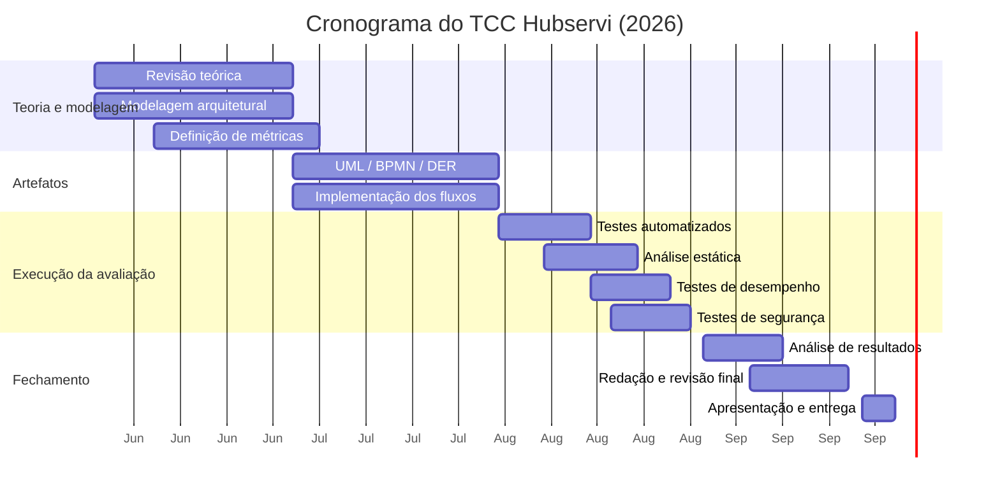

> **Marco crítico:** a coleta de resultados quantitativos ocorre em **agosto de 2026**; até lá, o trabalho reporta planejamento e *baseline* (Seções 5 e 7), sem números de avaliação medidos.

---

# Apêndice A — Diagramas (UML, BPMN, DER)

# DER — Diagrama Entidade-Relacionamento

Modelo de dados do Hubservi, fiel ao esquema real das *migrations* (`supabase/migrations/`). As *views* `service_stats` e `public_profiles` são derivadas e não aparecem como entidades persistentes.

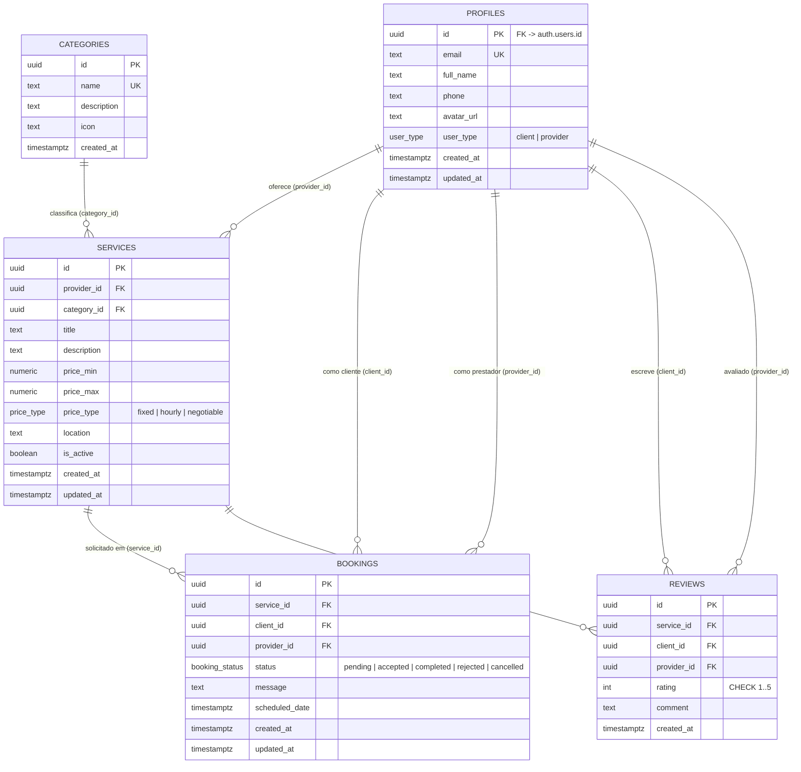

## Notas

- `PROFILES.id` referencia `auth.users.id` (tabela gerenciada pelo Supabase Auth); o *trigger* `handle_new_user()` materializa o perfil no cadastro.
- `REVIEWS` possui restrição de unicidade `UNIQUE(service_id, client_id)`: uma avaliação por cliente por serviço.
- `SERVICES` possui a restrição `CHECK (price_max IS NULL OR price_max >= price_min)`.
- Exclusões em cascata: a remoção de um `profile`/`service` propaga-se aos `bookings` e `reviews` relacionados (`ON DELETE CASCADE`); `services.category_id` usa `ON DELETE RESTRICT`.

---

# Dicionário de dados

Derivado das *migrations* em `supabase/migrations/` (migration inicial `20260303232457_*` e posteriores). Tipos conforme PostgreSQL.

## Enumerações

| Tipo | Valores |
|------|---------|
| `user_type` | `client`, `provider` |
| `price_type` | `fixed`, `hourly`, `negotiable` |
| `booking_status` | `pending`, `accepted`, `completed`, `rejected`, `cancelled` |

## Tabela `profiles`

| Coluna | Tipo | Restrições | Descrição |
|--------|------|-----------|-----------|
| `id` | uuid | PK; FK → `auth.users(id)` ON DELETE CASCADE | Identificador do usuário |
| `email` | text | UNIQUE, NOT NULL | E-mail (sincronizado do Auth) — **PII** |
| `full_name` | text | NOT NULL, DEFAULT '' | Nome de exibição |
| `phone` | text | DEFAULT '' | Telefone — **PII** |
| `avatar_url` | text | DEFAULT '' | URL do avatar |
| `user_type` | user_type | NOT NULL, DEFAULT 'client'; imutável (*trigger*) | Papel do usuário |
| `created_at` | timestamptz | NOT NULL, DEFAULT now() | Criação |
| `updated_at` | timestamptz | NOT NULL, DEFAULT now() | Atualização (*trigger*) |

## Tabela `categories`

| Coluna | Tipo | Restrições | Descrição |
|--------|------|-----------|-----------|
| `id` | uuid | PK, DEFAULT gen_random_uuid() | Identificador |
| `name` | text | UNIQUE, NOT NULL | Nome da categoria |
| `description` | text | DEFAULT '' | Descrição |
| `icon` | text | DEFAULT '' | Ícone (UI) |
| `created_at` | timestamptz | NOT NULL, DEFAULT now() | Criação |

## Tabela `services`

| Coluna | Tipo | Restrições | Descrição |
|--------|------|-----------|-----------|
| `id` | uuid | PK, DEFAULT gen_random_uuid() | Identificador |
| `provider_id` | uuid | NOT NULL, FK → `profiles(id)` ON DELETE CASCADE | Prestador dono |
| `category_id` | uuid | NOT NULL, FK → `categories(id)` ON DELETE RESTRICT | Categoria |
| `title` | text | NOT NULL | Título |
| `description` | text | NOT NULL, DEFAULT '' | Descrição |
| `price_min` | numeric(10,2) | NOT NULL, DEFAULT 0 | Preço mínimo |
| `price_max` | numeric(10,2) | CHECK (`price_max IS NULL OR price_max >= price_min`) | Preço máximo (opcional) |
| `price_type` | price_type | NOT NULL, DEFAULT 'fixed' | Modelo de preço |
| `location` | text | DEFAULT '' | Localidade |
| `is_active` | boolean | NOT NULL, DEFAULT true | Visibilidade pública |
| `created_at` | timestamptz | NOT NULL, DEFAULT now() | Criação |
| `updated_at` | timestamptz | NOT NULL, DEFAULT now() | Atualização (*trigger*) |

Índices: `provider_id`, `category_id`, `is_active`, e índice GIN de busca textual sobre `title`.

## Tabela `bookings`

| Coluna | Tipo | Restrições | Descrição |
|--------|------|-----------|-----------|
| `id` | uuid | PK, DEFAULT gen_random_uuid() | Identificador |
| `service_id` | uuid | NOT NULL, FK → `services(id)` ON DELETE CASCADE | Serviço |
| `client_id` | uuid | NOT NULL, FK → `profiles(id)` ON DELETE CASCADE | Cliente |
| `provider_id` | uuid | NOT NULL, FK → `profiles(id)` ON DELETE CASCADE | Prestador (deve coincidir com o dono do serviço — *trigger*) |
| `status` | booking_status | NOT NULL, DEFAULT 'pending'; transições validadas (*trigger*) | Estado |
| `message` | text | DEFAULT '' | Mensagem da solicitação |
| `scheduled_date` | timestamptz | NULL | Data agendada |
| `created_at` | timestamptz | NOT NULL, DEFAULT now() | Criação |
| `updated_at` | timestamptz | NOT NULL, DEFAULT now() | Atualização (*trigger*) |

Índices: `client_id`, `provider_id`, `service_id`.

## Tabela `reviews`

| Coluna | Tipo | Restrições | Descrição |
|--------|------|-----------|-----------|
| `id` | uuid | PK, DEFAULT gen_random_uuid() | Identificador |
| `service_id` | uuid | NOT NULL, FK → `services(id)` ON DELETE CASCADE | Serviço avaliado |
| `client_id` | uuid | NOT NULL, FK → `profiles(id)` ON DELETE CASCADE | Autor (cliente) |
| `provider_id` | uuid | NOT NULL, FK → `profiles(id)` ON DELETE CASCADE | Prestador avaliado |
| `rating` | integer | NOT NULL, CHECK (1 ≤ rating ≤ 5) | Nota |
| `comment` | text | NOT NULL, DEFAULT '' | Comentário |
| `created_at` | timestamptz | NOT NULL, DEFAULT now() | Criação |
| — | — | UNIQUE (`service_id`, `client_id`) | Uma avaliação por cliente por serviço |

Índices: `service_id`, `client_id`.

## Views

| View | Colunas | Descrição |
|------|---------|-----------|
| `service_stats` | `service_id`, `review_count` (int), `average_rating` (numeric(3,2)) | Agregação de avaliações por serviço; `security_invoker = true` |
| `public_profiles` | `id`, `full_name`, `avatar_url`, `user_type`, `created_at` | Projeção sem PII (omite `email` e `phone`) para consumo anônimo |

---

# Diagrama de Casos de Uso

Atores: **Visitante** (não autenticado), **Cliente** e **Prestador** (perfis autenticados). O Cliente e o Prestador especializam o ator genérico Usuário Autenticado.

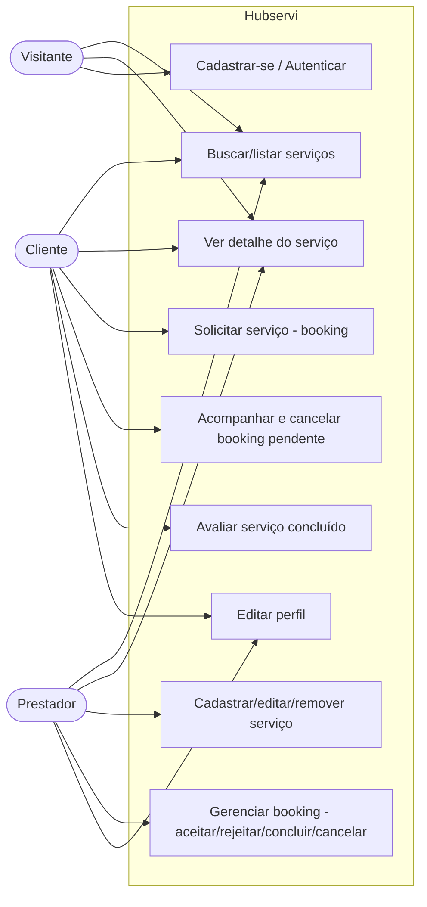

## Notas

- UC4 (solicitar) é exclusivo do Cliente; UC7 e UC8 são exclusivos do Prestador (regras impostas por RLS e *triggers*).
- UC6 (avaliar) exige booking com status `completed` no serviço (política RLS de `INSERT` em `reviews`).
- O Visitante só executa UC1, UC2 e UC3; demais casos exigem autenticação (`ProtectedRoute`).

---

# Diagrama de Classes

Modelo de domínio derivado do esquema real (tabelas, enums e *views*). Não inclui entidades de recomendação/interação (inexistentes no sistema real).

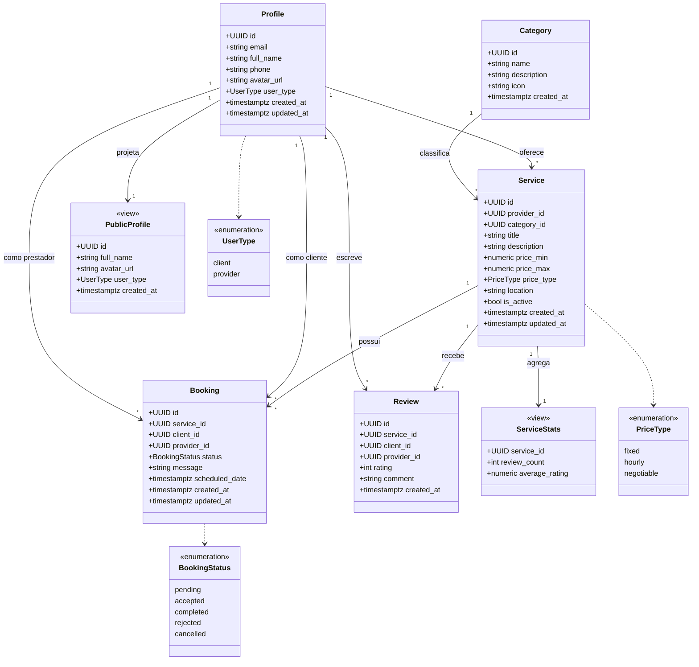

## Notas

- `Profile.id` referencia `auth.users.id`; o *trigger* `handle_new_user` materializa o profile no cadastro.
- `Review` tem restrição `UNIQUE(service_id, client_id)`.
- `ServiceStats` e `PublicProfile` são *views* derivadas, não tabelas.

---

# Diagrama de Sequência — Autenticação

Fluxo de cadastro/login com provisão automática de perfil. Fonte: `src/pages/Auth.tsx`, `src/contexts/AuthContext.tsx`, *trigger* `handle_new_user()`.

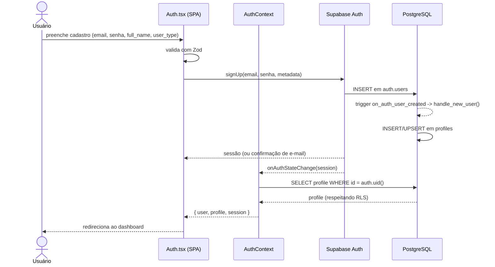

## Notas

- A criação do perfil ocorre no servidor, via *trigger* idempotente (`ON CONFLICT DO UPDATE`), independente das políticas de RLS (`SECURITY DEFINER`).
- O `AuthContext` mantém a sessão e o perfil em memória, recarregando-os a cada mudança de estado de autenticação.

---

# Diagrama de Sequência — Contratação (booking)

Solicitação de serviço pelo cliente e tratamento pelo prestador. Fonte: `src/components/BookingDialog.tsx`, `ServiceDetail.tsx`, dashboards, *triggers* `validate_booking_provider()` e `validate_booking_status_transition()`.

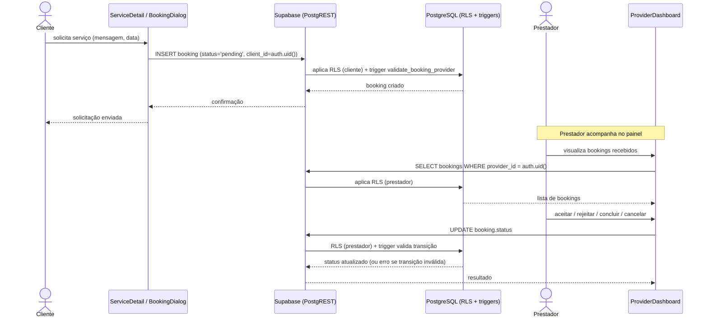

## Notas

- O cliente também pode **cancelar** uma solicitação enquanto `status = 'pending'` (política RLS + transição `pending → cancelled`, migration `20260528000000`).
- Transições inválidas de status são rejeitadas pelo *trigger* com exceção.

---

# Diagrama de Sequência — Avaliação (review)

Registro de avaliação após booking concluído. Fonte: `src/components/ReviewForm.tsx`, `ServiceDetail.tsx`, política RLS de `INSERT` em `reviews`.

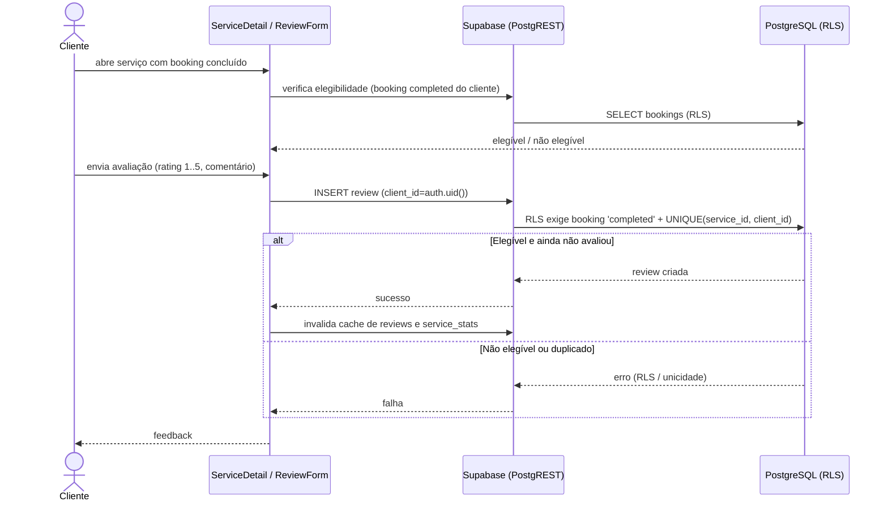

## Notas

- A *view* `service_stats` recalcula `review_count` e `average_rating` ao ser consultada após a inserção.
- A unicidade `(service_id, client_id)` impede mais de uma avaliação por cliente por serviço.

---

# Diagrama de Componentes

Componentes lógicos do Hubservi e suas dependências. Fonte: `src/`.

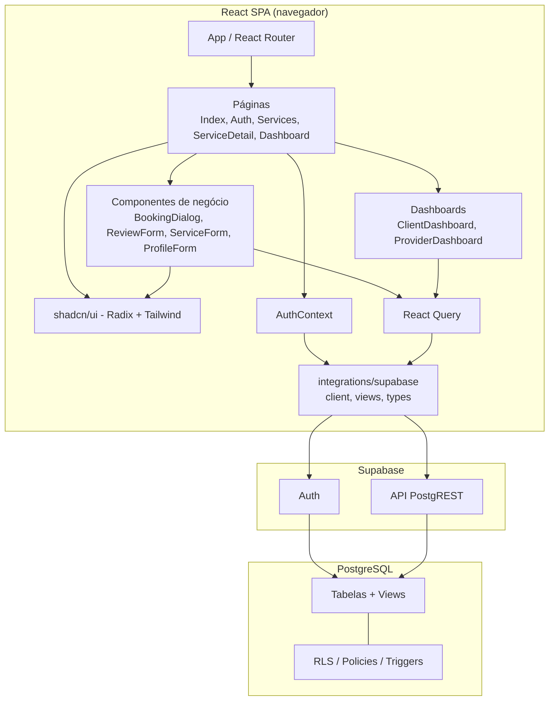

## Notas

- `integrations/supabase/client.ts` é o ponto único de acesso ao BaaS; `views.ts` encapsula consultas à *view* `public_profiles`.
- Toda autorização é aplicada na camada de banco (RLS), não no cliente; o cliente apenas reflete as restrições.

---

# Diagrama de Implantação

Topologia de implantação do paradigma SPA + BaaS + Serverless. O artefato da SPA é estático (gerado por `vite build`) e servido por uma hospedagem de conteúdo estático/CDN; o *backend* é integralmente gerenciado pelo Supabase.

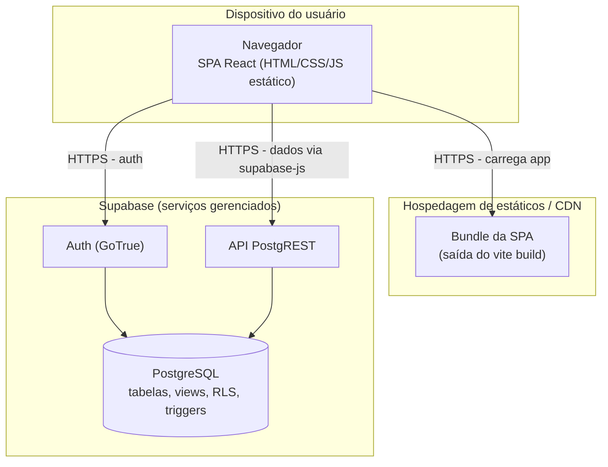

## Notas

- Não há servidor de aplicação próprio: o navegador comunica-se diretamente com os serviços gerenciados do Supabase via HTTPS.
- As credenciais expostas ao cliente são as chaves públicas (`VITE_SUPABASE_URL`, `VITE_SUPABASE_PUBLISHABLE_KEY`); a segurança dos dados depende das políticas de RLS no PostgreSQL.
- O Supabase Storage não está configurado nas *migrations*; URLs de avatar são externas.

---

# BPMN — Contratação de serviço

Processo de negócio da contratação, das raias Cliente e Prestador, mediado pelo sistema. Notação BPMN aproximada em Mermaid (`flowchart`).

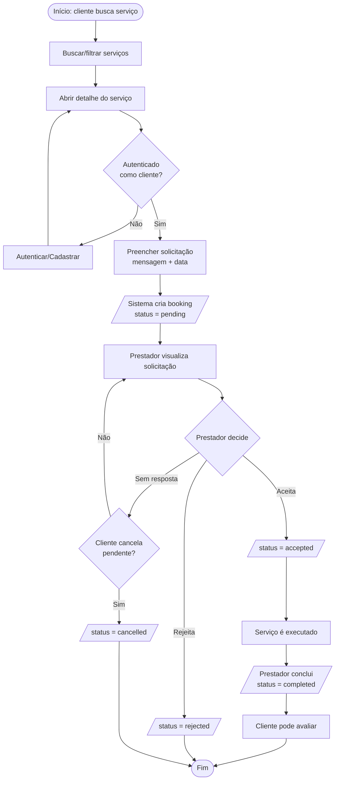

## Notas

- A criação do booking e as mudanças de status são validadas no banco (RLS + *triggers*).
- A avaliação só é habilitada após `status = completed` (ver [sequência — avaliação](sequencia-avaliacao.md)).

---

# BPMN / Máquina de estados — Gerenciamento de booking

Ciclo de vida do booking conforme o *trigger* `validate_booking_status_transition()` (migration inicial e `20260528000000`). As transições não representadas são rejeitadas pelo banco.

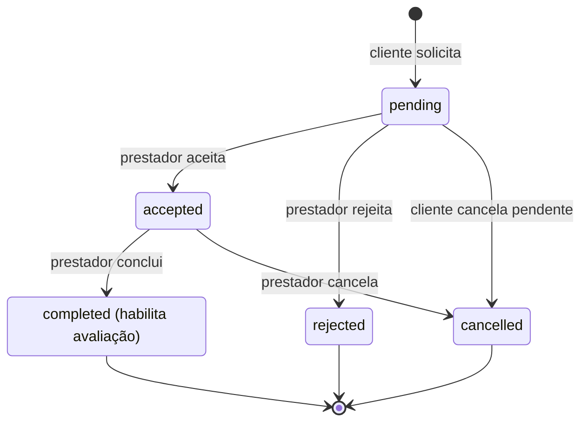

## Regras de transição (impostas por trigger)

| De | Para permitido |
|----|----------------|
| `pending` | `accepted`, `rejected`, `cancelled` |
| `accepted` | `completed`, `cancelled` |
| `completed` | — (estado final) |
| `rejected` | — (estado final) |
| `cancelled` | — (estado final) |

## Atores e permissões (RLS)

- **Prestador:** altera o status dos próprios bookings (`accepted`, `rejected`, `completed`, `cancelled`).
- **Cliente:** pode cancelar (`pending → cancelled`) apenas os próprios bookings ainda pendentes.
- Transições inválidas resultam em exceção no banco; auto-transições (`status` inalterado) são toleradas.

---

# Referências

> Referências em formato ABNT (NBR 6023). As citações no texto seguem o sistema autor-data (NBR 10520). Recomenda-se conferir e completar edição/tradução conforme o exemplar efetivamente consultado antes da entrega final.

ASSOCIAÇÃO BRASILEIRA DE NORMAS TÉCNICAS. **NBR 6023**: informação e documentação: referências: elaboração. Rio de Janeiro: ABNT, 2018.

ASSOCIAÇÃO BRASILEIRA DE NORMAS TÉCNICAS. **NBR 10520**: informação e documentação: citações em documentos: apresentação. Rio de Janeiro: ABNT, 2023.

BASS, Len; CLEMENTS, Paul; KAZMAN, Rick. **Software architecture in practice**. 3rd ed. Upper Saddle River: Addison-Wesley, 2012.

CLEMENTS, Paul; KAZMAN, Rick; KLEIN, Mark. **Evaluating software architectures**: methods and case studies. Boston: Addison-Wesley, 2002.

INTERNATIONAL ORGANIZATION FOR STANDARDIZATION; INTERNATIONAL ELECTROTECHNICAL COMMISSION. **ISO/IEC 25010**: systems and software engineering — Systems and software Quality Requirements and Evaluation (SQuaRE) — System and software quality models. Geneva: ISO, 2011.

PRESSMAN, Roger S.; MAXIM, Bruce R. **Engenharia de software**: uma abordagem profissional. 8. ed. Porto Alegre: AMGH, 2016.

SOMMERVILLE, Ian. **Engenharia de software**. 9. ed. São Paulo: Pearson Prentice Hall, 2011.

---

## Referências complementares sugeridas (opcional)

> Inserir conforme o aprofundamento adotado. Exemplos pertinentes ao paradigma BaaS/Serverless e à documentação técnica utilizada:

FOWLER, Martin. **Patterns of enterprise application architecture**. Boston: Addison-Wesley, 2002.

ISO/IEC. **ISO/IEC 25023**: systems and software engineering — Systems and software Quality Requirements and Evaluation (SQuaRE) — Measurement of system and software product quality. Geneva: ISO, 2016.

SUPABASE. **Supabase documentation**. Disponível em: https://supabase.com/docs. Acesso em: 18 jun. 2026.

POSTGRESQL GLOBAL DEVELOPMENT GROUP. **PostgreSQL documentation**: row security policies. Disponível em: https://www.postgresql.org/docs/current/ddl-rowsecurity.html. Acesso em: 18 jun. 2026.
