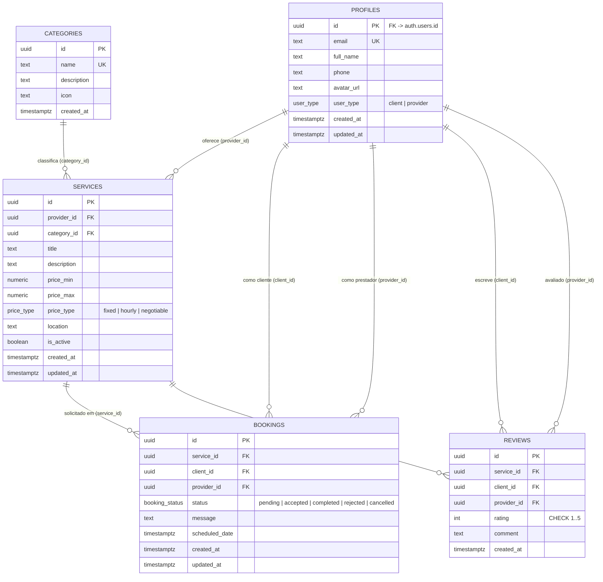
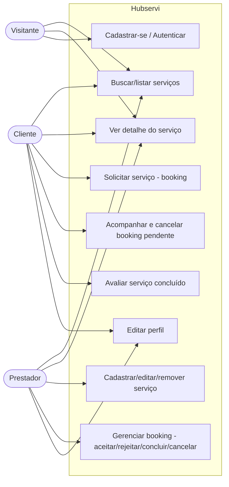
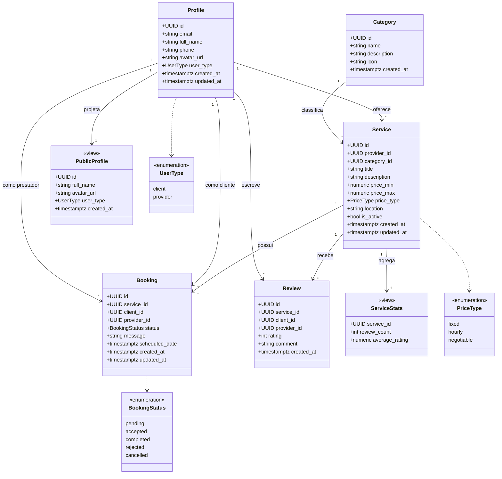
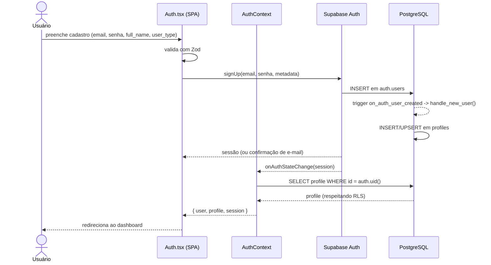
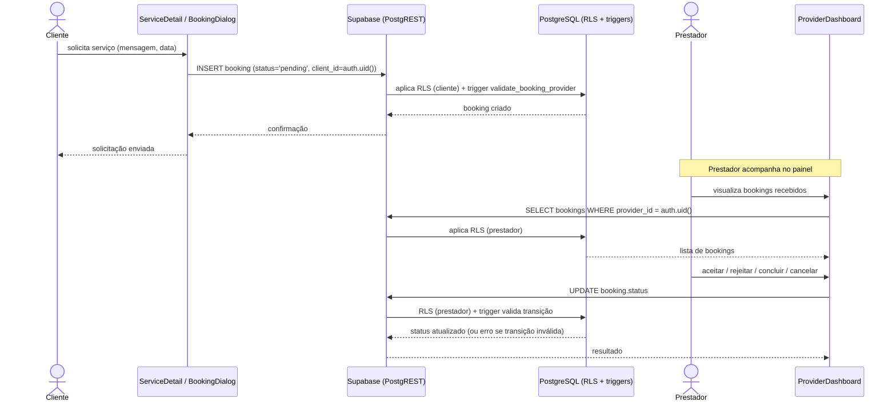
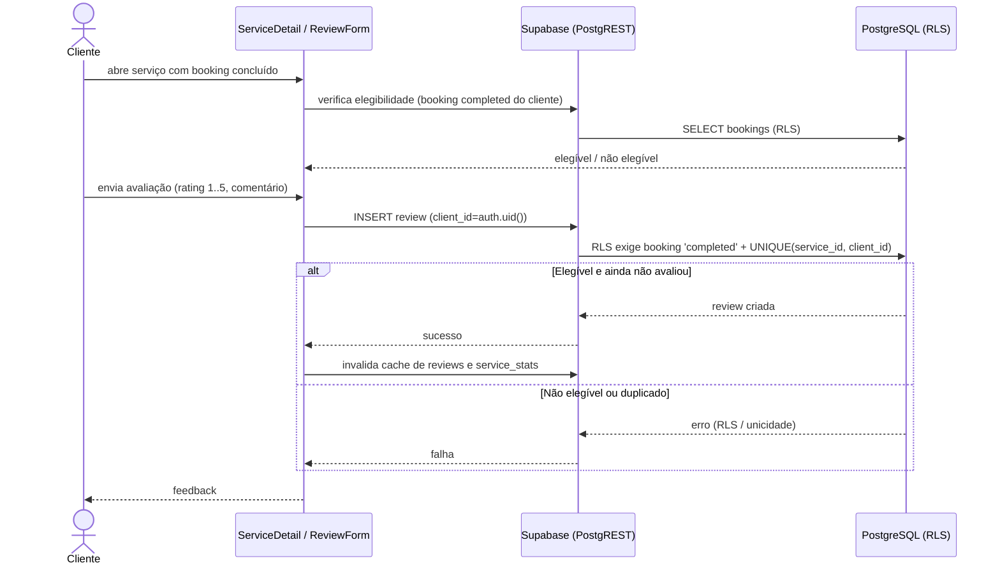
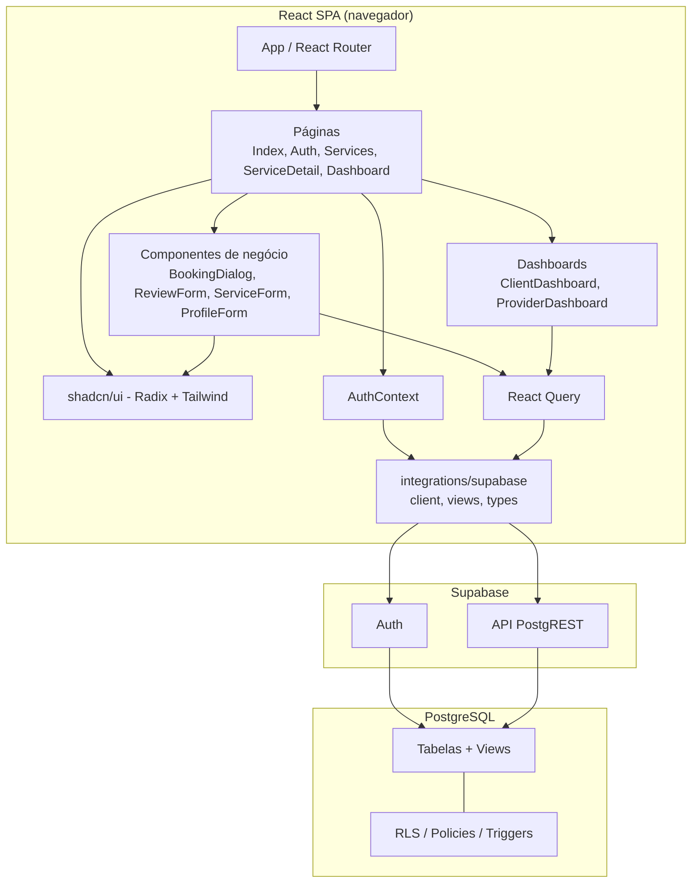
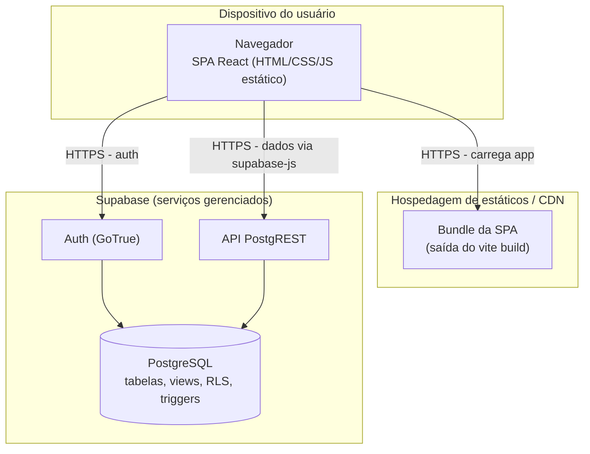
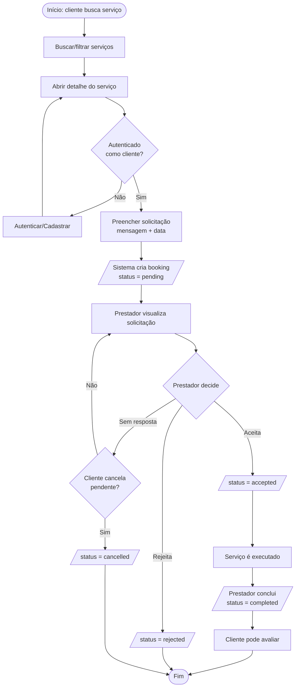
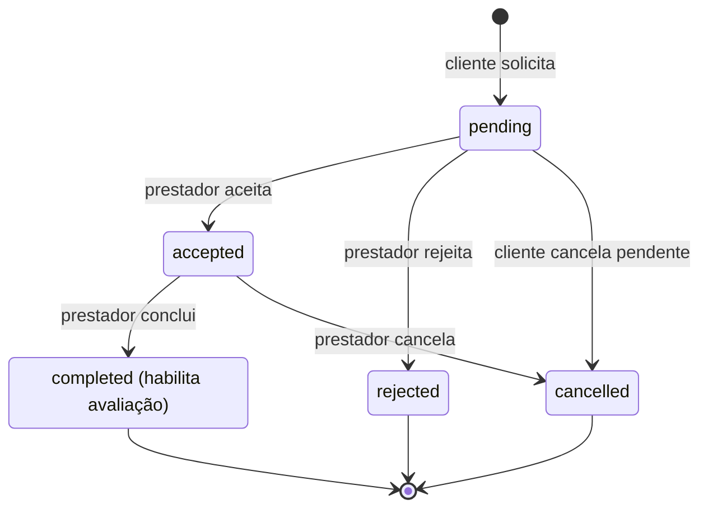

# Apêndice A — Diagramas (UML, BPMN e DER) e dicionário de dados

**Material suplementar** do artigo *Avaliação Técnica de uma Arquitetura Web baseada em BaaS/Serverless para Intermediação de Serviços: um estudo de caso da plataforma Hubservi*.

Pedro Conrado Fernandes Vieira · Richardy Gabriel Rodrigues da Costa
Graduandos em Engenharia de Software — Uni-FACEF
Orientador: Prof. Daniel Facciolo Pires

---

## Sobre este documento

Este apêndice foi publicado como documento próprio, e não como seção do artigo, por três razões:

1. Os diagramas são **artefatos do estudo de caso** (o instrumento), não resultados da avaliação (o objeto de pesquisa). Mantê-los fora do corpo preserva essa distinção, formalizada na Seção 1.5 do artigo.
2. Em Markdown no GitHub, os blocos Mermaid são **renderizados nativamente** e permanecem legíveis, pesquisáveis e versionados — o que uma imagem embutida no `.docx` não oferece.
3. Cada diagrama é **derivado do código-fonte e das `migrations`**, não desenhado à parte. Publicá-lo ao lado do código torna a divergência entre modelo e implementação verificável.

A numeração é **autocontida** (Figura A.1–A.10, Tabela A.1–A.7): inserir ou remover figuras no corpo do artigo não a desloca.

Os fontes Mermaid de cada figura estão em [`docs/tcc/diagramas/`](diagramas/), um arquivo por diagrama. Este documento é montado a partir deles por [`gerar-apendice.mjs`](gerar-apendice.mjs) — **não o edite à mão**; edite o diagrama de origem e regenere:

```bash
node docs/tcc/gerar-apendice.mjs
```

### Como citar

> VIEIRA, Pedro Conrado Fernandes; COSTA, Richardy Gabriel Rodrigues da. **Apêndice A — Diagramas (UML, BPMN e DER) e dicionário de dados**: material suplementar. Franca: Uni-FACEF, 2026. Disponível em: https://github.com/Richardy-Rodrigues/hubservi/blob/tcc-v1/docs/tcc/apendice-a-diagramas.md. Acesso em: [data].

### Material suplementar relacionado

| Documento | Conteúdo |
|---|---|
| [Apêndice B — Reprodução das medições](apendice-b-reproducao.md) | Como reproduzir cada medição M-01…M-26, e o que não é reproduzível |
| [Registro de medições](medicoes/registro-medicoes.md) | Tabela mestra: valor, ferramenta, versão, evidência e veredito |
| [Protocolo de medição](medicoes/README.md) | Regras de coleta e regra anti-fabricação |
| [Evidências brutas](medicoes/evidencias/) | Saídas originais das ferramentas, por data de coleta |

---

## Sumário

- Figura A.1 — Diagrama Entidade-Relacionamento (DER)
- Figura A.2 — Diagrama de Casos de Uso
- Figura A.3 — Diagrama de Classes
- Figura A.4 — Diagrama de Sequência — Autenticação
- Figura A.5 — Diagrama de Sequência — Contratação (booking)
- Figura A.6 — Diagrama de Sequência — Avaliação (review)
- Figura A.7 — Diagrama de Componentes
- Figura A.8 — Diagrama de Implantação
- Figura A.9 — BPMN — Contratação de serviço
- Figura A.10 — BPMN / Máquina de estados — Gerenciamento de booking
- A.1 Dicionário de dados (Tabelas A.1–A.7)

---


## Figura A.1 — Diagrama Entidade-Relacionamento (DER)

Modelo de dados do Hubservi, fiel ao esquema real das *migrations* (`supabase/migrations/`). As *views* `service_stats` e `public_profiles` são derivadas e não aparecem como entidades persistentes.



> **Figura A.1 — Diagrama Entidade-Relacionamento (DER).** Fonte: elaborado pelos autores (2026), a partir de `diagramas/der.md`.

### Notas

- `PROFILES.id` referencia `auth.users.id` (tabela gerenciada pelo Supabase Auth); o *trigger* `handle_new_user()` materializa o perfil no cadastro.
- `REVIEWS` possui restrição de unicidade `UNIQUE(service_id, client_id)`: uma avaliação por cliente por serviço.
- `SERVICES` possui a restrição `CHECK (price_max IS NULL OR price_max >= price_min)`.
- Exclusões em cascata: a remoção de um `profile`/`service` propaga-se aos `bookings` e `reviews` relacionados (`ON DELETE CASCADE`); `services.category_id` usa `ON DELETE RESTRICT`.

## Figura A.2 — Diagrama de Casos de Uso

Atores: **Visitante** (não autenticado), **Cliente** e **Prestador** (perfis autenticados). O Cliente e o Prestador especializam o ator genérico Usuário Autenticado.



> **Figura A.2 — Diagrama de Casos de Uso.** Fonte: elaborado pelos autores (2026), a partir de `diagramas/caso-de-uso.md`.

### Notas

- UC4 (solicitar) é exclusivo do Cliente; UC7 e UC8 são exclusivos do Prestador (regras impostas por RLS e *triggers*).
- UC6 (avaliar) exige booking com status `completed` no serviço (política RLS de `INSERT` em `reviews`).
- O Visitante só executa UC1, UC2 e UC3; demais casos exigem autenticação (`ProtectedRoute`).

## Figura A.3 — Diagrama de Classes

Modelo de domínio derivado do esquema real (tabelas, enums e *views*). Não inclui entidades de recomendação/interação (inexistentes no sistema real).



> **Figura A.3 — Diagrama de Classes.** Fonte: elaborado pelos autores (2026), a partir de `diagramas/classes.md`.

### Notas

- `Profile.id` referencia `auth.users.id`; o *trigger* `handle_new_user` materializa o profile no cadastro.
- `Review` tem restrição `UNIQUE(service_id, client_id)`.
- `ServiceStats` e `PublicProfile` são *views* derivadas, não tabelas.

## Figura A.4 — Diagrama de Sequência — Autenticação

Fluxo de cadastro/login com provisão automática de perfil. Fonte: `src/pages/Auth.tsx`, `src/contexts/AuthContext.tsx`, *trigger* `handle_new_user()`.



> **Figura A.4 — Diagrama de Sequência — Autenticação.** Fonte: elaborado pelos autores (2026), a partir de `diagramas/sequencia-autenticacao.md`.

### Notas

- A criação do perfil ocorre no servidor, via *trigger* idempotente (`ON CONFLICT DO UPDATE`), independente das políticas de RLS (`SECURITY DEFINER`).
- O `AuthContext` mantém a sessão e o perfil em memória, recarregando-os a cada mudança de estado de autenticação.

## Figura A.5 — Diagrama de Sequência — Contratação (booking)

Solicitação de serviço pelo cliente e tratamento pelo prestador. Fonte: `src/components/BookingDialog.tsx`, `ServiceDetail.tsx`, dashboards, *triggers* `validate_booking_provider()` e `validate_booking_status_transition()`.



> **Figura A.5 — Diagrama de Sequência — Contratação (booking).** Fonte: elaborado pelos autores (2026), a partir de `diagramas/sequencia-contratacao.md`.

### Notas

- O cliente também pode **cancelar** uma solicitação enquanto `status = 'pending'` (política RLS + transição `pending → cancelled`, migration `20260528000000`).
- Transições inválidas de status são rejeitadas pelo *trigger* com exceção.

## Figura A.6 — Diagrama de Sequência — Avaliação (review)

Registro de avaliação após booking concluído. Fonte: `src/components/ReviewForm.tsx`, `ServiceDetail.tsx`, política RLS de `INSERT` em `reviews`.



> **Figura A.6 — Diagrama de Sequência — Avaliação (review).** Fonte: elaborado pelos autores (2026), a partir de `diagramas/sequencia-avaliacao.md`.

### Notas

- A *view* `service_stats` recalcula `review_count` e `average_rating` ao ser consultada após a inserção.
- A unicidade `(service_id, client_id)` impede mais de uma avaliação por cliente por serviço.

## Figura A.7 — Diagrama de Componentes

Componentes lógicos do Hubservi e suas dependências. Fonte: `src/`.



> **Figura A.7 — Diagrama de Componentes.** Fonte: elaborado pelos autores (2026), a partir de `diagramas/componentes.md`.

### Notas

- `integrations/supabase/client.ts` é o ponto único de acesso ao BaaS; `views.ts` encapsula consultas à *view* `public_profiles`.
- Toda autorização é aplicada na camada de banco (RLS), não no cliente; o cliente apenas reflete as restrições.

## Figura A.8 — Diagrama de Implantação

Topologia de implantação do paradigma SPA + BaaS + Serverless. O artefato da SPA é estático (gerado por `vite build`) e servido por uma hospedagem de conteúdo estático/CDN; o *backend* é integralmente gerenciado pelo Supabase.



> **Figura A.8 — Diagrama de Implantação.** Fonte: elaborado pelos autores (2026), a partir de `diagramas/implantacao.md`.

### Notas

- Não há servidor de aplicação próprio: o navegador comunica-se diretamente com os serviços gerenciados do Supabase via HTTPS.
- As credenciais expostas ao cliente são as chaves públicas (`VITE_SUPABASE_URL`, `VITE_SUPABASE_PUBLISHABLE_KEY`); a segurança dos dados depende das políticas de RLS no PostgreSQL.
- O Supabase Storage não está configurado nas *migrations*; URLs de avatar são externas.

## Figura A.9 — BPMN — Contratação de serviço

Processo de negócio da contratação, das raias Cliente e Prestador, mediado pelo sistema. Notação BPMN aproximada em Mermaid (`flowchart`).



> **Figura A.9 — BPMN — Contratação de serviço.** Fonte: elaborado pelos autores (2026), a partir de `diagramas/bpmn-contratacao.md`.

### Notas

- A criação do booking e as mudanças de status são validadas no banco (RLS + *triggers*).
- A avaliação só é habilitada após `status = completed` (ver [sequência — avaliação](diagramas/sequencia-avaliacao.md)).

## Figura A.10 — BPMN / Máquina de estados — Gerenciamento de booking

Ciclo de vida do booking conforme o *trigger* `validate_booking_status_transition()` (migration inicial e `20260528000000`). As transições não representadas são rejeitadas pelo banco.



> **Figura A.10 — BPMN / Máquina de estados — Gerenciamento de booking.** Fonte: elaborado pelos autores (2026), a partir de `diagramas/bpmn-gerenciamento-booking.md`.

### Regras de transição (impostas por trigger)

| De | Para permitido |
|----|----------------|
| `pending` | `accepted`, `rejected`, `cancelled` |
| `accepted` | `completed`, `cancelled` |
| `completed` | — (estado final) |
| `rejected` | — (estado final) |
| `cancelled` | — (estado final) |

### Atores e permissões (RLS)

- **Prestador:** altera o status dos próprios bookings (`accepted`, `rejected`, `completed`, `cancelled`).
- **Cliente:** pode cancelar (`pending → cancelled`) apenas os próprios bookings ainda pendentes.
- Transições inválidas resultam em exceção no banco; auto-transições (`status` inalterado) são toleradas.

---

## A.1 Dicionário de dados

Derivado das *migrations* em `supabase/migrations/` (migration inicial `20260303232457_*` e posteriores). Tipos conforme PostgreSQL.

### Tabela A.1 — Tipos enumerados do esquema

| Tipo | Valores |
|------|---------|
| `user_type` | `client`, `provider` |
| `price_type` | `fixed`, `hourly`, `negotiable` |
| `booking_status` | `pending`, `accepted`, `completed`, `rejected`, `cancelled` |

> **Tabela A.1 — Tipos enumerados do esquema.** Fonte: elaborado pelos autores (2026), a partir de `supabase/migrations/`.

### Tabela A.2 — Tabela `profiles`

| Coluna | Tipo | Restrições | Descrição |
|--------|------|-----------|-----------|
| `id` | uuid | PK; FK → `auth.users(id)` ON DELETE CASCADE | Identificador do usuário |
| `email` | text | UNIQUE, NOT NULL | E-mail (sincronizado do Auth) — **PII** |
| `full_name` | text | NOT NULL, DEFAULT '' | Nome de exibição |
| `phone` | text | DEFAULT '' | Telefone — **PII** |
| `avatar_url` | text | DEFAULT '' | URL do avatar |
| `user_type` | user_type | NOT NULL, DEFAULT 'client'; imutável (*trigger*) | Papel do usuário |
| `created_at` | timestamptz | NOT NULL, DEFAULT now() | Criação |
| `updated_at` | timestamptz | NOT NULL, DEFAULT now() | Atualização (*trigger*) |

> **Tabela A.2 — Tabela `profiles`.** Fonte: elaborado pelos autores (2026), a partir de `supabase/migrations/`.

### Tabela A.3 — Tabela `categories`

| Coluna | Tipo | Restrições | Descrição |
|--------|------|-----------|-----------|
| `id` | uuid | PK, DEFAULT gen_random_uuid() | Identificador |
| `name` | text | UNIQUE, NOT NULL | Nome da categoria |
| `description` | text | DEFAULT '' | Descrição |
| `icon` | text | DEFAULT '' | Ícone (UI) |
| `created_at` | timestamptz | NOT NULL, DEFAULT now() | Criação |

> **Tabela A.3 — Tabela `categories`.** Fonte: elaborado pelos autores (2026), a partir de `supabase/migrations/`.

### Tabela A.4 — Tabela `services`

| Coluna | Tipo | Restrições | Descrição |
|--------|------|-----------|-----------|
| `id` | uuid | PK, DEFAULT gen_random_uuid() | Identificador |
| `provider_id` | uuid | NOT NULL, FK → `profiles(id)` ON DELETE CASCADE | Prestador dono |
| `category_id` | uuid | NOT NULL, FK → `categories(id)` ON DELETE RESTRICT | Categoria |
| `title` | text | NOT NULL | Título |
| `description` | text | NOT NULL, DEFAULT '' | Descrição |
| `price_min` | numeric(10,2) | NOT NULL, DEFAULT 0 | Preço mínimo |
| `price_max` | numeric(10,2) | CHECK (`price_max IS NULL OR price_max >= price_min`) | Preço máximo (opcional) |
| `price_type` | price_type | NOT NULL, DEFAULT 'fixed' | Modelo de preço |
| `location` | text | DEFAULT '' | Localidade |
| `is_active` | boolean | NOT NULL, DEFAULT true | Visibilidade pública |
| `created_at` | timestamptz | NOT NULL, DEFAULT now() | Criação |
| `updated_at` | timestamptz | NOT NULL, DEFAULT now() | Atualização (*trigger*) |

Índices: `provider_id`, `category_id`, `is_active`, e índice GIN de busca textual sobre `title`.

> **Tabela A.4 — Tabela `services`.** Fonte: elaborado pelos autores (2026), a partir de `supabase/migrations/`.

### Tabela A.5 — Tabela `bookings`

| Coluna | Tipo | Restrições | Descrição |
|--------|------|-----------|-----------|
| `id` | uuid | PK, DEFAULT gen_random_uuid() | Identificador |
| `service_id` | uuid | NOT NULL, FK → `services(id)` ON DELETE CASCADE | Serviço |
| `client_id` | uuid | NOT NULL, FK → `profiles(id)` ON DELETE CASCADE | Cliente |
| `provider_id` | uuid | NOT NULL, FK → `profiles(id)` ON DELETE CASCADE | Prestador (deve coincidir com o dono do serviço — *trigger*) |
| `status` | booking_status | NOT NULL, DEFAULT 'pending'; transições validadas (*trigger*) | Estado |
| `message` | text | DEFAULT '' | Mensagem da solicitação |
| `scheduled_date` | timestamptz | NULL | Data agendada |
| `created_at` | timestamptz | NOT NULL, DEFAULT now() | Criação |
| `updated_at` | timestamptz | NOT NULL, DEFAULT now() | Atualização (*trigger*) |

Índices: `client_id`, `provider_id`, `service_id`.

> **Tabela A.5 — Tabela `bookings`.** Fonte: elaborado pelos autores (2026), a partir de `supabase/migrations/`.

### Tabela A.6 — Tabela `reviews`

| Coluna | Tipo | Restrições | Descrição |
|--------|------|-----------|-----------|
| `id` | uuid | PK, DEFAULT gen_random_uuid() | Identificador |
| `service_id` | uuid | NOT NULL, FK → `services(id)` ON DELETE CASCADE | Serviço avaliado |
| `client_id` | uuid | NOT NULL, FK → `profiles(id)` ON DELETE CASCADE | Autor (cliente) |
| `provider_id` | uuid | NOT NULL, FK → `profiles(id)` ON DELETE CASCADE | Prestador avaliado |
| `rating` | integer | NOT NULL, CHECK (1 ≤ rating ≤ 5) | Nota |
| `comment` | text | NOT NULL, DEFAULT '' | Comentário |
| `created_at` | timestamptz | NOT NULL, DEFAULT now() | Criação |
| — | — | UNIQUE (`service_id`, `client_id`) | Uma avaliação por cliente por serviço |

Índices: `service_id`, `client_id`.

> **Tabela A.6 — Tabela `reviews`.** Fonte: elaborado pelos autores (2026), a partir de `supabase/migrations/`.

### Tabela A.7 — Views derivadas

| View | Colunas | Descrição |
|------|---------|-----------|
| `service_stats` | `service_id`, `review_count` (int), `average_rating` (numeric(3,2)) | Agregação de avaliações por serviço; `security_invoker = true` |
| `public_profiles` | `id`, `full_name`, `avatar_url`, `user_type`, `created_at` | Projeção sem PII (omite `email` e `phone`) para consumo anônimo |

> **Tabela A.7 — Views derivadas.** Fonte: elaborado pelos autores (2026), a partir de `supabase/migrations/`.


