# Apêndice C — Evidências de execução

**Material suplementar** do artigo *Avaliação Técnica de uma Arquitetura Web baseada em BaaS/Serverless para Intermediação de Serviços: um estudo de caso da plataforma Hubservi*.

Pedro Conrado Fernandes Vieira · Richardy Gabriel Rodrigues da Costa  
Graduandos em Engenharia de Software — Uni-FACEF  
Orientador: Prof. Daniel Facciolo Pires

> **Arquivo gerado** por `docs/tcc/gerar-artigo-docx.py`. Para alterar legendas ou a ordem das figuras, edite a lista `CAPTURAS` naquele script e regenere — assim o Markdown e o `.docx` continuam com a mesma numeração.

---

## O que este documento é

As capturas de tela de **todas** as execuções de ferramenta que sustentam a Seção 7 do artigo. As mais relevantes — os três defeitos detectados e os pares antes/depois de cobertura e de desempenho — aparecem também no corpo do artigo; o conjunto completo fica aqui, para que verificar qualquer número reportado não dependa de acesso ao ambiente de execução.

A fronteira com o [Apêndice B](apendice-b-reproducao.md) é deliberada: o **B** ensina *como reproduzir* cada medição; o **C** mostra *o que se viu* quando ela foi executada. Um é procedimento, o outro é registro.

---

## Nota de método — vale como legenda de todas as figuras

As imagens **reencenam na tela as saídas preservadas** das execuções de **15 e 16 de julho de 2026**, no commit `ad89e6c`. **Nenhuma medição foi reexecutada para produzi-las** — é isso que garante que cada número visível seja idêntico ao reportado no artigo. A reencenação é literal: as saídas de terminal são impressas byte a byte, com as sequências de cor originais, e os relatórios do ESLint e do Lighthouse são renderizados pelo relatório oficial da própria ferramenta a partir dos JSON arquivados.

Reexecutar as ferramentas hoje produziria números diferentes dos do artigo — e a saída que evidencia a exposição de PII (Figura C.10) sequer é reproduzível, já que o defeito foi corrigido. O procedimento de captura está em [`medicoes/evidencias/prints/README.md`](medicoes/evidencias/prints/README.md).

### Uma lacuna declarada

O catálogo do repositório prevê 18 telas; **17** estão aqui. Falta a do Madge (medição M-03, ausência de dependências circulares), que não chegou a ser capturada. A medição não fica sem evidência: é atestada pelo arquivo bruto [`madge-circular.txt`](medicoes/evidencias/2026-07-15/madge-circular.txt) e confirmada de forma independente pelo dependency-cruiser (Figura C.7).

---

## Índice

| Figura | Captura | Ferramenta | Saída bruta preservada |
|---|---|---|---|
| C.1 | P-01 | registro de ambiente | [`2026-07-15/ambiente.txt`](medicoes/evidencias/2026-07-15/ambiente.txt) |
| C.2 | P-02 | Vitest 3.2.7 | [`2026-07-15/vitest-unit.log`](medicoes/evidencias/2026-07-15/vitest-unit.log) |
| C.3 | P-03 | Vitest com `@vitest/coverage-v8` | [`2026-07-16/coverage-semana5.txt`](medicoes/evidencias/2026-07-16/coverage-semana5.txt) |
| C.4 | P-04 | ESLint 9.32 | [`2026-07-15/eslint-report.json`](medicoes/evidencias/2026-07-15/eslint-report.json) |
| C.5 | P-05 | ESLint 9.32 com `eslint-plugin-sonarjs` 3 | [`2026-07-16/eslint-sonarjs-report.json`](medicoes/evidencias/2026-07-16/eslint-sonarjs-report.json) |
| C.6 | P-07 | jscpd 4 | [`2026-07-16/jscpd/jscpd-report.json`](medicoes/evidencias/2026-07-16/jscpd/jscpd-report.json) |
| C.7 | P-08 | dependency-cruiser 16.10.4 | [`2026-07-16/depcruise-metrics.txt`](medicoes/evidencias/2026-07-16/depcruise-metrics.txt) |
| C.8 | P-09 | Supabase CLI 2.109.1 e Vitest | [`2026-07-16/vitest-integration.log`](medicoes/evidencias/2026-07-16/vitest-integration.log) |
| C.9 | P-10 | Vitest (integração) | [`2026-07-16/suite-integracao-completa.log`](medicoes/evidencias/2026-07-16/suite-integracao-completa.log) |
| C.10 | P-11 | Vitest (integração) | [`2026-07-16/rls-furos-ANTES.log`](medicoes/evidencias/2026-07-16/rls-furos-ANTES.log) |
| C.11 | P-12 | Vitest (integração) | [`2026-07-16/rls-furos-DEPOIS.log`](medicoes/evidencias/2026-07-16/rls-furos-DEPOIS.log) |
| C.12 | P-13 | `psql` sobre o *stack* local | [`2026-07-16/grants-profiles-depois.txt`](medicoes/evidencias/2026-07-16/grants-profiles-depois.txt) |
| C.13 | P-14 | Lighthouse 12.8.2, perfil móvel | [`2026-07-16/lighthouse-3.json`](medicoes/evidencias/2026-07-16/lighthouse-3.json) |
| C.14 | P-15 | Lighthouse 12.8.2, perfil móvel | [`2026-07-16/lighthouse-split-2.json`](medicoes/evidencias/2026-07-16/lighthouse-split-2.json) |
| C.15 | P-16 | autocannon 8 | [`2026-07-16/autocannon-load.json`](medicoes/evidencias/2026-07-16/autocannon-load.json) |
| C.16 | P-17 | `npm audit` | [`2026-07-16/npm-audit.json`](medicoes/evidencias/2026-07-16/npm-audit.json) |
| C.17 | P-18 | `supabase db lint` 2.109.1 | [`2026-07-16/supabase-db-lint.txt`](medicoes/evidencias/2026-07-16/supabase-db-lint.txt) |

---

## Figuras

### Figura C.1 — Ambiente de medição: sistema operacional, processador, Node.js e versões das ferramentas, no *commit* `ad89e6c`

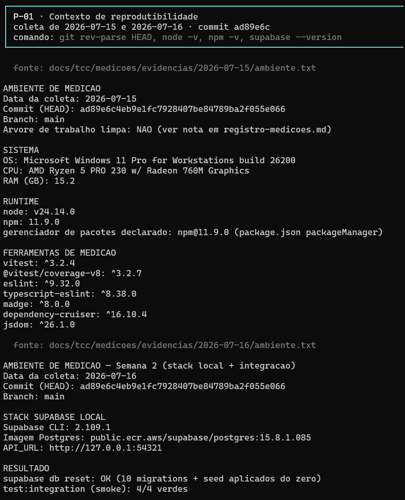

*Fonte: registro de ambiente; execução de 15 e 16 jul. 2026; saída bruta preservada em [`2026-07-15/ambiente.txt`](medicoes/evidencias/2026-07-15/ambiente.txt).*

### Figura C.2 — Suíte unitária do *baseline*, com os 11 testes existentes no início da avaliação

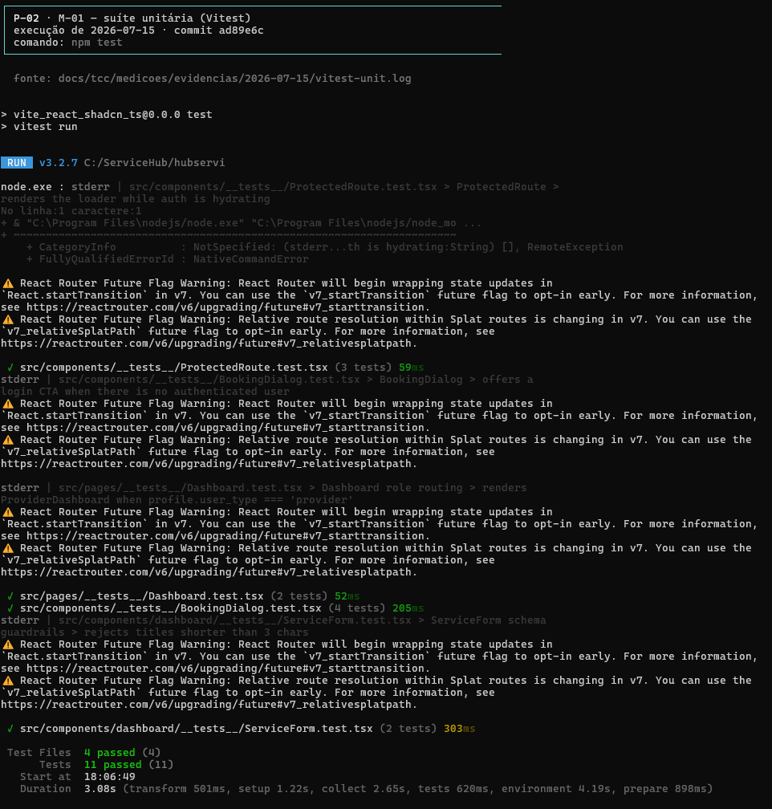

*Fonte: Vitest 3.2.7; execução de 15 jul. 2026; saída bruta preservada em [`2026-07-15/vitest-unit.log`](medicoes/evidencias/2026-07-15/vitest-unit.log).*

### Figura C.3 — Cobertura após a ampliação da suíte: 31,99% das linhas (559 de 1.747) e 75% dos ramos

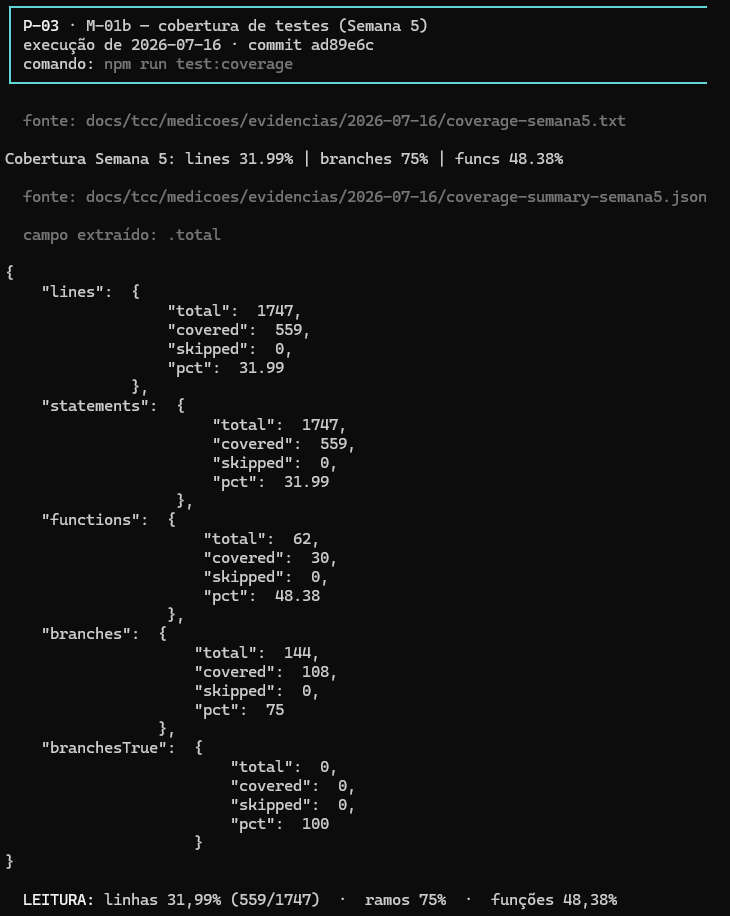

*Fonte: Vitest com `@vitest/coverage-v8`; execução de 16 jul. 2026; saída bruta preservada em [`2026-07-16/coverage-semana5.txt`](medicoes/evidencias/2026-07-16/coverage-semana5.txt).*

### Figura C.4 — Análise estática na configuração do projeto: 19 erros e 9 avisos

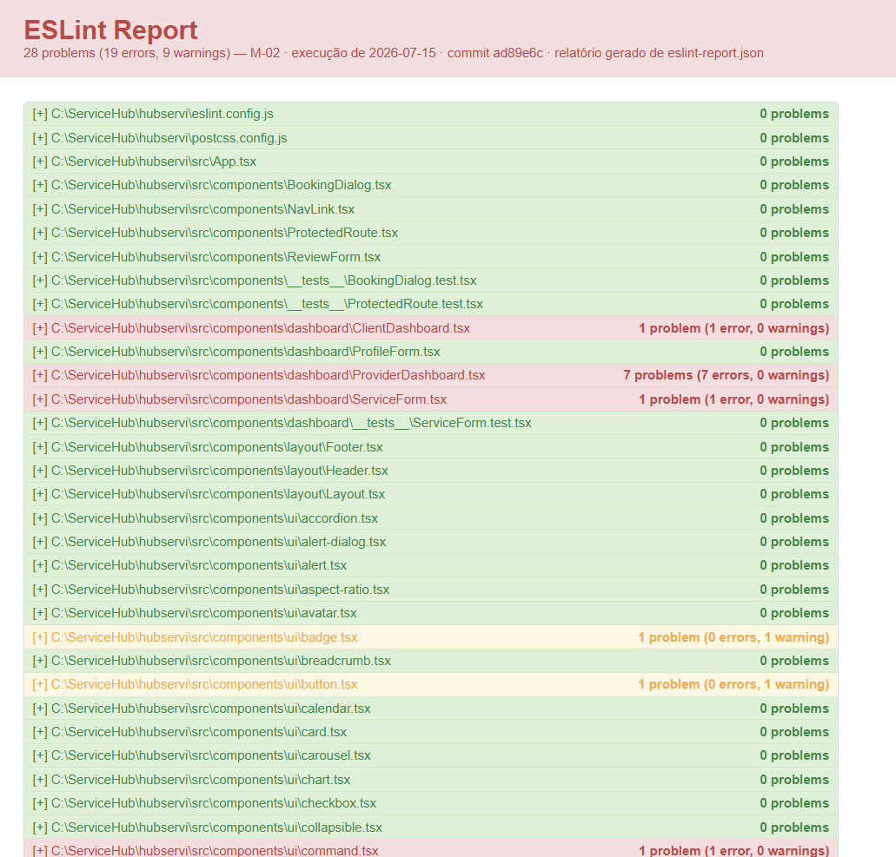

*Fonte: ESLint 9.32; execução de 15 jul. 2026; saída bruta preservada em [`2026-07-15/eslint-report.json`](medicoes/evidencias/2026-07-15/eslint-report.json).*

### Figura C.5 — Análise estática sob a configuração de medição, com regras de complexidade e de *code smells*: 25 erros e 4 avisos

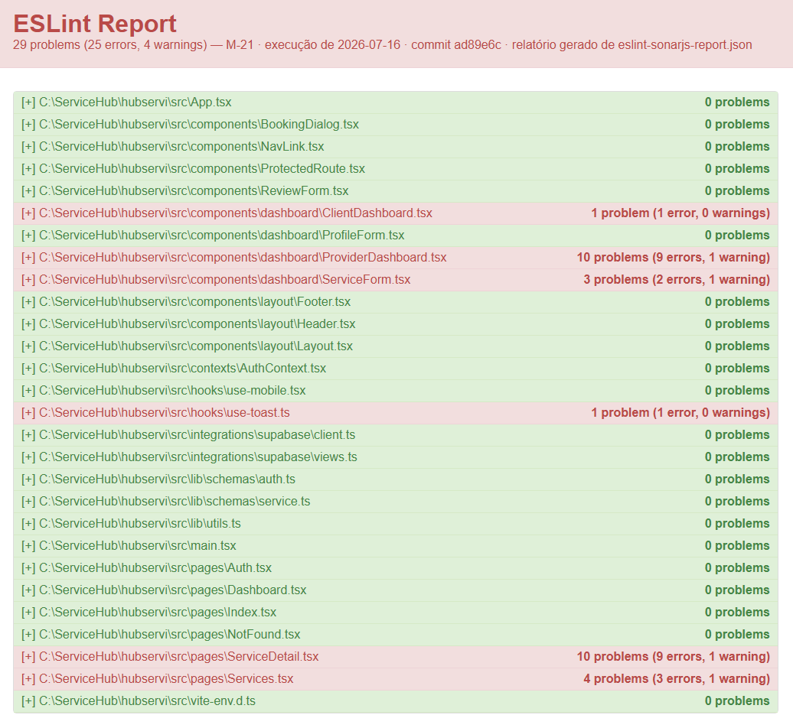

*Fonte: ESLint 9.32 com `eslint-plugin-sonarjs` 3; execução de 16 jul. 2026; saída bruta preservada em [`2026-07-16/eslint-sonarjs-report.json`](medicoes/evidencias/2026-07-16/eslint-sonarjs-report.json).*

### Figura C.6 — Duplicação de código no agregado: 3,03% — 10 clones, 107 de 3.528 linhas

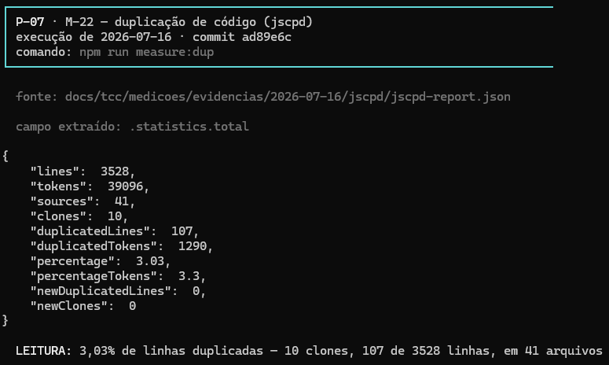

*Fonte: jscpd 4; execução de 16 jul. 2026; saída bruta preservada em [`2026-07-16/jscpd/jscpd-report.json`](medicoes/evidencias/2026-07-16/jscpd/jscpd-report.json).*

### Figura C.7 — Instabilidade por módulo: núcleo estável (`lib/utils` 4%, `client.ts` 8%, `AuthContext` 13%) e folhas voláteis entre 90% e 100%

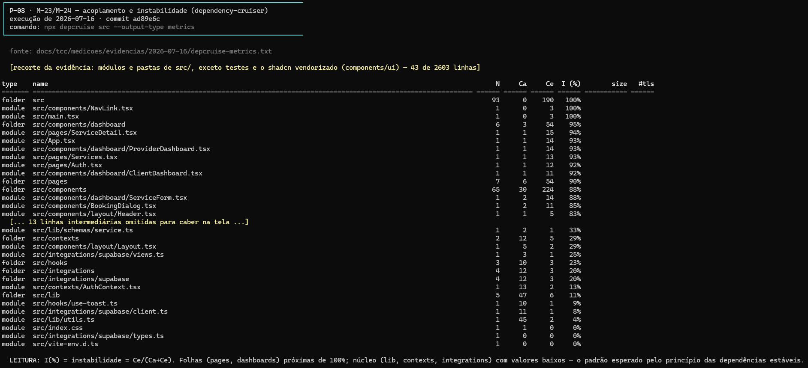

*Fonte: dependency-cruiser 16.10.4; execução de 16 jul. 2026; saída bruta preservada em [`2026-07-16/depcruise-metrics.txt`](medicoes/evidencias/2026-07-16/depcruise-metrics.txt).*

### Figura C.8 — Reconstrução do banco a partir do histórico versionado (10 *migrations* e *seed*) e *smoke* de integração aprovado, 4 de 4

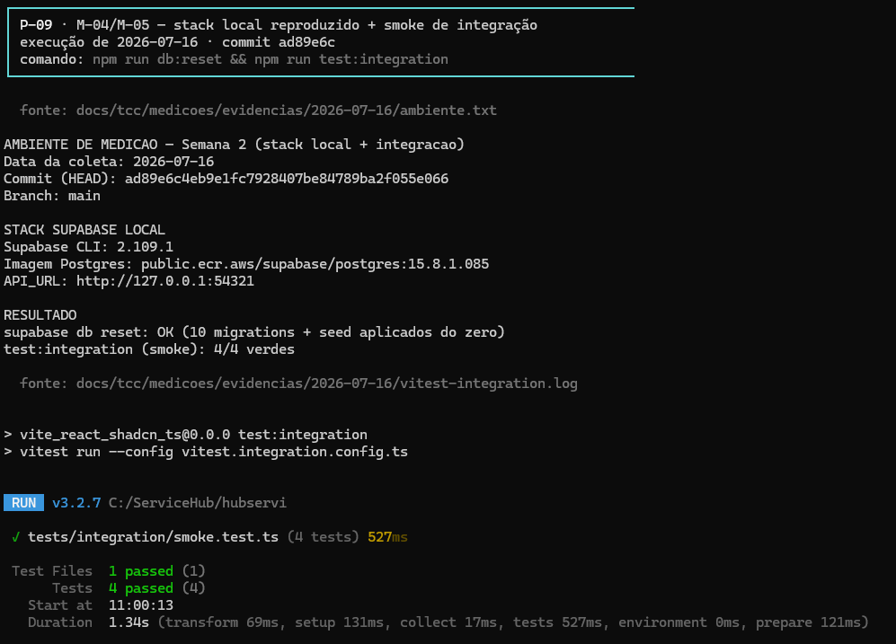

*Fonte: Supabase CLI 2.109.1 e Vitest; execução de 16 jul. 2026; saída bruta preservada em [`2026-07-16/vitest-integration.log`](medicoes/evidencias/2026-07-16/vitest-integration.log).*

### Figura C.9 — Suíte completa de autorização (RLS) e de *triggers*, executada contra a API PostgREST real

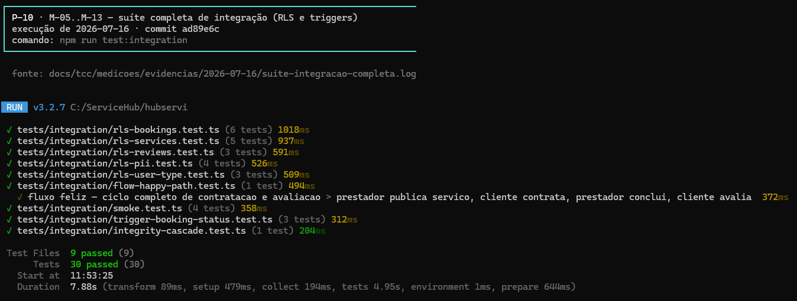

*Fonte: Vitest (integração); execução de 16 jul. 2026; saída bruta preservada em [`2026-07-16/suite-integracao-completa.log`](medicoes/evidencias/2026-07-16/suite-integracao-completa.log).*

### Figura C.10 — **Antes** da correção: duas falhas, com o vazamento literal do campo `email` de outro usuário na saída do teste

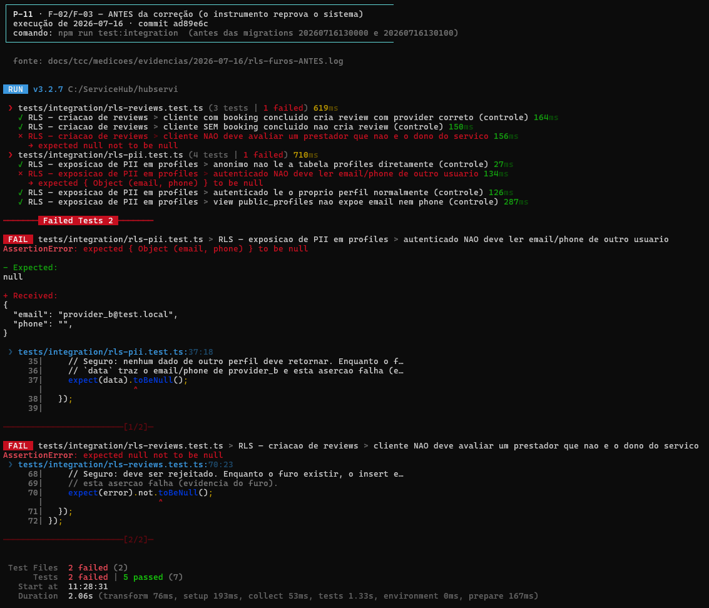

*Fonte: Vitest (integração); execução de 16 jul. 2026; saída bruta preservada em [`2026-07-16/rls-furos-ANTES.log`](medicoes/evidencias/2026-07-16/rls-furos-ANTES.log).*

### Figura C.11 — **Depois** da correção: os mesmos dois testes aprovados, após as *migrations* corretivas

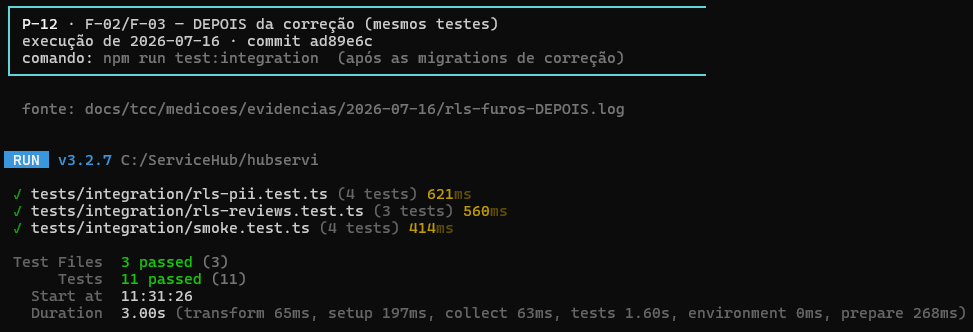

*Fonte: Vitest (integração); execução de 16 jul. 2026; saída bruta preservada em [`2026-07-16/rls-furos-DEPOIS.log`](medicoes/evidencias/2026-07-16/rls-furos-DEPOIS.log).*

### Figura C.12 — Privilégios de API concedidos aos papéis `anon`, `authenticated` e `service_role` sobre `profiles`, após a *migration* que tornou o histórico auto-suficiente

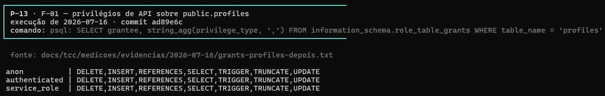

*Fonte: `psql` sobre o *stack* local; execução de 16 jul. 2026; saída bruta preservada em [`2026-07-16/grants-profiles-depois.txt`](medicoes/evidencias/2026-07-16/grants-profiles-depois.txt).*

### Figura C.13 — Carregamento inicial **antes** do *code-splitting*: *performance score* de 85 e LCP de 3,49 s (execução mediana de três)

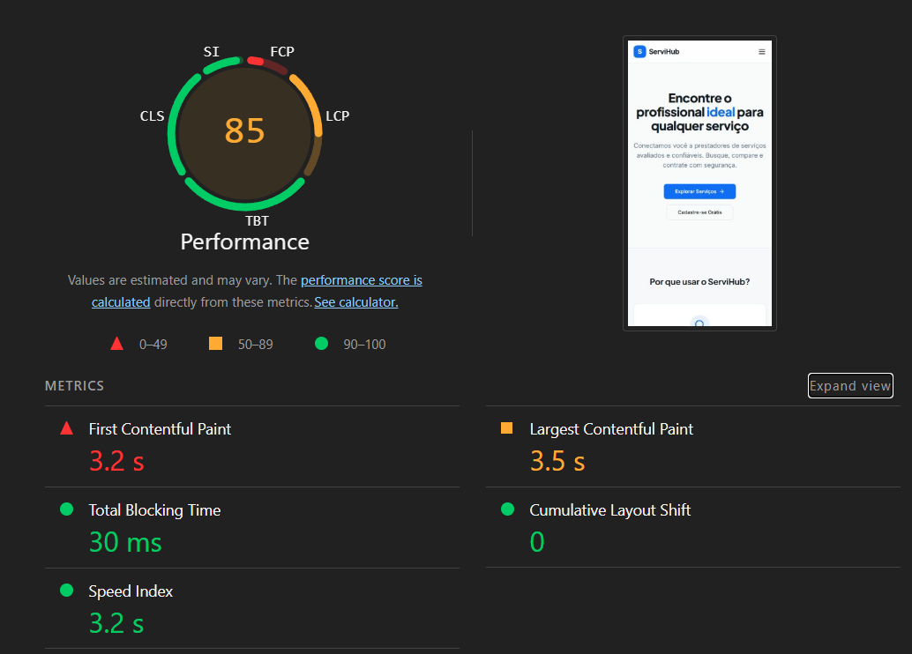

*Fonte: Lighthouse 12.8.2, perfil móvel; execução de 16 jul. 2026; saída bruta preservada em [`2026-07-16/lighthouse-3.json`](medicoes/evidencias/2026-07-16/lighthouse-3.json).*

### Figura C.14 — Carregamento inicial **depois** do *code-splitting*: *performance score* de 88 e LCP de 3,17 s (execução mediana de três)

*Fonte: Lighthouse 12.8.2, perfil móvel; execução de 16 jul. 2026; saída bruta preservada em [`2026-07-16/lighthouse-split-2.json`](medicoes/evidencias/2026-07-16/lighthouse-split-2.json).*

### Figura C.15 — Carga sobre a listagem de serviços: 44.413 requisições em 20 s, vazão de 2.221 req/s, nenhum erro e nenhuma resposta fora da faixa 2xx

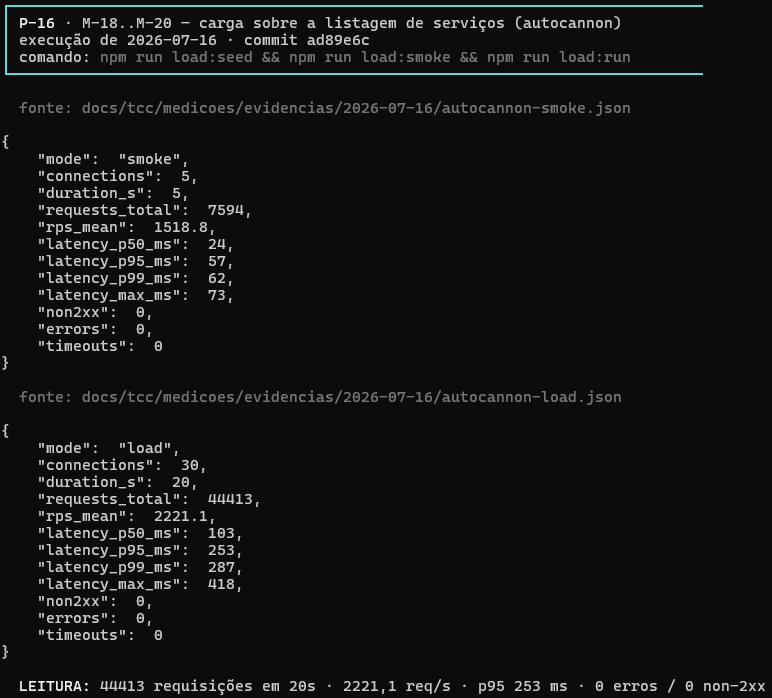

*Fonte: autocannon 8; execução de 16 jul. 2026; saída bruta preservada em [`2026-07-16/autocannon-load.json`](medicoes/evidencias/2026-07-16/autocannon-load.json).*

### Figura C.16 — Análise de composição de dependências sobre 825 pacotes: 12 vulnerabilidades altas, 8 moderadas e nenhuma crítica

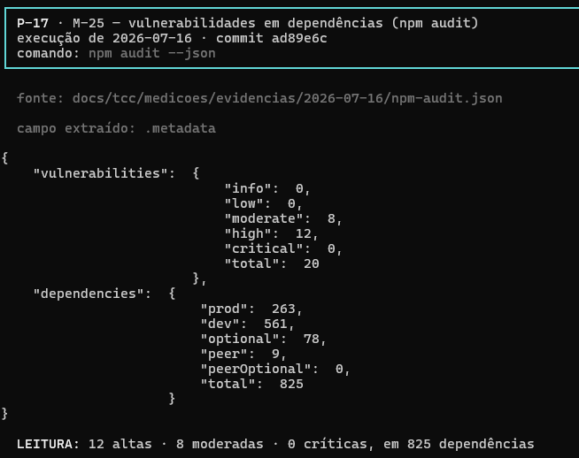

*Fonte: `npm audit`; execução de 16 jul. 2026; saída bruta preservada em [`2026-07-16/npm-audit.json`](medicoes/evidencias/2026-07-16/npm-audit.json).*

### Figura C.17 — Verificação de integridade do *schema*: nenhum erro encontrado

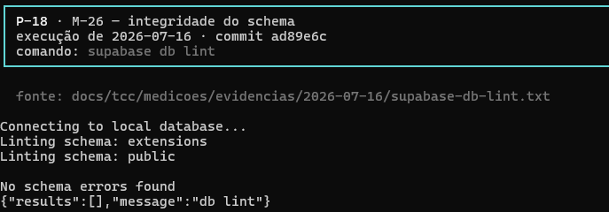

*Fonte: `supabase db lint` 2.109.1; execução de 16 jul. 2026; saída bruta preservada em [`2026-07-16/supabase-db-lint.txt`](medicoes/evidencias/2026-07-16/supabase-db-lint.txt).*

---

## Material suplementar relacionado

| Documento | Conteúdo |
|---|---|
| [Apêndice A — Diagramas e dicionário de dados](apendice-a-diagramas.md) | UML, BPMN, DER e dicionário de dados |
| [Apêndice B — Reprodução das medições](apendice-b-reproducao.md) | Como reexecutar cada medição, e o que não reproduz |
| [Registro de medições](medicoes/registro-medicoes.md) | Tabela mestra: valor, ferramenta, versão, evidência, veredito |
| [Evidências brutas](medicoes/evidencias/) | Saídas originais das ferramentas, por data |

### Como citar

> VIEIRA, Pedro Conrado Fernandes; COSTA, Richardy Gabriel Rodrigues da. **Apêndice C — Evidências de execução**: material suplementar. Franca: Uni-FACEF, 2026. Disponível em: https://github.com/Richardy-Rodrigues/hubservi/blob/tcc-v2/docs/tcc/apendice-c-evidencias.md. Acesso em: [data].
