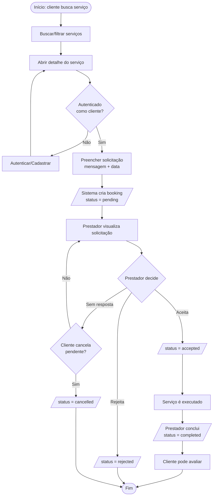

# BPMN — Contratação de serviço

Processo de negócio da contratação, das raias Cliente e Prestador, mediado pelo sistema. Notação BPMN aproximada em Mermaid (`flowchart`).

## Notas

- A criação do booking e as mudanças de status são validadas no banco (RLS + *triggers*).
- A avaliação só é habilitada após `status = completed` (ver [sequência — avaliação](sequencia-avaliacao.md)).
