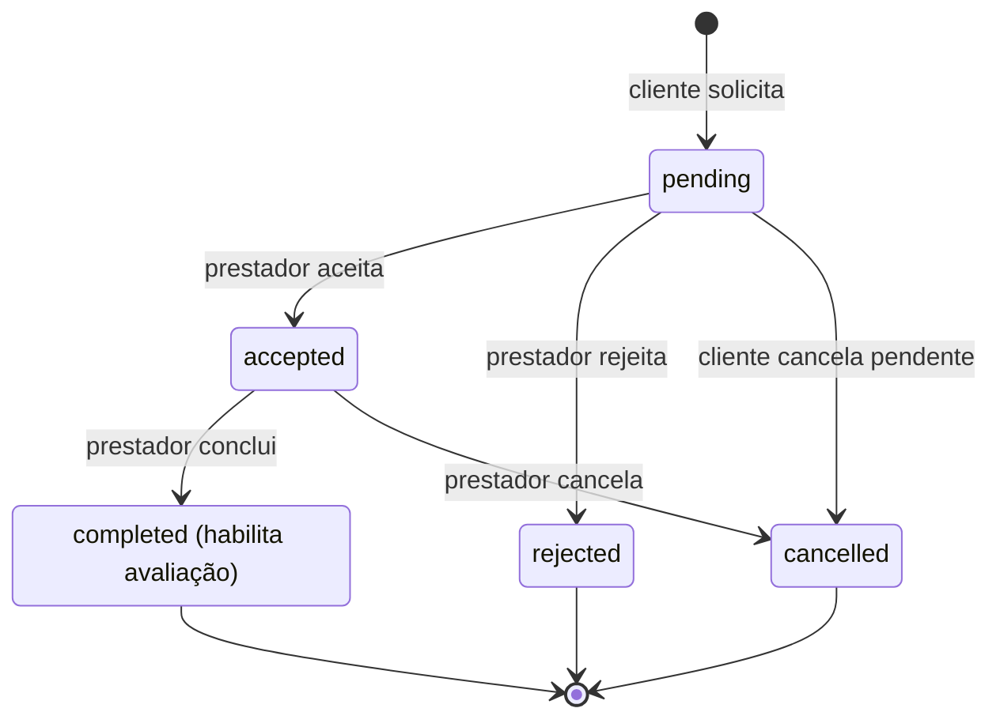

# BPMN / Máquina de estados — Gerenciamento de booking

Ciclo de vida do booking conforme o *trigger* `validate_booking_status_transition()` (migration inicial e `20260528000000`). As transições não representadas são rejeitadas pelo banco.

## Regras de transição (impostas por trigger)

| De | Para permitido |
|----|----------------|
| `pending` | `accepted`, `rejected`, `cancelled` |
| `accepted` | `completed`, `cancelled` |
| `completed` | — (estado final) |
| `rejected` | — (estado final) |
| `cancelled` | — (estado final) |

## Atores e permissões (RLS)

- **Prestador:** altera o status dos próprios bookings (`accepted`, `rejected`, `completed`, `cancelled`).
- **Cliente:** pode cancelar (`pending → cancelled`) apenas os próprios bookings ainda pendentes.
- Transições inválidas resultam em exceção no banco; auto-transições (`status` inalterado) são toleradas.
