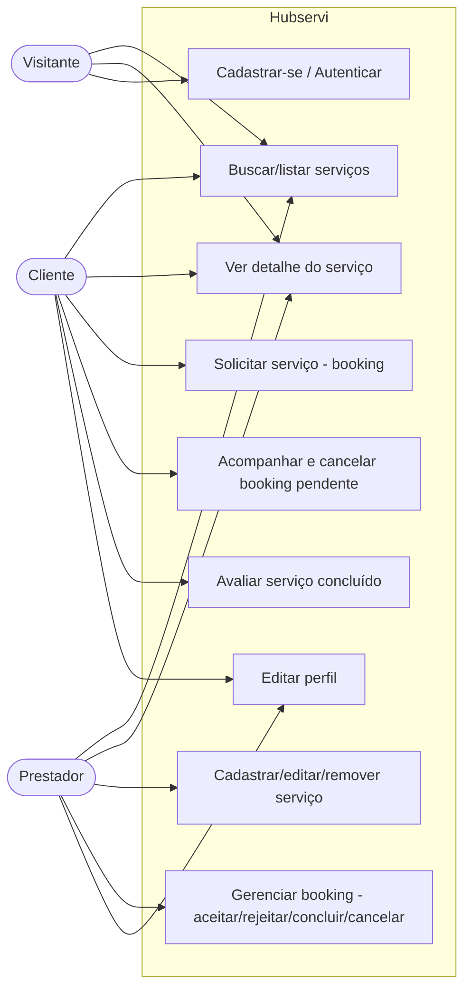

# Diagrama de Casos de Uso

Atores: **Visitante** (não autenticado), **Cliente** e **Prestador** (perfis autenticados). O Cliente e o Prestador especializam o ator genérico Usuário Autenticado.

## Notas

- UC4 (solicitar) é exclusivo do Cliente; UC7 e UC8 são exclusivos do Prestador (regras impostas por RLS e *triggers*).
- UC6 (avaliar) exige booking com status `completed` no serviço (política RLS de `INSERT` em `reviews`).
- O Visitante só executa UC1, UC2 e UC3; demais casos exigem autenticação (`ProtectedRoute`).
