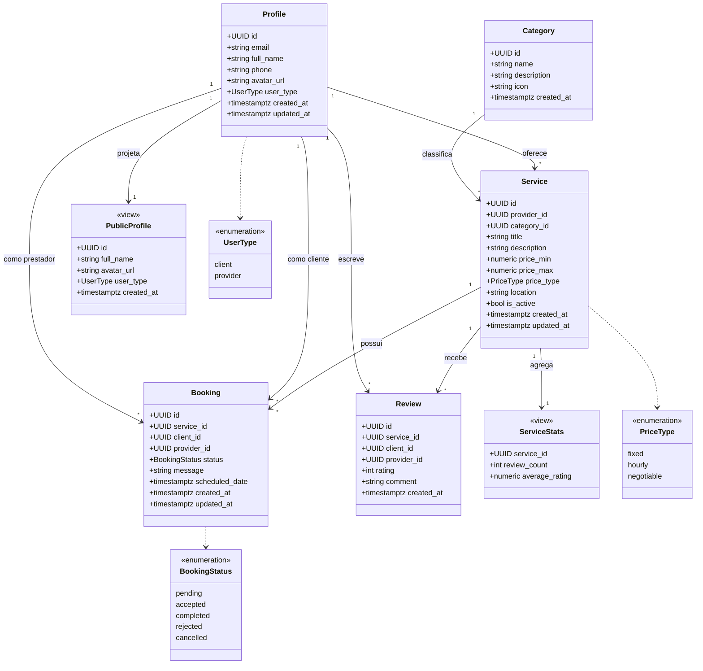

# Diagrama de Classes

Modelo de domínio derivado do esquema real (tabelas, enums e *views*). Não inclui entidades de recomendação/interação (inexistentes no sistema real).

## Notas

- `Profile.id` referencia `auth.users.id`; o *trigger* `handle_new_user` materializa o profile no cadastro.
- `Review` tem restrição `UNIQUE(service_id, client_id)`.
- `ServiceStats` e `PublicProfile` são *views* derivadas, não tabelas.
