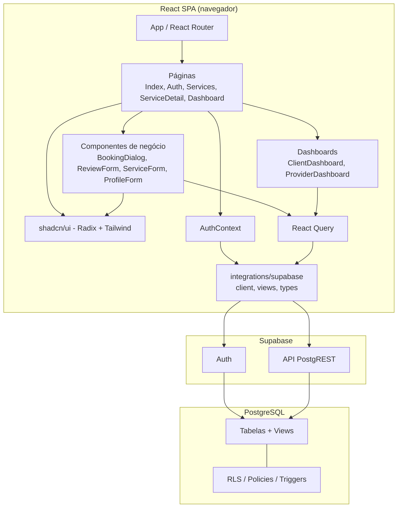

# Diagrama de Componentes

Componentes lógicos do Hubservi e suas dependências. Fonte: `src/`.

## Notas

- `integrations/supabase/client.ts` é o ponto único de acesso ao BaaS; `views.ts` encapsula consultas à *view* `public_profiles`.
- Toda autorização é aplicada na camada de banco (RLS), não no cliente; o cliente apenas reflete as restrições.
