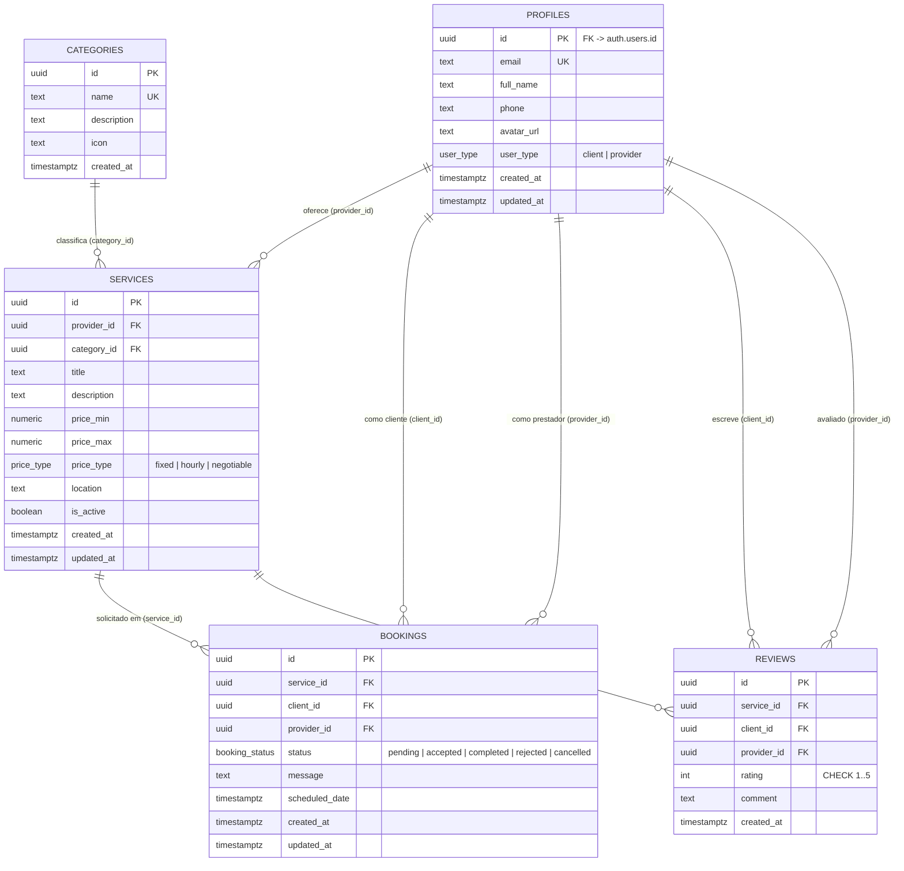

# DER — Diagrama Entidade-Relacionamento

Modelo de dados do Hubservi, fiel ao esquema real das *migrations* (`supabase/migrations/`). As *views* `service_stats` e `public_profiles` são derivadas e não aparecem como entidades persistentes.

## Notas

- `PROFILES.id` referencia `auth.users.id` (tabela gerenciada pelo Supabase Auth); o *trigger* `handle_new_user()` materializa o perfil no cadastro.
- `REVIEWS` possui restrição de unicidade `UNIQUE(service_id, client_id)`: uma avaliação por cliente por serviço.
- `SERVICES` possui a restrição `CHECK (price_max IS NULL OR price_max >= price_min)`.
- Exclusões em cascata: a remoção de um `profile`/`service` propaga-se aos `bookings` e `reviews` relacionados (`ON DELETE CASCADE`); `services.category_id` usa `ON DELETE RESTRICT`.
