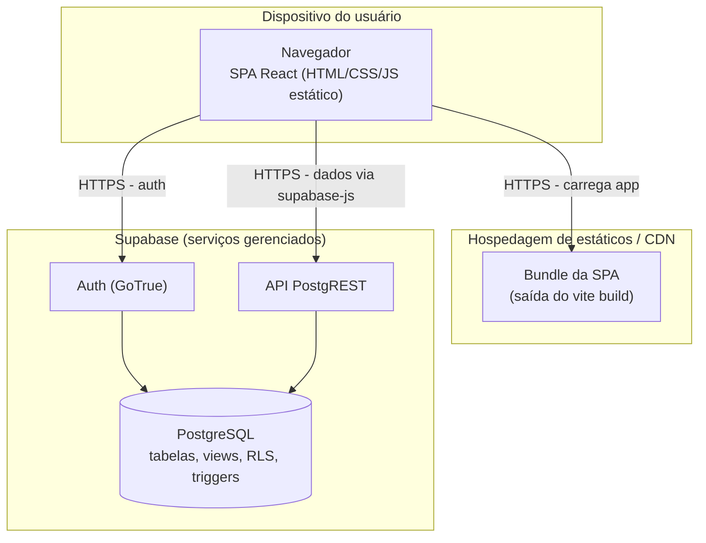

# Diagrama de Implantação

Topologia de implantação do paradigma SPA + BaaS + Serverless. O artefato da SPA é estático (gerado por `vite build`) e servido por uma hospedagem de conteúdo estático/CDN; o *backend* é integralmente gerenciado pelo Supabase.

## Notas

- Não há servidor de aplicação próprio: o navegador comunica-se diretamente com os serviços gerenciados do Supabase via HTTPS.
- As credenciais expostas ao cliente são as chaves públicas (`VITE_SUPABASE_URL`, `VITE_SUPABASE_PUBLISHABLE_KEY`); a segurança dos dados depende das políticas de RLS no PostgreSQL.
- O Supabase Storage não está configurado nas *migrations*; URLs de avatar são externas.
