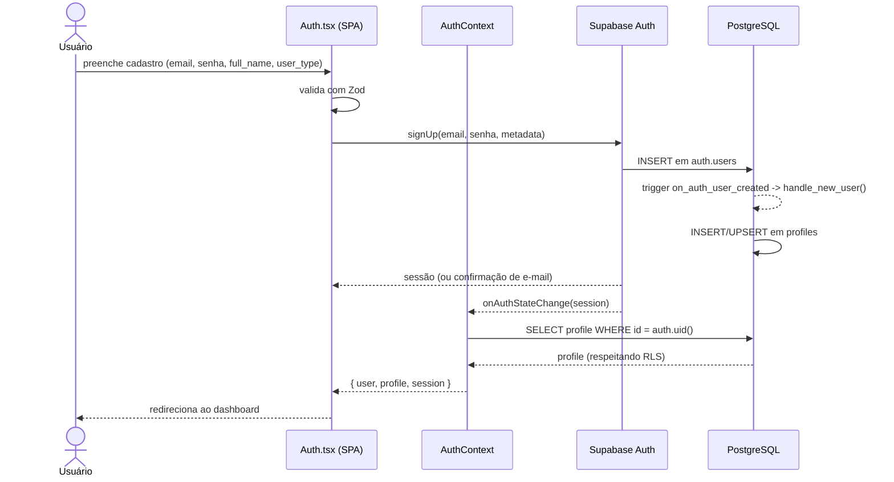

# Diagrama de Sequência — Autenticação

Fluxo de cadastro/login com provisão automática de perfil. Fonte: `src/pages/Auth.tsx`, `src/contexts/AuthContext.tsx`, *trigger* `handle_new_user()`.

## Notas

- A criação do perfil ocorre no servidor, via *trigger* idempotente (`ON CONFLICT DO UPDATE`), independente das políticas de RLS (`SECURITY DEFINER`).
- O `AuthContext` mantém a sessão e o perfil em memória, recarregando-os a cada mudança de estado de autenticação.
