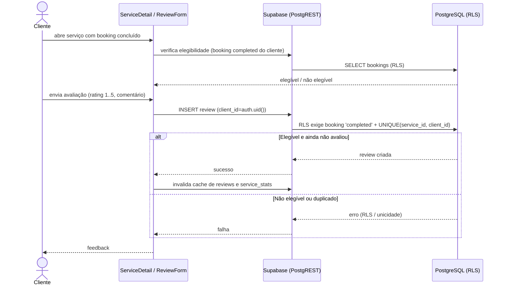

# Diagrama de Sequência — Avaliação (review)

Registro de avaliação após booking concluído. Fonte: `src/components/ReviewForm.tsx`, `ServiceDetail.tsx`, política RLS de `INSERT` em `reviews`.

## Notas

- A *view* `service_stats` recalcula `review_count` e `average_rating` ao ser consultada após a inserção.
- A unicidade `(service_id, client_id)` impede mais de uma avaliação por cliente por serviço.
