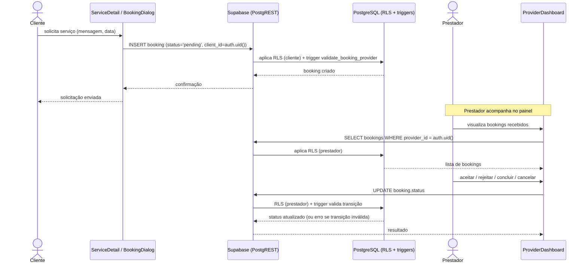

# Diagrama de Sequência — Contratação (booking)

Solicitação de serviço pelo cliente e tratamento pelo prestador. Fonte: `src/components/BookingDialog.tsx`, `ServiceDetail.tsx`, dashboards, *triggers* `validate_booking_provider()` e `validate_booking_status_transition()`.

## Notas

- O cliente também pode **cancelar** uma solicitação enquanto `status = 'pending'` (política RLS + transição `pending → cancelled`, migration `20260528000000`).
- Transições inválidas de status são rejeitadas pelo *trigger* com exceção.
